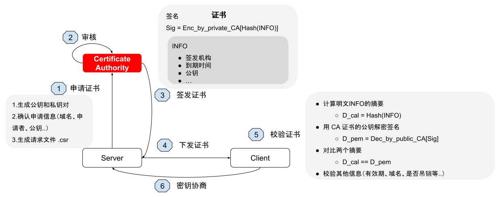

# 2.5.1 SSL 加密原理

本节，我们尝试从零开始，设计一套“绝对”安全的信息传输机制，从设计者的角度思考 HTTPS 加密原理。

## 1. 解决信息传递的安全性

HTTP 之上的 SSL 层的本质是为了实现信息传递“绝对”的安全性。

如图 2-11 所示，在 1 对 1 的通信模型中，为了确保信息传递的安全性，可以使用对称加密算法，如 AES、ChaCha20、DES 等。只要密钥不被第三方获取，就能保证信息传递的安全性。

:::center
   
 图 2-11 对称加密示例
:::

但是，在 HTTP 场景下，对称加密方式的方式就行不通了。如图 2-12 所示，对称加密的核心在于如何保证密钥的安全性。但由于 HTTP 通信模型是 1 对 N，一旦密钥被多方知晓，就相当于没有加密。

:::center
   
 图 2-12 对称加密 1 v N 模式
:::

为了解决密钥暴露的问题，我们为每个客户端分配不同的加密算法或密钥，并引入一个协商过程，以确定双方将使用哪种加密算法或密钥。这个协商过程正是 TLS 协议握手阶段做的事情。其流程如图 2-13 所示。

:::center
   
 图 2-13 对称加密模式下密钥协商过程
:::

不过问题还是存在，协商过程解决了对称加密算法或秘钥独立性问题，但协商过程依旧是明文的，密钥依然存在被截获的可能性。

解决上述问题就必须换一种思路，只使用对称加密就会陷入“无限套娃”的死胡同。我们引入一个新的概念“非对称加密算法”，非对称加密有两个密钥：公钥、私钥，私钥加密的密文只能公钥解，公钥加密的密文只能私钥解。这种分离确保了即使公钥被公开，没有私钥也无法解密信息。

由于非对称加密算法通常需要更多的计算资源，特别是加/解密大量数据时，计算资源的消耗会更大。所以我们使用对称加密算法加密 HTTP 内容。

- 首先，客户端与服务端会进行协商，确定一个双方都支持的对称加密算法，例如 AES。
- 确认对称加密算法后，客户端会随机生成一个对称加密密钥。
- 客户端使用服务端的公钥加密该密钥，并将密文传输给服务端。此时，只有服务端的私钥能够解密该密文，因此能保证密钥传输的安全性。

上述中的“协商”，在 TLS 协议中叫密钥交换，密钥交换有两种算法 RSA 和 ECDHE 算法。两者的区别是：RSA 历史悠久，兼容性好，但不支持 PFS （Perfect Forward Secrecy，完美前向保密。保证即使私钥泄露，也无法破解泄露之前通信内容）。而 ECDHE 则基于椭圆曲线的 Diffie-Hellman (ECC-DH) 算法，计算速度更快，并且支持 PFS。

如此，我们实现了”降低加/解密的耗时，同时又保证密钥传输的安全性“，达成既要安全又要效率的目标。

但问题还没有结束，公钥如何传输给客户端呢？

## 2.证书认证机构

如图 2-14 所示，如果服务端直接发送公钥证书给客户端，仍然无法避免中间被截获的可能性。

这时，我们引入一个双方都信任的第三方机构，第三方机构也使用非对称的方式，对“服务器公钥”再进行一次加密。客户端获取加密后的“公钥”，使用第三方机构的公钥（预先内置在本地）进行解密。

虽然流程绕了些，但离我们的目标“绝对”安全又近了些。“双方都信任的第三方机构”就是 HTTPS 中的 CA（CA，Certificate Authority，证书认证机构）。

:::center
   
 图 2-14 公钥存在被截获的可能性
:::

HTTPS 中把公钥规范成“数字证书”，数字证书通常包含服务端公钥、持有者信息、CA 的信息以及过期信息等，数字证书由 CA 签发。服务端向 CA 申请数字证书后，再把数字证书下发给客户端。**至于第三方 CA 公钥的问题，解决方案就是提前预装在系统内，这就是系统内根证书的由来**。

至此，信息传递的”绝对“安全性目标基本得到实现。

## 3.证书验证链

客户端从服务端下载数字证书之后，根据本地的根证书校验是否合法。因为服务端向 CA 申请的证书一般不是最顶级的 CA 机构签发，而是由中间二级 CA 机构签发，所以还有一个证书信任链的验证环节。

如图 2-15 所示，thebyte.com.cn 证书的层级有三级。

:::center
   
 图 2-15 CA 证书层次结构
:::

这种三级层级关系的证书会先由本地根证书验证中间证书，验证通过后再用中间证书验证服务端证书，全部验证通过后，才确定服务器证书是可信任的。**从整个流程来看，HTTPS 关键在于根证书的安全性，如果根证书被修改了，那么信息传递也不再是“绝对”安全**。

最后，总结 HTTPS 的通信加密逻辑如图 2-16 所示，服务端向 CA 机构申请证书，在 TLS 握手阶段向客户端下发证书，然后客户端和服务器协商生成一个 HTTP 会话密钥（协商阶段使用非对称加密保证安全），之后客户端和服务端使用该会话密钥（也就是对称加密）进行通讯。

:::center
   
图 2-16 HTTPS 通信流程
:::

理解了 HTTPS 的原理之后，在后面的几节，笔者将介绍通过升级 TLS 协议、优化数字证书的方式，加速 HTTPS 请求。
