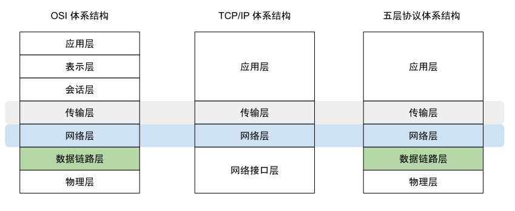

# 2.2 网络分层下的优化指南

对一个复杂的系统进行性能调优，可以考虑在不同层次的角度去思考与实践。

计算机网络的所有概念中，分层次的体系结构是最基本的概念。被广泛所知的分层模型有三种，如图2-2所示：第一是 OSI 网络七层模型，不过该模型并未被实际应用。第二是基于 TCP/IP 互联网的四层模型，但由于 TCP/IP 最下面的网络接口层并没有实质内容。所以在学习网络原理时，通常综合 OSI 和 TCP/IP 模型的优点，采用第三种五层协议的体系结构。

	
	
图2-2 计算机网络体系结构

