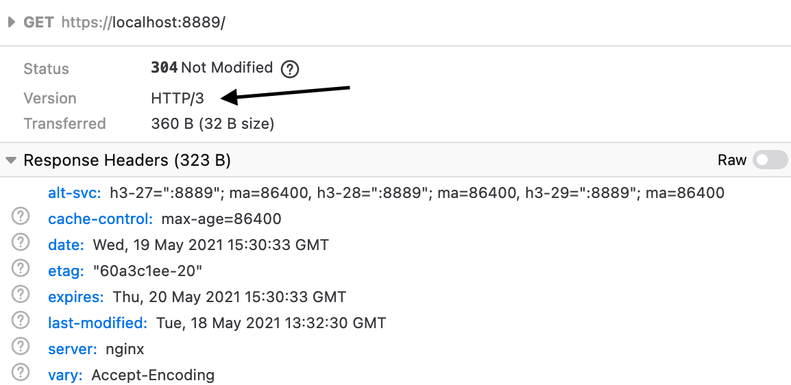

# 2.8.2 部署 HTTP/3 服务

对于 Nginx 来说，部署 HTTP/3 服务目前有两种方案可以选择：Cloudflare 的分支版本、官方 Nginx-quic 项目。常规方式部署需要安装 BoringSSL 等依赖，这里我们直接使用 docker 镜像 nginx-http3 进行部署。

1. 拉取镜像
```plain
$ docker pull macbre/nginx-http3:latest
```

2. 运行容器并查看 Nginx 配置信息
```plain
$ docker run -it macbre/nginx-http3 nginx -V

nginx version: nginx/1.21.1 (quic-d0ef43a53a51)
built by gcc 10.3.1 20210424 (Alpine 10.3.1_git20210424) 
built with OpenSSL 1.1.1 (compatible; BoringSSL) (running with BoringSSL)
TLS SNI support enabled
configure arguments: 
	--build=quic-d0ef43a53a51
	--prefix=/etc/nginx 
	--sbin-path=/usr/sbin/nginx 
	--modules-path=/usr/lib/nginx/modules 
...
```
nginx.conf 配置信息：

```nginx configuration
server {
    # quic and http/3
    listen 443 http3 reuseport;

    # http/2 and http/1.1
    listen 443 ssl http2;

    ssl_certificate     /etc/nginx/ssl/localhost.crt;
    ssl_certificate_key /etc/nginx/ssl/localhost.key;

    # Enable all TLS versions (TLSv1.3 is required for QUIC).
    ssl_protocols TLSv1.2 TLSv1.3;

    # 0-RTT QUIC connection resumption
    ssl_early_data on;

    # Add Alt-Svc header to negotiate HTTP/3.
    add_header alt-svc 'h3-27=":443"; ma=86400, h3-28=":443"; ma=86400, h3-29=":443"; ma=86400';

    # Sent when QUIC was used
    add_header QUIC-Status $quic;

    location / {
        # your config
    }
}
```

- 开启 HTTP/3。
- 启用 early_data 特性。
- 设置 alt-svc 用于 HTTP 协议选择（Alt-Svc 全称为“Alternative-Service”，直译为“备选服务”）。该头部列举了当前站点备选的访问方式列表，一般用于在提供“QUIC”等新兴协议支持的同时，实现向下兼容）。


4. 通过浏览器请求确认是否已经是 QUIC 协议。

<div  align="center">
	
    <p>图2-17 测试是否开启QUIC协议</p>
</div>
