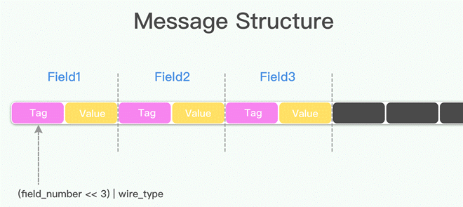

# 2.4.2 使用 Protocol Buffers 序列化数据

笔者参与的部分需要注意序列化性能、数据传输量的业务中大量使用了 Protocol Buffers[^1]。这一节，我们来了解下这个数据格式，以及讨论我们为什么选择它。

Protocol Buffers（简称 Protobuf 或者 pb）是 Google 公司开发的一种轻便高效的结构化数据存储格式，用来描述各种数据结构进行结构化数据串行化，或者说序列化。相比 XML 和 JSON，Protobuf 更小、更快、更简单，很适合做数据存储或 RPC 数据交换格式。

## 1. 为什么要有 Protobuf

开发人员如果要进行低版本、新旧协议兼容，会写如下类似逻辑的代码，虽然能实现多版本协议支持，不过代码比较丑陋。

```plain
if (version == 1.0) {
   ...
} else if (version > 2.0) {
   ...
} else {
   ...
}
```
使用明确的格式协议处理服务端新旧协议（APP 高低版本）等兼容性问题，会使新协议的迭代变得非常复杂，开发人员必须确保历史版本都能被兼容、理解，然后才能切换开关开启新协议。

Protobuf 的出现就是为了解决这种向后兼容问题。

## 2. Protobuf 使用示例 

在 Protobuf 中，所有结构化的数据都被称为 message，我们定义一个简单的 message，进行应用示例。

1. 定义一个 message（如果开头第一行不声明 `syntax = "proto3";` 则默认使用 proto2 进行解析）。

```plain
syntax = "proto3"; // pb 版本声明

message Person  { 
  string name = 1;
  int32 age = 2;
}  
```

2. 定义完 message 结构体之后，生成 java 可调用的类文件。

```plain
proto --java_out = / Person.proto
```

3. 在 Java 中使用 Protobuf 定义的结构进行序列化数据（需要提前安装 protobuf 依赖库）。

```plain
//1、 创建Builder
PersonProto.Person.Builder builder = PersonProto.Person.newBuilder();
//2、 设置Person的属性
builder.setAge(35);
builder.setName("小李");
//3、 创建Person
PersonProto.Person person = builder.build();
//4、序列化
byte[] data = person.toByteArray();
```

4. 序列化后的数据，可以通过 RPC、HTTP 等方式传递，接收方获取数据后进行反序列化。
```plain
PersonProto.Person person = PersonProto.Person.parseFrom(data);
System.out.println(person.getAge());
System.out.println(person.getName());
```

如以上示例，便完成了 Protobuf 的应用。

## 3. Protobuf 编码原理

Protobuf 介绍中说序列化后的数据比 JSON、XML 更紧凑，那么思考一个简单的问题 “Protobuf 序列化后的数据传输过程中还需要压缩么？”，想知道这个问题的答案，得先了解什么是 Varint 编码。

### 3.1 Varint 编码

Varint 是一种使用一个或多个字节序列化整数的方法，会把整数编码为变长字节。除了最后一个字节外，Varint 编码中的每个字节都设置了最高有效位（most significant bit，msb），msb 为 1 则表明后面的字节还是属于当前数据的，如果是 0 那么这是当前数据的最后一个字节数据。

如下面这个例子，1 用一个字节就可以表示，所以 msb 为 0。
```plain
0000 0001
```
如果需要多个字节表示，msb 就应该设置为 1 ，例如 300，如果用 Varint 表示的话：

```plain
1010 1100 0000 0010
```

由于 300 超过了 7 位，所以 300 需要用 2 个字节来表示（Varint 一个字节只有 7 位能用来表示数字，最高位 msb 用来表示后面是否有更多字节）。

读到这里可能有读者会问了：“Varint 不是为了紧凑 int 的么？那 300 本来可以用 2 个字节表示，现在还是 2 个字节了，哪里紧凑了，花费的空间没有变啊！”。Varint 确实是一种紧凑的表示数字的方法，300 如果用 int32 表示，需要 4 个字节，现在用 Varint 表示，只需要 2 个字节了，缩小了一半。从统计的角度来说，一般不会所有的消息中的数字都是大数，因此大多数情况下，采用 Varint 后，可以用更少的字节数来表示数字信息。

现在回答上面的问题，Protobuf 序列化的 string 类型和 byte 类型是直接存储的，只有 int 采用了变长压缩，当然还需要压缩。

### 3.2 Message 结构

Protobuf 还有个很重要的特性：向后兼容。

想搞明白 Protocol buffer 如何做到向后兼容，得解析 message 的结构设计。如图 2-11 所示，Protobuf 的 message 是一系列键值对，message 的二进制版本只是使用字段号(field's number 和 wire_type) 作为 key。每个字段的名称和声明类型只能在解码端通过引用消息类型的定义（即 .proto 文件）来确定，这一点也是人们常常说的 protocol buffer 比 JSON，XML 安全一点的原因，如果没有数据结构描述 .proto 文件，拿到数据以后无法解释成正常的数据。

<div  align="center">
	
	<p>图2-11 Message 结构</p>
</div> 

由于采用了 tag-value 的形式，所以 option 类型的字段如果有，就存在这个 message buffer 中，如果没有，就不会在这里，这一点也算是压缩了 message 的大小了。当消息编码时，键和值被连接成一个字节流，当消息被解码时，解析器需要能够跳过它无法识别的字段。这样，就可以将新字段添加到消息中，而不会破坏不知道它们的旧程序。

这就是 Protobuf “向后”兼容特性的原理。


[^1]: 参见 https://github.com/protocolbuffers/protobuf