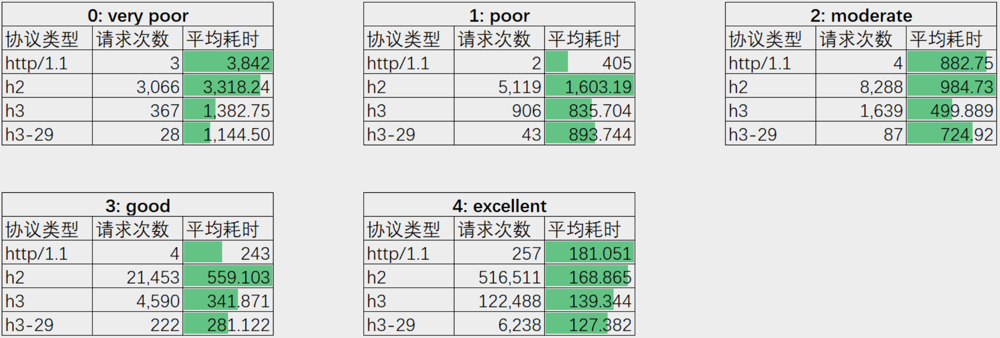

# 2.8.2 QUIC 实践

截止笔者写下这篇文章之时，距离 HTTP/3 正式发布已经过去了一年半之久，那么 QUIC 的表现如何，是否可以应用到正式环境？笔者所在企业的基础架构团队在国内对 HTTP/1.1、HTTP/2、HTTP/3 等各版本进行可用性测试，本文将测试数据分享，以供读者参考。

第一个测试的是根据用户网络状态分级对各协议的耗时表现。测试数据表明，在同等网络环境条件下 HTTP/3 或 H3-29 延迟降低了 100% 左右（耗时单位 ms）。

	
	
图2-18 各网络质量下的协议耗时表现

不过这次测试也发现了另外一个问题：综合来看网络请求成功率的对比， HTTP3 或 H3-29 的失败率更高。

	
	
图2-19 各网络质量下的协议成功率表现

最后总结，综合来看无论是在客户端还是服务端，QUIC 协议的集成并非一件易事，下面让我们来看看客户端和服务端在集成 QUIC 时需要考虑的问题：

- 客户端的问题
	- 应用适配成本和收益之间的权衡，普通的应用是否有必要升级成 QUIC，这需要业务需求和技术投入的综合考量。
	- 过渡期可能还需要新旧网络库都存在，以便进行降级容错，这也使得逻辑代码更为复杂。

- 服务端的问题
	- 网络事件模型需要适配 QUIC 协议栈做调整，同时还要考虑和 TCP 的兼容。
	- 后端架构面临调整，例如 4 层负载均衡是否支持 QUIC？ HTTP/3 的 QUIC 流量如何换成 HTTP/1 转给后端服务器。
	- 服务端 QUIC 流量的能耗比，如何做到和 TCP 一样的能耗性能。

虽然 HTTP/3 已经被标准化，不过还是得面对现实，HTTP/3 大规模应用还需给一点时间。