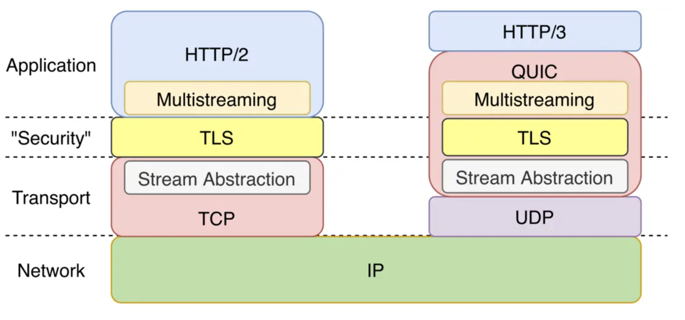

# 2.5.1 理解QUIC

QUIC (Quick UDP Internet Connection, 快速 UDP 互联网连接) 是一种基于 UDP 封装的安全、可靠传输协议，它的目标是取代 TCP 成为标准且效率更高的安全传输协议。

下图是 QUIC 在协议栈中的位置，基于 QUIC 承载的 HTTP 协议进一步被标准化为 HTTP/3。

	
	
图 3-8 HTTP2 与 HTTP3 协议对比

## 1.QUIC 出现的背景

在 QUIC 出现之前，HTTP 中使用 TCP 作为传输数据的底层协议。然而，传统的 TCP 这种已经使用了40多年的传输层通信协议，在目前高 BDP、复杂的移动网络的背景下，存在先天的性能瓶颈，这些问题集中在以下几点：

- 建立连接时握手延迟大：HTTPS 握手初次连接至少需要 3 个 RTT 才能建立。
- 队头阻塞问题：以 HTTP/2 为例，多个数据请求在同一个 TCP 连接上所有流都必须按顺序处理。如果一个流的数据丢失，后面其他流的数据将被阻塞，直到丢失的数据被重传。
- TCP 协议僵化问题：作为一个运行了接近 40 多年的协议，许多中间件（例如防火墙和路由器）已经变得依赖于某些隐式规则，推动 TCP 协议更新非常困难。

以上的问题，就是 QUIC 出现的背景。

## 2.QUIC的优点

QUIC 采用 UDP 作为其传输协议，与 TCP 相比具有更低的延迟和更高的吞吐量，并且它还使 QUIC 能够绕过可能干扰 TCP 的网络中间件。 QUIC 包含基于 TLS 1.3 内置加密协议，可在端点之间提供安全通信。总结，列举 QUIC 的重要特性，这些特性是 QUIC 得以被广泛应用的关键。

### 2.1支持连接迁移

当用户网络环境发生变化，如 WIFI 切换到 4G 时，基于 TCP 四元组的方式无法保持连接的存活，而 QUIC 由于使用连接 ID 识别连接，当源地址发生改变时，QUIC 可以实现无缝切换，从而保证连接存活和数据正常收发。

	
	
图 3-9 QUIC 支持连接迁移

### 2.2低延时连接

以一个 HTTPS 的请求为例，使用 TLS1.3 初次连接需要 2-RTT 才能开启数据传输，另外对于 TCP Fastopen 等方案，由于协议僵化等原因，也难以在网络中应用。而 QUIC 基于 UDP 无需 TCP 握手，初次连接只需要 1- RTT 就能开启数据传输。

	
	
图 3-10 QUIC 请求 RTT 示例

### 2.3可插拔拥塞控制

TCP协议和内核绑定，要升级拥塞控制算法，必须升级内核才可以。而 QUIC 协议栈运行在用户态 支持可插拔的 Cubic、BBRv2 等拥塞控制算法，也可以根据具体场景定制私有算法。

### 2.4降低对丢包的敏感度

QUIC 为每个流设计和实现单独的流量控制，解决了影响整个连接的队头阻塞问题，QUIC 在单个连接上每个流之间没有顺序依赖。这意味着如果流 2 丢失了一个 UDP 数据包，它只会影响流 2 的处理，不会阻塞流 1 和 3 的数据传输。此外，作为 QUIC 的一项新功能，HPACK 标头压缩格式的变体 QPACK 旨在减少通过网络传输的冗余数据量，从而有助于缓解头部阻塞问题，这样 QUIC 在弱网场景下比 TCP 有更高的传输效率。

	
	
图 3-11 QUIC 流

