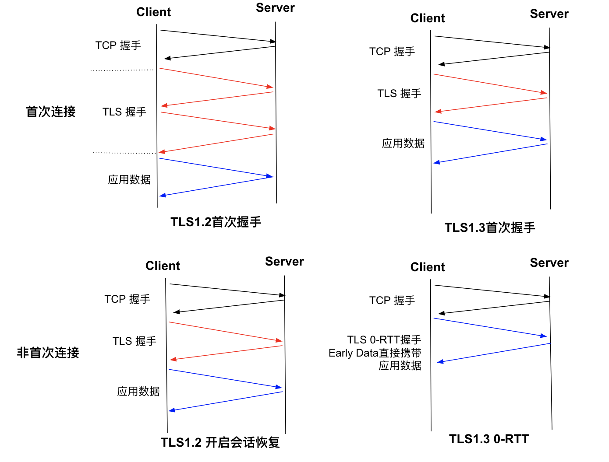

# 3.3.2 使用 QUIC 协议，实现低延迟、高可靠的传输服务

在 QUIC 出现之前，HTTP 中使用 TCP 作为传输数据的底层协议。然而，传统的 TCP 这种已经使用了40多年的传输层通信协议，在目前高 BDP、复杂的移动网络的背景下，存在先天的性能瓶颈，这些问题集中在以下几点：

- 建立连接时握手延迟大：HTTPS 握手初次连接至少需要 3 个 RTT 才能建立。
- 队头阻塞问题：以 HTTP/2 为例，多个数据请求在同一个 TCP 连接上所有流都必须按顺序处理。如果一个流的数据丢失，后面其他流的数据将被阻塞，直到丢失的数据被重传。
- TCP 协议僵化问题：作为一个运行了接近 40 多年的协议，许多中间件（例如防火墙和路由器）已经变得依赖于某些隐式规则，推动 TCP 协议更新非常困难。

以上的问题，就是 QUIC 出现的背景。

QUIC (Quick UDP Internet Connection, 快速 UDP 互联网连接) 是一种基于 UDP 封装的安全、可靠传输协议，他的目标是取代 TCP 并自包含 TLS 成为标准的安全传输协议。

下图是 QUIC 在协议栈中的位置，基于 QUIC 承载的 HTTP 协议进一步被标准化为 HTTP3。

	
	
图：HTTP2 与 HTTP3 协议对比

QUIC 采用 UDP 作为其传输协议，与 TCP 相比具有更低的延迟和更高的吞吐量，并且它还使 QUIC 能够绕过可能干扰 TCP 的网络中间件。 QUIC 包含基于 TLS 1.3 的内置加密协议，可在端点之间提供安全通信。总结，列举 QUIC 的重要特性，这些特性是 QUIC 得以被广泛应用的关键

### 1. 支持连接迁移

当用户网络环境发生变化时，如 WIFI 切换到 4G，基于 TCP 四元组的方式无法保持连接的存活。而 QUIC 使用连接 ID 唯一识别连接。当源地址发生改变时，QUIC 可以实现无缝切换，保证连接存活和数据正常收发。

	

### 2.低延时连接

以一个 HTTPS 的请求为例，即使在最好的 TLS1.3 的 early data 下仍然需要 1 RTT 开启数据传输。而对于目前线上常见的 TLS1.2 完全握手的情况，则需要 3RTT 开启数据传输，另外对于 TCP Fastopen 等方案，由于协议僵化的问题，也难以在网络中应用。

	

而 QUIC 由于基于 UDP，无需 TCP 握手。 在最理想的情况下，短连接下 QUIC 可以做到 0 RTT 开启数据传输。

	

QUIC 在握手过程中使用 DH(Diffie-Hellman) 算法协商初始密钥，DH 密钥协商需要通行双方各自生成自己的非对称公私钥对。server 端与客户端的关系是 1vN 的关系，server 端生成一份公私钥对, 让 N 个客户端公用, 能明显减少生成开销。server 端的这份公私钥对就是专门用于握手使用的，客户端一经获取，就可以缓存下来后续建连时继续使用, 这个就是达成0-RTT握手的关键。

### 3. 可插拔拥塞控制

QUIC 支持可插拔的 Cubic、BBR、Reno 等拥塞控制算法，也可以根据具体场景定制私有算法。`可插拔` 拥塞控制优势如下：

- 不同的拥塞控制算法可以在应用层实现，不需要操作系统或内核的支持，而传统 TCP 拥塞控制需要端到端的网络协议栈才能达到控制效果。
- 允许单个应用程序的不同连接支持不同的拥塞控制配置。
- 应用程序无需停机或升级即可更改拥塞控制。我们唯一要做的就是修改配置并在服务器端重新加载它。

### 4. 降低对丢包的敏感度

QUIC 为每个流设计和实现单独的流量控制，解决了影响整个连接的队头阻塞问题，QUIC 在单个连接上每个流之间没有顺序依赖。这意味着如果流 2 丢失了一个 UDP 数据包，它只会影响流 2 的处理，不会阻塞流 1 和 3 的数据传输。此外，作为 QUIC 的一项新功能，HPACK 标头压缩格式的变体 QPACK 旨在减少通过网络传输的冗余数据量，从而有助于缓解头部阻塞问题，这样 QUIC 在弱网场景下比  TCP 有更高的传输效率。

	

