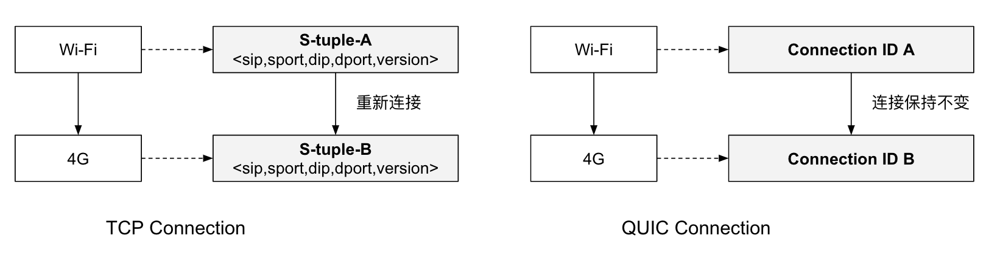
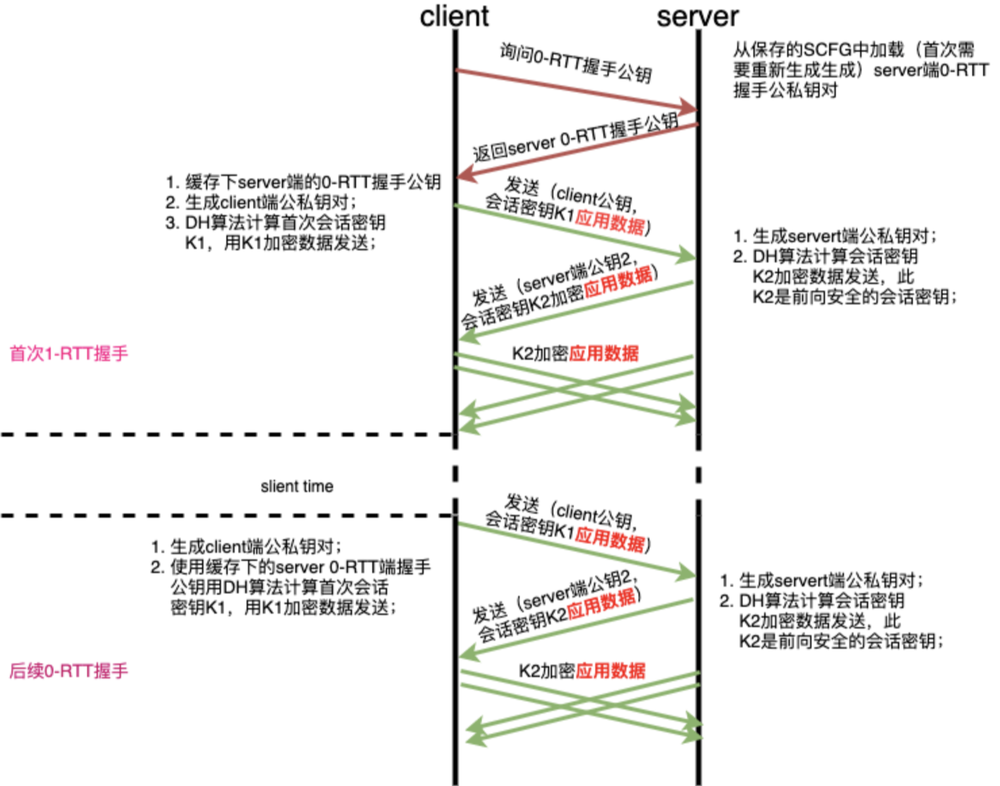
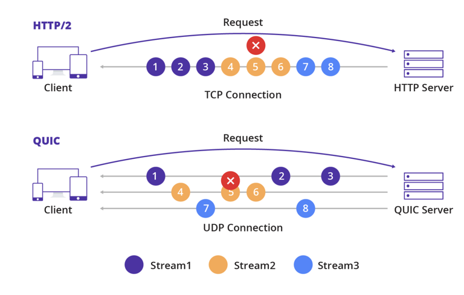

# 2.8.1 快速 UDP 网络连接

QUIC (Quick UDP Internet Connection, 快速 UDP 网络连接) 是一种基于 UDP 封装的安全、可靠传输协议，它的目标是取代 TCP 成为标准且效率更高的安全传输协议。

实际上推动替换 TCP 协议的先驱并不是 IETF，而是 Google 公司。早在 2013 年，Google 在它的服务器（如 Google.com、youtube.com）和 Chrome 浏览器中启用了名为 “快速 UDP 网络连接（QUIC）” 的全新传输协议。2015 年，Google 将 QUIC 提交给 IETF，并在 IETF 的推动下对 QUIC 进行规范化。2018 年末，IETF 正式批准了 HTTP over QUIC 使用 HTTP/3 的版本号，将其确立为最新一代的互联网标准。

如图 2-13 所示，QUIC 整合了 TCP、TLS 和 HTTP/2 的优点，基于 QUIC 承载的 HTTP 协议进一步被标准化为 HTTP/3。

	
	
图2-13 HTTP协议对比

## 1.QUIC 出现的背景

在 QUIC 出现之前，HTTP 中使用 TCP 作为传输数据的底层协议。然而，TCP 这种已经使用了 40 多年的传输层通信协议在设计之时，肯定没有想到今天移动设备盛行的场景。在如今复杂的移动网络的环境下，TCP 存在着先天的设计缺陷，这些问题集中在以下几点：

- 建立连接时握手延迟大：HTTPS 握手初次连接至少需要 3 个 RTT 才能建立。
- 队头阻塞问题：以 HTTP/2 为例，多个数据请求在同一个 TCP 连接上所有流都必须按顺序处理。如果一个流的数据丢失，后面其他流的数据将被阻塞，直到丢失的数据被重传。
- TCP 协议僵化问题：作为一个运行了接近 40 多年的协议，许多中间件（例如防火墙和路由器）已经变得依赖于某些隐式规则，推动 TCP 协议更新非常困难。

QUIC 在以上问题的背景中应用而生。

## 2.QUIC 协议的特点

QUIC 采用 UDP 作为其传输协议，与 TCP 相比没有丢包自动重传的特性，QUIC 的可靠性传输能力完全由自己实现。汲取 TCP 的设计经验以及现在的网络环境因素影响，QUIC 得以实现具有更低的延迟和更高的吞吐量。下面列举 QUIC 的部分重要特性，这些特性是 QUIC 被寄予厚望的关键。

### 2.1 支持连接迁移

当用户网络环境发生变化，如 WIFI 切换到 4G 时，TCP 基于四元组的方式无法保持连接的存活。而 QUIC 由于使用连接 ID 识别连接，当源地址发生改变时，连接不受环境变化影响，因为 QUIC 可以实现无缝切换，从而保证连接存活和数据正常收发。

	
	
图2-14 QUIC 支持连接迁移

### 2.2 低延时连接

以一个 HTTPS 的请求为例，使用 TLS1.3 初次连接需要 2-RTT 才能开启数据传输，另外对于 TCP Fastopen 等方案，由于协议僵化等原因，也难以在网络中应用。而 QUIC 基于 UDP 无需 TCP 握手，初次连接只需要 1- RTT 就能开启数据传输。

	
	
图 2-15 QUIC 请求 RTT 示例

### 2.3 可插拔拥塞控制

“构建在 UDP 之上”意味着可以不关心内核或者不用深入了解内核的开发，也可以灵活地调整可靠传输机制和拥塞控制算法等。QUIC 协议栈运行在用户态，支持可插拔的 cubic、BBR 等拥塞控制算法，也可以根据具体场景定制私有算法。

笔者在内部业务中推进 TCP 拥塞控制算法时，相当难以推进，原因就是要升级内核。

### 2.4 降低对丢包的敏感度

QUIC 为每个流设计和实现单独的流量控制，解决了影响整个连接的队头阻塞问题，QUIC 在单个连接上每个流之间没有顺序依赖。这意味着如果流 2 丢失了一个 UDP 数据包，它只会影响流 2 的处理，不会阻塞流 1 和 3 的数据传输。此外，作为 QUIC 的一项新功能，HPACK 标头压缩格式的变体 QPACK 旨在减少通过网络传输的冗余数据量，从而有助于缓解头部阻塞问题，这样 QUIC 在弱网场景下比 TCP 有更高的传输效率。

	
	
图 2-16 QUIC 流

