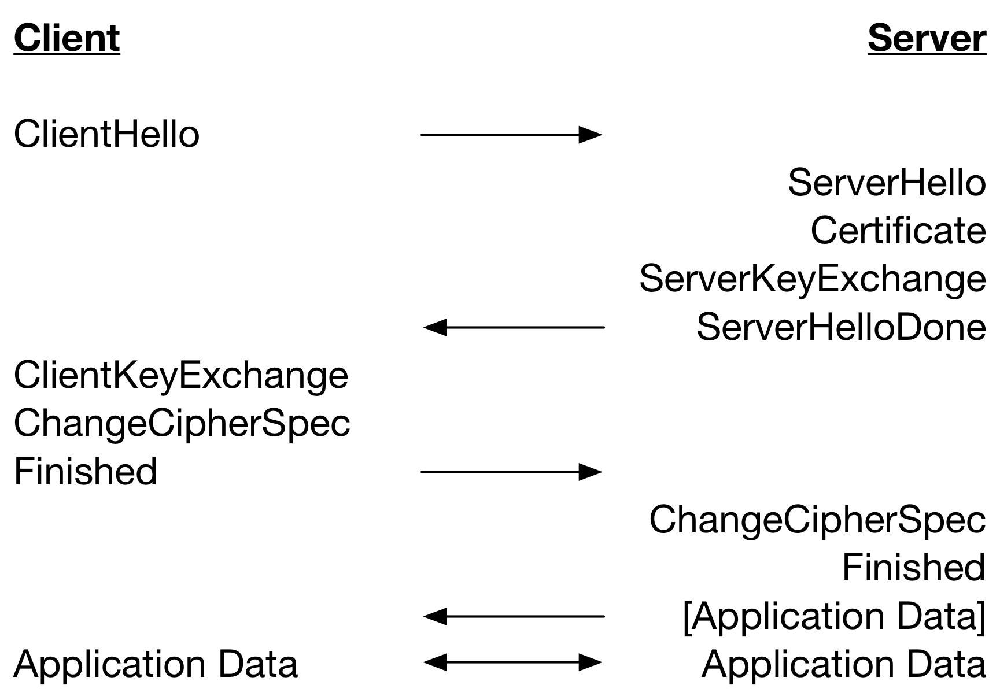
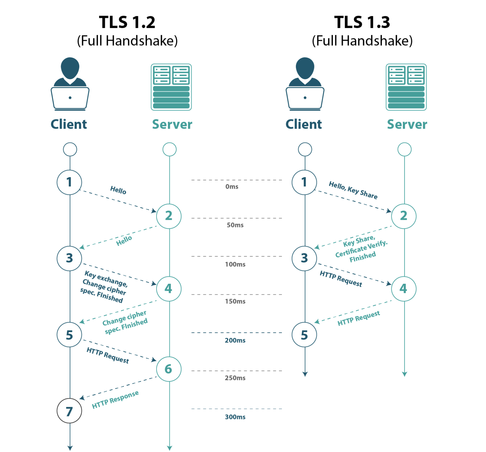
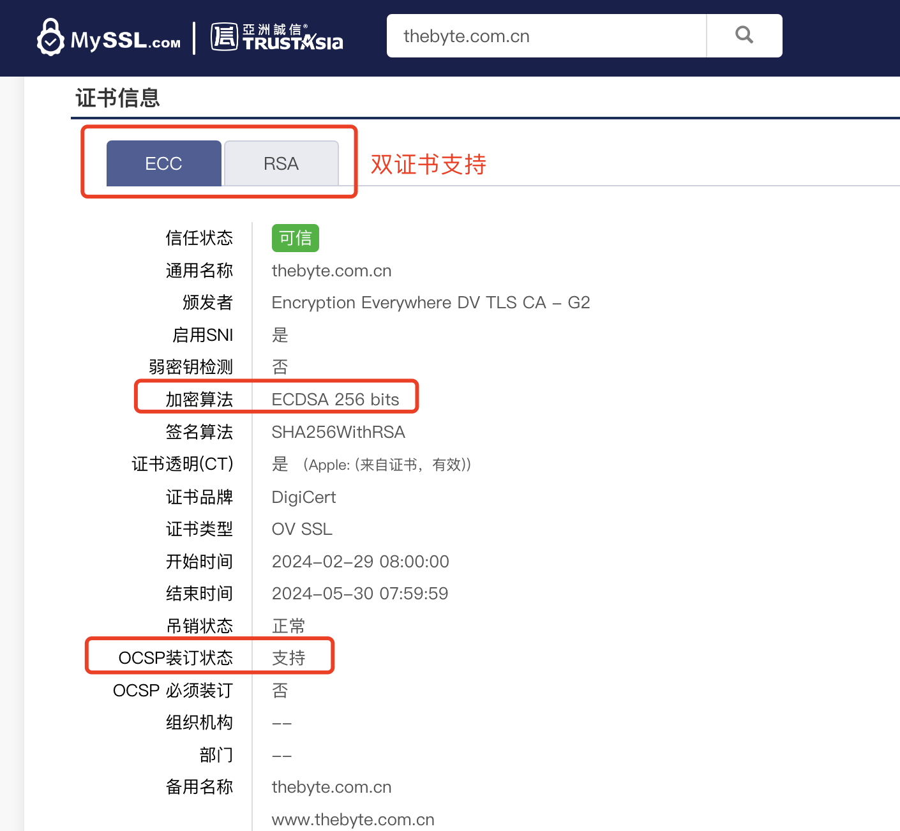

# 2.5.2 SSL 层优化实践

HTTPS 建立连接的过程中，TLS 握手阶段最长可以花费 2-RTT，除去握手延迟外，SSL 层还有其他的一些隐形消耗，不做任何优化措施情况下，网络耗时和加解密耗时影响会让 HTTPS 连接效率比 HTTP 慢上几百毫秒，在高延迟网络环境下，HTTPS 延迟问题更加明显。

2.5.1 节中，已介绍 SSL 层的原理，从中总结，对于 SSL 层的优化，我们从两个环节入手：**协议升级、证书优化**。

## 1. 协议升级

优化 SSL 层，效果最为明显的方式是升级最新 TLS1.3 协议[^1]。TLS 1.3 协议放弃了安全性较低的加密功能的支持，并改进了 TLS 握手流程。TLS 1.3 协议中的 TLS 握手只需要一次 RTT 而不是两次，如果客户端复用之前连接，TLS 握手的往返次数可以为零，这使 HTTPS 连接更快，能显著减少延迟并改善用户体验。如图 2-17 所示，如果使用 TLS 1.2 需要两次往返（ 2-RTT ）才能完成握手，然后才能发送请求。

<div  align="center">
	
    <p>图2-17 TLS1.2 握手流程</p>
</div>

相比 TLS1.2 协议，TLS 1.3 协议的握手时间减半，如图 2-18 所示。这意味着访问一个网站，使用 TLS 1.3 协议，会降低将近 100ms 的延时。

<div  align="center">
	
    <p>图2-18 TLS1.3 握手流程</p>
</div>

## 2.证书优化

SSL 层中的证书验证也是一个比较耗时的环节：服务器需要把自己的证书链全发给客户端，客户端接收后再逐一验证。证书环节我们关注两个方面优化：**证书传输优化** 、 **证书中非对称算法升级** 。

### 2.1 证书传输优化

客户端在验证证书过程中，需要判断当前证书状态[^2]，是否被撤销/过期等，需要再去访问 CA 下载 CRL 或者 OCSP 数据，这又会产生 DNS 查询、建立连接、收发数据等一系列网络通信，增加多个 RTT。

:::tip
- CRL（Certificate Revocation List）证书撤销列表，是由 CA 机构维护的一个列表，列表中包含已经被吊销的证书序列号和吊销时间。
- OCSP（Online Certificate Status Protocol）在线证书状态协议，是一种改进的证书状态确认方法，用于减轻证书吊销检查的负载和提高数据传输的私密性，相比于 CRL ，OCSP提供了实时验证证书状态的能力。[^3]
- OCSP Stapling 是 OCSP 的改进方案，将原本需要客户端实时发起的 OCSP 请求转嫁给服务端，服务端通过预先访问 CA 获取 OCSP 响应，然后在握手时随着证书一起发给客户端，免去了客户端连接 CA 服务器查询的环节，解决了 OCSP 的隐私和性能问题。[^4]
:::

1. 在 Nginx 中配置 OCSP Stapling 服务。
```nginx configuration
server {
    listen 443 ssl;
    server_name  thebyte.com.cn;
    index index.html;

    ssl_certificate         server.pem;#证书的.cer文件路径
    ssl_certificate_key     server-key.pem;#证书的.key文件

    # 开启 OCSP Stapling 当客户端访问时 NginX 将去指定的证书中查找 OCSP 服务的地址，获得响应内容后通过证书链下发给客户端。
    ssl_stapling on;
    ssl_stapling_verify on;# 启用OCSP响应验证，OCSP信息响应适用的证书
    ssl_trusted_certificate /path/to/xxx.pem;# 若 ssl_certificate 指令指定了完整的证书链，则 ssl_trusted_certificate 可省略。
    resolver 8.8.8.8 valid=60s;# 添加resolver解析OSCP响应服务器的主机名，valid表示缓存。
    resolver_timeout 2s;# resolver_timeout表示网络超时时间
}
```


2. 检查服务端是否已开启 OCSP Stapling。

```shell 
openssl s_client -connect thebyte.com.cn:443 -servername thebyte.com.cn -status -tlsextdebug < /dev/null 2>&1 | grep "OCSP" 
```
若结果中存在”successful“，则表示已开启 OCSP Stapling 服务。
```plain
OCSP response:
OCSP Response Data:
    OCSP Response Status: successful (0x0)
    Response Type: Basic OCSP Response
```

### 2.2 证书算法优化

目前 SSL 密钥交换 + 签名有三种主流的方式：

- RSA 密钥交换（无需签名）。
- ECDHE 密钥交换、RSA 签名。
- ECDHE 密钥交换、ECDSA 签名。

内置 ECDSA 公钥的证书一般被称之为 ECC 证书，内置 RSA 公钥的证书就是 RSA 证书，相比 RSA，ECC 证书具有安全性高，处理速度更快的优点，尤其适合在移动设备上使用。但是其唯一的缺点就是兼容性问题，古代的 XP 和 Android2.3 不支持这种加密方式。不过 Nginx 从 1.11.0 版本起开始提供了对 RSA/ECC 双证书的支持，它可以在 TLS 握手的时候根据客户端支持的加密方法选择对应的证书，以向下兼容古代客户端。

如图 2-19 所示，256 位 ECC Key 在安全性上等同于 3072 位 RSA Key，加上 ECC 运算速度更快，ECDHE 密钥交换 + ECDSA 数字签名无疑是最好的选择。由于同等安全条件下，ECC 算法所需的 Key 更短，所以 ECC 证书文件体积比 RSA 证书要小一些。

<div  align="center">
    
    <p>图2-19 ECC vs RSA</p>
</div>

在 Nginx 里可以用 ssl_ciphers、ssl_ecdh_curve 等指令配置服务器使用的密码套件和椭圆曲线，把优先使用的放在前面，配置示例：

```plain
ssl_dyn_rec_enable on;
ssl_protocols TLSv1.2 TLSv1.3;
ssl_ecdh_curve X25519:P-256;
ssl_ciphers EECDH+CHACHA20:EECDH+CHACHA20-draft:EECDH+ECDSA+AES128:EECDH+aRSA+AES128:RSA+AES128:EECDH+ECDSA+AES256:EECDH+aRSA+AES256:RSA+AES256:EECDH+ECDSA+3DES:EECDH+aRSA+3DES:RSA+3DES:!MD5;
ssl_prefer_server_ciphers on;
ssl_session_cache shared:SSL:20m;
ssl_session_timeout 15m;
ssl_session_tickets off;
```

配置完成之后，使用 https://myssl.com/ 服务测试证书配置，如图 2-20 所示。

<div  align="center">
    
    <p>图2-20 使用 myssl.com 测试证书</p>
</div>

## 3.SSL 优化效果

SSL 层的优化手段除了软件层面还有一些硬件加速的方案，例如使用支持 AES-NI 特性的 CPU、专用 QAT 加速卡[^5]。如表 2-2，通过对 ECC、RSA、TLS1.2、TLS1.3 等不同维度的测试，以获取最佳的配置方案。

表 2-2 HTTPS 不同维度的性能测试

|场景|QPS|Time|单次发出请求数|
|:--|:--|:--|:--|
|RSA 证书 + TLS1.2| 316.20| 316.254ms|100|
|RSA 证书 + TLS1.2 + QAT| 530.48| 188.507ms|100|
|RSA 证书 + TLS1.3| 303.01| 330.017ms|100|
|RSA 证书 + TLS1.3 + QAT| 499.29| 200.285ms|100|
|ECC 证书 + TLS1.2| 639.39| 203.319ms|100|
|ECC 证书 + TLS1.3| 627.39| 159.390ms|100|

从 SSL 加速的结果上看，使用 ECC 证书较 RSA 证书性能提升很多，即使 RSA 使用了 QAT 加速比起 ECC 还是存在差距。另外 QAT 方案的硬件成本、维护成本较高，综合考虑建议使用 TLS1.3 + ECC 证书方式。

[^1]: 参见 https://wiki.openssl.org/index.php/TLS1.3
[^2]: 参见 https://datatracker.ietf.org/doc/html/rfc3280
[^3]: 参见 https://datatracker.ietf.org/doc/html/rfc6960
[^4]: 参见 https://datatracker.ietf.org/doc/html/rfc6066#section-8
[^5]: 英特尔® Quick Assist Technology（简称 QAT）是 Intel 公司推出的一种专用硬件加速技术，可以用来提高 Web 服务器中计算密集的公钥加密以及数据压缩解压的吞吐率以及降低 CPU 负载。
