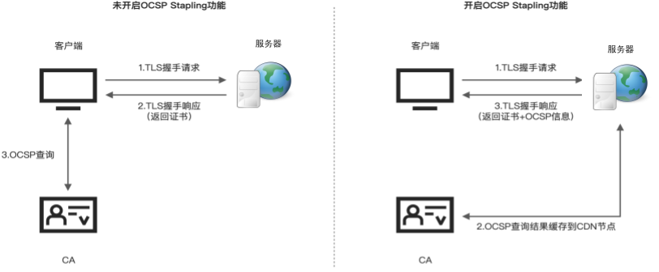

# 2.5.2 HTTPS 优化实践

HTTPS 的请求过程中，SSL 握手阶段中，客户端与服务端协商确认 TLS 版本、Cipher Suite（密码套件），验证数字证书，生成会话密钥等。不做任何优化的情况下，
HTTPS 的延迟要比 HTTP 高出几百毫秒，尤其在弱网环境下，HTTPS 的延迟问题更为突出。

在本文中，我们将通过升级 TLS 协议、选择合适的密码套件以及开启 OCSP Stapling 的方式来加快 HTTPS 请求的速度。


## 1. 使用 TLS1.3 协议 

2018 年发布的 TLS 1.3 协议优化了 SSL 握手过程，将握手缩短至 1 次 RTT，甚至可以复用之前连接时实现零 RTT（使用扩展 early_data ）。

以 Nginx 配置为例，确保 Nginx 版本为 1.13.0 及以上，OpenSSL 版本为 1.1.1 及以上，然后在配置文件中通过 ssl_protocols 指令增加 TLSv1.3 选项即可。

```nginx
server {
	listen 443 ssl;
	ssl_protocols TLSv1.2 TLSv1.3;

	# 其他 SSL 配置...
}
```

## 2. 使用 ECC 证书

HTTPS 数字证书分为 RSA 证书和 ECC 证书。两者的区别在于：
- RSA 证书使用的是 RSA 算法生成的公钥，兼容性好，但不支持 PFS （Perfect Forward Secrecy，完美前向保密。保证即使私钥泄露，也无法破解泄露之前通信内容）。
- ECC 证书使用的是椭圆曲线算法（Elliptic Curve Cryptography）生成的公钥，它的计算速度快，安全性高，支持 PFS，能以更小的密钥长度提供更高的安全性。例如，256 位的 ECC 密钥提供的安全性约等于 3072 位的 RSA 密钥。


相较于 RSA 证书，ECC 证书的唯一问题是兼容性要差一些。例如在 Windows XP 中，使用 ECC 证书的网站只有 Firefox 能访问（Firefox 的 TLS 自己实现，不依赖操作系统）；Android 平台中，也需要 Android 4+ 才支持 ECC 证书。

好消息是，Nginx 1.11.0 开始提供了对 RSA/ECC 双证书的支持。它的实现原理是：分析在 TLS 握手中双方协商得到的 Cipher Suite（密码套件），如果支持 ECDSA（数字证书签名算法）就返回 ECC 证书，否则返回 RSA 证书。Nginx 配置双证书支持如下所示：

```nginx
server {
	listen 443 ssl;
	ssl_protocols TLSv1.2 TLSv1.3;

	# RSA 证书
	ssl_certificate  /cert/rsa/fullchain.cer;
	ssl_certificate_key  /cert/rsa/thebyte.com.cn.key;
	# ECDSA 证书
	ssl_certificate  /cert/ecc/fullchain.cer;
	ssl_certificate_key  /cert/ecc/thebyte.com.cn.key;

    # 其他 SSL 配置...
}
```
但注意，并不是配置了 ECC 证书就一定生效。ECC 证书是否生效跟客户端与服务端协商到的密码套件（Cipher Suites）有直接关系。

密码套件影响通信双方使用的加密、认证算法和密钥交换算法，它的配置如下所示：

```nginx
server {
	# 设置协商加密算法时，优先使用我们服务端的加密套件，而不是客户端浏览器的加密套件。
	ssl_prefer_server_ciphers on;
	# 配置密码套件
    ssl_ciphers 'ECDHE+CHACHA20:ECDHE+CHACHA20-draft:ECDSA+AES128:ECDHE+AES128:RSA+AES128:RSA+3DES';

    # 其他 SSL 配置...
}
```
在服务器中，通过 openssl 查看上述配置（ssl_ciphers）支持的密码套件及优先级。

```bash
$ openssl ciphers -V 'ECDHE+CHACHA20:ECDHE+CHACHA20-draft:ECDSA+AES128:ECDHE+AES128:RSA+AES128:RSA+3DES' | column -t
0x13,0x02  -  TLS_AES_256_GCM_SHA384         TLSv1.3  Kx=any   Au=any    Enc=AESGCM(256)             Mac=AEAD
0x13,0x03  -  TLS_CHACHA20_POLY1305_SHA256   TLSv1.3  Kx=any   Au=any    Enc=CHACHA20/POLY1305(256)  Mac=AEAD
0x13,0x01  -  TLS_AES_128_GCM_SHA256         TLSv1.3  Kx=any   Au=any    Enc=AESGCM(128)             Mac=AEAD
0xCC,0xA9  -  ECDHE-ECDSA-CHACHA20-POLY1305  TLSv1.2  Kx=ECDH  Au=ECDSA  Enc=CHACHA20/POLY1305(256)  Mac=AEAD
0xCC,0xA8  -  ECDHE-RSA-CHACHA20-POLY1305    TLSv1.2  Kx=ECDH  Au=RSA    Enc=CHACHA20/POLY1305(256)  Mac=AEAD
0xC0,0x2B  -  ECDHE-ECDSA-AES128-GCM-SHA256  TLSv1.2  Kx=ECDH  Au=ECDSA  Enc=AESGCM(128)             Mac=AEAD
```

可以看到，使用 ECDSA 签名认证算法（Au=ECDSA）排在 RSA 签名认证算法（Au=RSA）之前。这样的优先级保证了优先使用 ECC 证书。


## 3. 调整 https 会话缓存

HTTPS 建立连接后，会生成一个 session 用于保存客户端和服务器之间的安全连接信息，如果 session 没有过期，后续的连接就能重复使用之前的握手过程结果。

与 session 相关的配置如下：
```nginx
server {
	ssl_session_cache shared:SSL:10m;
	ssl_session_timeout
}
```
上述配置的说明如下：
- ssl_session_cache 设置 ssl/tls会话缓存的类型和大小。shared:SSL:10m 表示所有的 nginx 工作进程共享 ssl 会话缓存，官网介绍 1M 可以存放约 4000 个 sessions。
- ssl_session_timeout 客户端可以重用会话缓存中 ssl 参数的过期时间。

## 4. 开启 OCSP stapling

客户端首次下载数字证书时需要向 CA 发起 OCSP（在线证书状态协议）请求，确认证书是否被撤销或过期。由于网络延迟，这个操作会导致产生 2s ~ 3s 不等的请求阻塞。

OCSP stapling（一般翻译为 OCSP 装订）是一项 TLS 的拓展。它查询 OCSP 接口的工作交给服务器来做，服务器通过低频次查询，将查询结果缓存到服务器中（默认缓存时间60分钟）。当有客户端向服务器发起 TLS 握手请求时，服务器将证书的 OCSP 信息随证书链一同发送给客户端，从而避免了客户端验证证书时产生的阻塞问题。

:::center
  <br/>
 图 2-24 OCSP Stapling 工作原理
:::

```nginx
server {
	ssl_stapling on;
	ssl_stapling_verify on;
	ssl_trusted_certificate /path/to/xxx.pem;
	resolver 8.8.8.8 valid=60s;# 
	resolver_timeout 2s;
}
``` 
要注意的是如果你的 CA 提供的 OCSP 需要验证的话，必须用 ssl_trusted_certificate 指定 CA 的中级证书和根证书（PEM 格式，放在一个文件中）的位置，否则会报错 ：[error] 17105#17105: OCSP_basic_verify() failed。

配置完成之后，使用 openssl 测试服务端是否已开启 OCSP Stapling 功能。

```bash 
$ openssl s_client -connect thebyte.com.cn:443 -servername thebyte.com.cn -status -tlsextdebug < /dev/null 2>&1 | grep "OCSP" 
OCSP response:
OCSP Response Data:
    OCSP Response Status: successful (0x0)
    Response Type: Basic OCSP Response
```
若结果中存在“successful”关键字，则表示已开启 OCSP Stapling 服务。


上述配置（（TLS1.3、ECC 证书、OCSP Stapling））完成之后，使用 https://myssl.com/ 服务验证是否生效，如图 2-20 所示。

:::center
  <br/>
 图 2-24 证书配置
:::

## 5. 优化效果

HTTPS 优化手段除了软件层面，还有一些硬件加速的方案，如使用 QAT 加速卡（Quick Assist Technology，Intel 公司推出的一种专用硬件加速技术）。

通过对不同的证书（ECC 和 RSA），不同的 TLS 协议（TLS1.2 和 TLS1.3）进行压测，测试结果如表 2-2 所示。

:::center
表 2-2 HTTPS 性能基准测试
:::
|场景|QPS|Time|单次发出请求数|
|:--|:--|:--|:--|
|RSA 证书 + TLS1.2| 316.20| 316.254ms|100|
|RSA 证书 + TLS1.2 + QAT| 530.48| 188.507ms|100|
|RSA 证书 + TLS1.3| 303.01| 330.017ms|100|
|RSA 证书 + TLS1.3 + QAT| 499.29| 200.285ms|100|
|ECC 证书 + TLS1.2| 639.39| 203.319ms|100|
|ECC 证书 + TLS1.3| 627.39| 159.390ms|100|

从测试结果上看，使用 ECC 证书明显比 RSA 证书性能提升很多。即使 RSA 证书使用了 QAT 加速，比起 ECC 证书的方式还是存在差距。此外，使用 QAT 加速要额外购买硬件，硬件成本以及维护成本都很高，不再推荐使用。

所以，HTTPS 优化配置推荐使用 TLS1.3 协议 + ECC 证书方式。