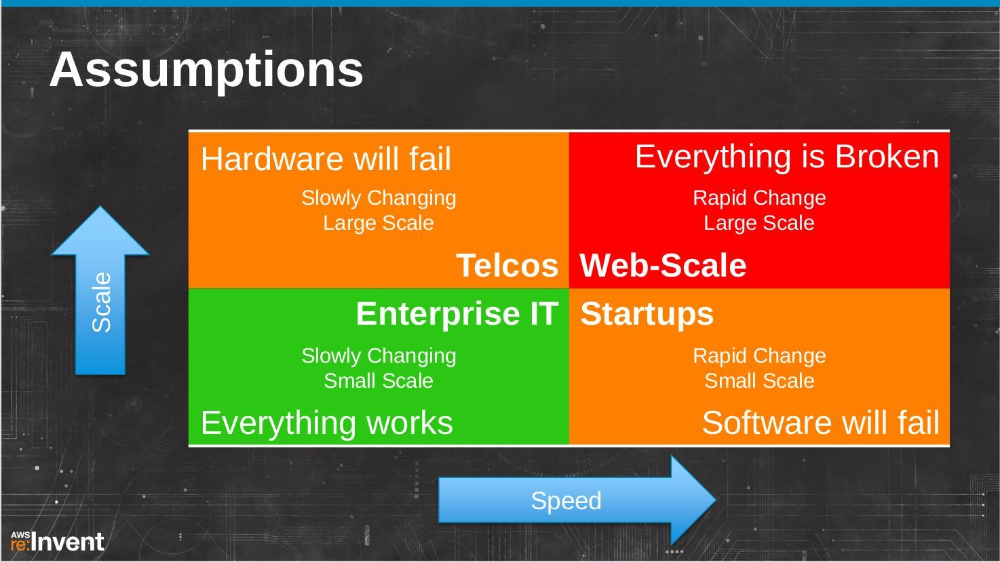

# 前言

如果你是一位互联网从业者，我猜出这几年你大概率被这些层出不穷的概念包围：云计算、PaaS、FaaS、CaaS、ServiceMesh、Serverless、可观测性、OLAP，当然不能遗漏了各种 Ops，诸如 DevOps、GitOps、MLOps、FinOps 等等。

近几年来，软件开发技术发生了翻天覆地的变化和革新，这也直接对如何构建上层应用产生了重大的影响。分析这些激动人心的技术变革以及讨论如何为业务赋能之前，我们先思考引发这一波技术浪潮的核心驱动力是什么？

## 软件在吞噬世界

互联网投资人 Mark Andreessen 曾发表过一篇文章《Software is Eating The World》，文章内容主要阐述了软件如何影响各个行业。援引原文部分内容：

:::tip <i></i>

我们处于戏剧性和广泛的技术和经济转变的中间，软件公司准备接管大量的经济。
...
十年前，当我在创办的 Netscape 公司时，大概只有 500 万人使用宽带互联网，而现在有超过 20 亿人使用宽带互联网。在接下来的 10 年里，我预计全球至少有 50 亿人拥有智能手机，每个人每天都可以随时随地使用这种手机充分利用互联网。
...
:::

文中列出了被重塑的产业，包括：最大的书店 Amazon、最多人订阅的 Video service Netflix、最大的音乐公司 iTunes 等等。

文章发表于 2011 年，2023 年再来回顾互联网的冲击，感触更加深刻，部分软件变成像水、电、媒一样的基础设施。

## 移动互联网在加剧变化

作者展望互联网规模时，写道「在接下来的 10 年里，我预计全球至少有 50 亿人拥有智能手机，每个人每天都可以随时随地使用手机充分利用互联网」。

现在，我们已经可以确认 Mark Andreessen 的预测很正确，移动互联网时代的用户规模已经开始向人口基数看齐，开始出现各类亿级 DAU 规模的移动应用。那么移动互联网如此巨大的用户规模会对软件开发有什么影响？援引 Netflix 分享中的一则总结，如图所示。

	
	
图 1 Netflix 按照规模和变更速度对软件企业划分的总结

在十年前乃至二十年前的互联网时代，大多数软件企业都位于图 1-8 左边的两个象限，规模或许有大有小，但是变更速度相对今天都不快。当企业发展壮大时，体现的也更多是在规模上，变更速度并不会发生质的变化。而今天的移动互联网时代，则都位于图 1 右边的两个象限：无论规模是大是小，变更速度都要求非常快。并且当企业逐步发展壮大，规模十倍百倍增长时，对变更速度的要求并不会降低，甚至会要求更快。

移动互联网时代，能够成长并发展起来的这些公司，他们的共同点是：

- 快速变更，不断创新，随时调整
- 提供持续可用的服务，应对各种可能的错误和中断
- 弹性可扩展的系统，应对用户规模的快速增长
- 提供新的用户体验，以移动为中心

这样的背景下，对软件开发有了更高的要求，软件开发的方式也不得不跟随时代而变化。

## 时代巨变掀起技术浪潮

软件对各行各业的渗透和对世界的改变，以及移动互联网时代巨大的用户基数下快速变更和不断创新的需求对软件开发方式带来巨大的推动力，我们清晰地看到如此波澜壮阔的技术浪潮：

- 软件正在改变世界。
- 移动互联网让这个变革影响到每一个人。
- 传统软件开发方式受到巨大的挑战。
- 因为云计算以及相关技术的普及，软件上云成为趋势。
- 云计算的形态持续在演进。

援引 InfoQ 主编徐川老师对云计算的总结：

:::tip 云计算技术总结
云计算的技术逐渐发展成为它本来该有的模样，以及与这样的云所匹配的软件架构，还有以及与这样的架构所匹配的开发流程与方法论。
:::

## 大时代下的个体

视角转回到个体，不管你是否接受，软件行业解决问题的技术一直在变化，并且**这种变化并不是平缓的升级，而是剧烈的革新替代**。譬如容器替代虚拟机、服务网格替代 SpringCloud、观测替代监控、Network Policy 替代 iptables 等等，这种替代导致软件开发中许多习以为常的假设全被打破。

剧烈变化的背景下，如果我们只专注于手头的工作，不抬头看天，过度关注于某个技术深度和细节，大革命来临的时候，之前关注的细节可能再也没有意义。

所以，本书很少描述某个软件如何安装、如何使用，而是思考问题的本质以及不同的解决方式，讨论它们的设计选择，探索些许核心原理，尝试悟透点技术发展的规律。例如网络优化受制于物理世界的枷锁，分布式系统演进是 CAP 定理的权衡选择，局限于时间与空间法则。近几年流行的容器、服务网格也不是什么黑科技，只是把计算机的基本原理、方法重新组合，换种形式解决业务变化带来的新问题。

读完本书，相信你对系统的整体运行一定有全新的认识与判断力：方案取舍、架构权衡将得心应手，各种症状处理更加游刃有余。

## 本书适合哪些读者

本书主要针对软件工程师、软件架构师以及技术负责人等，特别是那些需要对系统架构做权衡的人，譬如时常需要选择一些工具去解决某个领域的特定问题。退一步，即使你不需要做这些决定，本书也可以帮助你更好地理解这些技术的优缺点。

阅读本书，最好了解一些请求/响应型（Web）系统原理，熟悉一些常见的网络协议（譬如 TCP、HTTP 等）。如再有一些后端开发经验，这将会对阅读有很大帮助，至于你熟悉何种编程语言倒没有太大关系。

总体上讲，若以下条件适用你，你将从本书获取收益。

- 想了解业界的技术发展趋向和动态。
- 需要对系统架构做出权衡、洞察出各类设计陷阱。
- 需要构建高可用和健壮运行的系统。
- 对请求/响应式系统整体如何运行有着天然的兴趣和探索精神。

## 如何阅读本书

本书总共分为 4 大部分：

1. 第一部分，是全书的绪论，内容只有第 1 章。我们将从需求的背景、解决问题的角度讨论这几年技术架构演进的趋向。该部分适合所有读者，尤其是希望了解近期技术发展概况的人士。

2. 第二部分，主题是网络。实现高可用服务的前提是，确保用户请求顺利到达服务端。我们将从一道经典的面试题“浏览器打开 url 到页面展现，中间发生了什么？”出发，了解贯穿其中的整个网络请求链路，并努力实现“足够快”目标（第 2 章）。紧接着，跟着网络数据包进入内核网络，学习操作系统制定的根本规则、了解内核中各个模块/设备如何有机协作（第 3 章），最后根据网络数据包的转发/处理，讨论四层及七层负载均衡的设计模式和工作原理（第 4 章）。

3. 第三部分，内容关于分布式系统，我们先认识什么是数据一致性，然后讨论 CAP 定理以及受它影响而来的各个分布式事务模型（第 5 章）。接下来，我们向分布式副本容错模型进军，这是实现分布式系统可靠性的关键，其中的难点在于网络不可靠、节点可能宕机的环境下，如何实现共识（第 6 章）。
3. 第四部分，主题是基础设施的变革，我们先了解 Google 内部系统是怎么演变的，学习 Kubernetes 中关于计算、网络、存储逻辑中设计（第 7 章）。然后，回顾这十几年间服务通信的演化历史，搞清楚服务网格技术是如何出现的、解决了什么问题（第 8 章）。接下来的课题是根据系统运行状态的蛛丝马迹，保障复杂分布式系统的可靠运行（第 9 章）。最后第 10 章是提高生产力的秘籍，将介绍一种以声明式系统为基座、以 Git 为单一可信源的交付模型。

## 致谢

首先感谢我的爱人，在我决定下笔之际义无反顾地担负起照顾两个孩子的责任，并在两年时间内忍受我将工作之余的时间全部用在写作上，没有她的支持我无法完成该著作。

本书部分内容来源于我过往实践的总结，其次也参考了大量他人的思想、论文和著作，这些内容我已在本书脚注、内容备注和结论参考等不同形式呈现，如果您对这部分内容感兴趣，可以继续扩展阅读。

最后，谨以此书，献给我的家人以及热爱技术的朋友们。

## 勘误

限于作者的认知和精力，本书难免产生各种各样的错误。如果您在阅读时发现问题，欢迎评判指正，我将继续在本书的网址 [https://www.thebyte.com.cn/](https://www.thebyte.com.cn/) 进行勘误修正。

