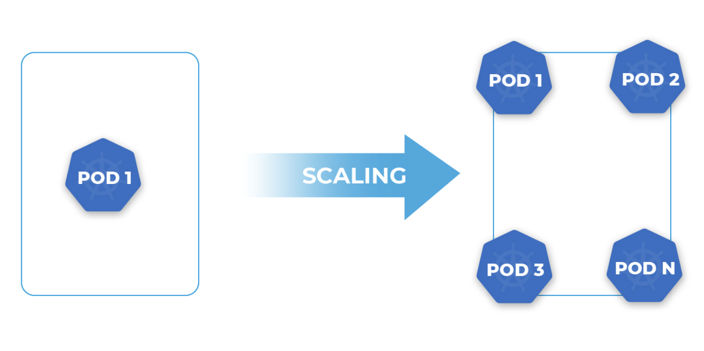

# 弹性伸缩

弹性伸缩意思通过应用云计算弹性伸缩的功能实现业务量增减资源的合理应用，对于弹性伸缩的意义，总结来说：

- 峰值负载应对：促销活动、节假日购物季或突发事件根据需求快速扩展资源，保证应用可用性和性能。
- 提高资源利用率：根据实际资源负载动态调整资源规模，避免基础设施资源浪费，降低 TCO。
- 应对故障和容错：多实例部署和快速替换，提高业务连续性和可用性。
- 跟随需求变化：匹配前端的业务需求及压力，快速调整规模，提高事件应对能力，满足需求和期望


## Horizontal Pod Autoscaling

Kubernetes 自身提供一种弹性伸缩的机制，包括 Vertical Pod Autoscaler (VPA) 和 Horizontal Pod Autoscaler (HPA)。HPA 根据 CPU 、内存利用率增加或减少副本控制器的 pod 数量，它是一个扩缩资源规模的功能特性。

HPA 依赖 Metrics-Server 捕获 CPU、内存数据来提供资源使用测量数据，也可以根据自定义指标（如 Prometheus）进行扩缩。

<div  align="center">
	
</div>

由上图看出，HPA 持续监控 Metrics-Server 的指标情况，然后计算所需的副本数动态调整资源副本，实现设置目标资源值的水平伸缩。

下面示例，创建一个 HPA, 期望 CPU 的利用率为 70%，副本数的范围是 1-10，操作对象名 nginx-deployment 为 Deployment 。

```plain
apiVersion: autoscaling/v2beta1
kind: HorizontalPodAutoscaler
metadata:
  name: scale
  namespace: default
spec:
  maxReplicas: 10                    # 目标资源的最大副本数量
  minReplicas: 1                     # 目标资源的最小副本数量
  metrics:                           # 度量指标，期望CPU的利用率为70%
  - resource:
      name: cpu
      targetAverageUtilization: 70
    type: Resource
  scaleTargetRef:                    # 目标资源
    apiVersion: apps/v1
    kind: Deployment
    name: nginx-deployment
```

使用 HPA 对资源进行伸缩，也存在一定局限性：

- 无外部指标支持。如不同的事件源，不同的中间件/应用程序等，业务端的应用程序变化及依赖是多样的，不只是基于 CPU 和内存扩展。
- 无法 1->0。应用程序总有 0 负载的时候，此时不能不运行工作负载吗？

所以就有了 Kubernetes-based Event-Driven Autoscaling（KEDA）！

## 利用事件驱动 Keda 进行弹性伸缩

Kubernetes 自带的 HPA 仅支持 CPU/MEM 等有限的指标，但事实情况这些指标不一定就能代表服务的负载情况，比如消息服务器，如果消息堆积过多，我们希望启用更多的 Customer 处理消息，这种情况下就可以使用 Keda。

KEDA 是 Kubernetes 基于事件驱动的自动伸缩工具，通过 KEDA 我们可以根据需要处理的事件数量来驱动 Kubernetes 中任何容器的扩展。