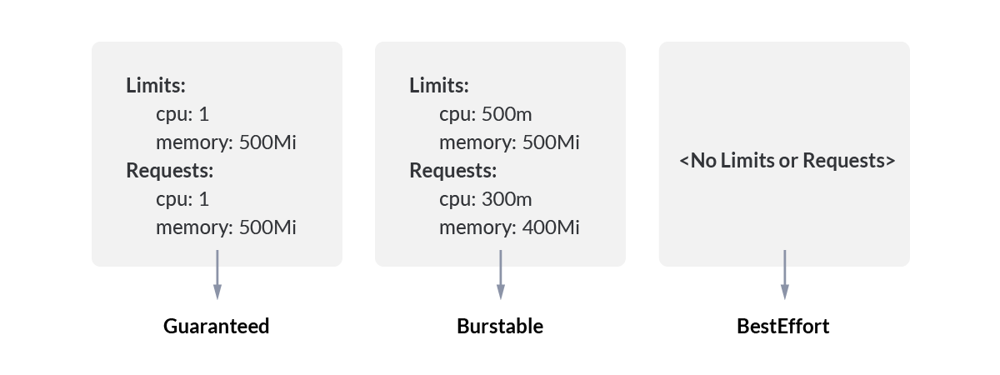

# 8.5.3 服务质量 Qos

kubernetes 根据 Pod 内容器内 requests、limits 的设置定义了几类不同的 Pod QoS 级别。在一个超用 （Over Committed，容器 limits 总和大于系统容量上限）系统中，由于容器负载波动会导致操作系统资源不足，最终可能导致部分容器被杀掉。QoS 级别决定了 kubernetes 处理这些 pod 的方式

K8s 将容器划分为 3 个 Qos 等级，这种优先级依次递减。

| QoS 级别| QoS 介绍 |
|:--|:--|
|Guaranteed| Pod 中的每个容器，包含初始化容器，必须指定内存和 CPU 的 requests 和 limits，并且两者要相等 |
|Burstable| Pod 不符合 Guaranteed QoS 类的标准；Pod 中至少一个容器具有内存或 CPU requests |
|BestEffort | Pod 中的容器必须没有设置内存和 CPU requests 或 limits |

	

我们以内存资源为例，当 Node 节点上内存资源不够的时：

- QoS 级别是 BestEffort 的 Pod 会最先被 kill 掉
- 如果 BestEffort 级别的 POD 已经被 kill 掉了，则继续查找 Burstable 级别的 Pod kill 掉。
- 如果 BestEffort 和 Burstable 的 Pod 都已经被 kill 掉，那么继续查找 Guaranteed 的 Pod，并且这些 pod 使用的内存已经超出了 limits 限制，这些被找到的 pod 会被 kill 掉