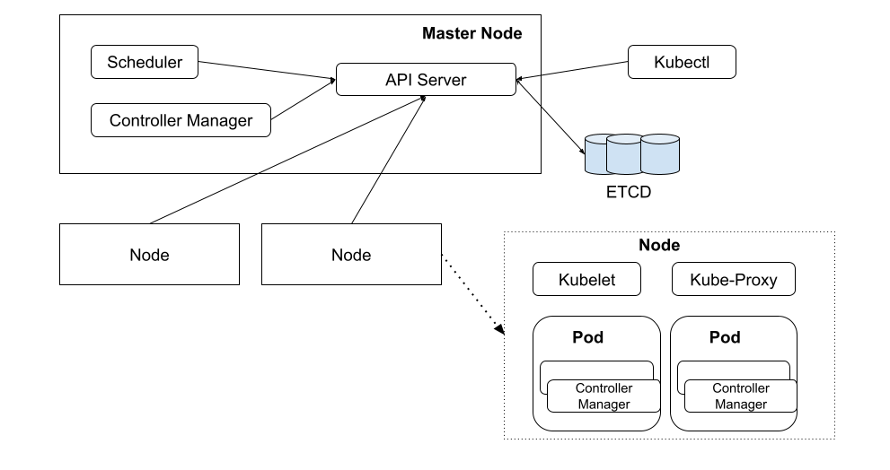

# 8.3 Kubernetes 系统架构

Kubernetes 是典型的主从架构。有两部分组成：管理者被称为 Control Plane（控制平面）、被管理者称为 Node（节点）。

	
	
图 Kubernetes 架构

## 1. Control Plane

Control Plane 是集群管理者，在逻辑上只有一个。按照习惯称呼，我们也可把该计算机称之为 Master 节点。Control Plane 对节点进行统一管理，调度资源并操作 Pod，它的目标就是使得用户创建的各种 Kubernetes 对象按照其配置所描述的状态运行。它包含如下组件：

- API Server： 操作 Kubernetes 各个资源的应用接口。并提供认证、授权、访问控制、API 注册和发现等机制。
- Scheduler（调度器）：负责调度 Pod 到合适的 Node 上。例如，通过 API Server 创建 Pod 后，Scheduler 将按照调度策略寻找一个合适的 Node。
- Controller Manager（集群控制器）：负责执行对集群的管理操作。例如，按照预期增加或者删除 Pod，按照既定顺序系统一系列 Pod。

## 2. Node

Node 通常也被称为工作节点，可以有多个，用于运行 Pod 并根据 Control Plane 的命令管理各个 Pod，它包含如下组件：

- Kubelet 是 Kubernetes 在 Node 节点上运行的代理，负责所在 Node 上 Pod 创建、销毁等整个生命周期的管理。
- Kube-proxy 在 Kubernetes 中，将一组特定的 Pod 抽象为 Service，Kube-proxy 通过维护节点上的网络规则，为 Service 提供集群内服务发现和负载均衡功能。
- Container runtime (容器运行时)：负责 Pod 和 内部容器的运行。在第七章已经介绍过各类容器运行时，Kubernetes 支持多种容器运行时，如 containerd、Docker 等。