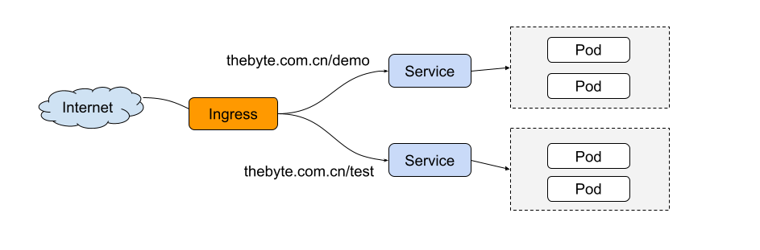
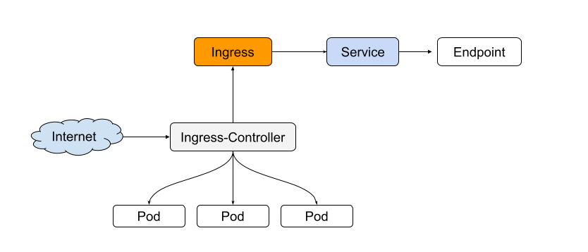

# 8.4.5 Ingress

在 Kubernetes 中，为了使外部的应用能够访问集群内的 service，最为常用的是使用 NodePort 和 LoadBalancer 两种类型的 service，但它们在使用上还是有一些限制，譬如对外提供访问时，NodePort 类型需要在外部搭建额外的负载均衡，其次 NodePort 会占用很多集群机器的端口。而 LoadBalancer 要求 Kubernetes 必须跑在支持的 Cloud Provider 上，由云厂商提供公网 IP 地址，当同时当存在多个 LoadBalancer 的类型 Service 时，会占用大量公网 ip 地址。 以上的问题有没有解决方案呢？ 答案是使用 Ingress。

Ingress 是英文入口的意思，在 Kubernetes 中，Ingress 用于定义如何从集群外部访问 Kubernetes 内部服务，是对集群中服务的外部访问进行管理的 API 对象。典型的访问方式，譬如 HTTP 和 HTTPS，另外也可提供负载均衡、SSL 卸载和基于名称的虚拟托管服务等功能。

<div  align="center">
	
</div>

## Ingress 的工作机制

要想使用 Ingress 功能，必须在 Kubernetes 集群上安装 Ingress Controller。Ingress Controller 有很多种实现，最常见的就是 Kubernetes 官方维护的 NGINX Ingress Controller。

外部请求首先到达 Ingress Controller，Ingress Controller 根据 Ingress 的路由规则，查找到对应的 Service，进而通过 Endpoint 查询到 Pod 的 IP 地址，然后将请求转发给 Pod。

<div  align="center">
	
</div>

## 创建 Ingress

下面例子中，使用 http 协议，关联的后端 Service 为 `nginx:8080`，使用 ELB 作为 Ingress 控制器（metadata.annotations 字段都是指定使用哪个 ELB 实例），当访问`http://192.168.10.155:8080/test”时，流量转发“nginx:8080`对应的 Service，从而将流量转发到对应 Pod。

```plain
apiVersion: networking.k8s.io/v1beta1
kind: Ingress
metadata:
  name: test-ingress
  annotations:
    kubernetes.io/ingress.class: cce
    kubernetes.io/elb.port: '8080'
    kubernetes.io/elb.ip: 192.168.10.155
    kubernetes.io/elb.id: aa7cf5ec-7218-4c43-98d4-c36c0744667a
spec:
  rules:
  - host: ''
    http:
      paths:
      - backend:
          serviceName: nginx
          servicePort: 8080
        path: "/test"
        property:
          ingress.beta.kubernetes.io/url-match-mode: STARTS_WITH
```

Ingress 中还可以设置外部域名，这样您就可以通过域名来访问到 ELB，进而访问到后端服务。

```plain
spec:
  rules:
  - host: www.thebyte.com.cn      # 域名
    http:
      paths:
      - path: /
        backend:
          serviceName: nginx
          servicePort: 80

```

## 路由到多个服务

Ingress 可以同时路由到多个服务，配置如下所示。

- 当访问“http://www.thebyte.com.cn/test”时，访问的是“s1:80”后端。
- 当访问“http://www.thebyte.com.cn/demo”时，访问的是“s2:80”后端。

```plain
spec:
  rules:
  - host: www.thebyte.com.cn  # host地址
    http:
      paths:
      - path: "/test"
        backend:
          serviceName: s1
          servicePort: 80
      - path: "/demo"
        backend:
          serviceName: s2
          servicePort: 80
```