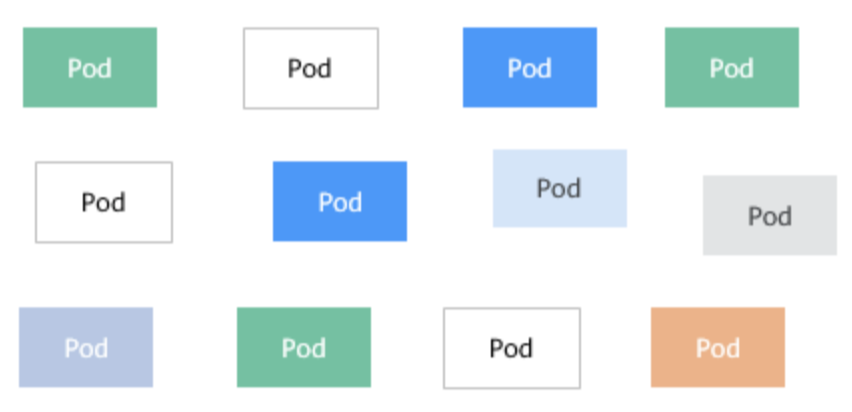
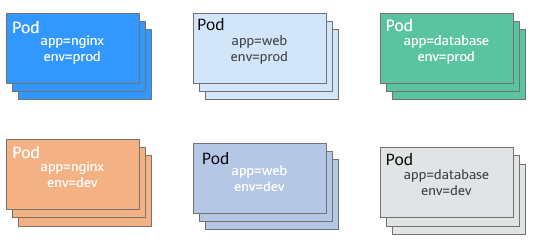

# Label 

当资源变得非常多的时候，如何分类管理就非常重要了，Kubernetes 提供了一种机制来为资源分类，那就是Label（标签）。Label 非常简单，但是却很强大，Kubernetes中几乎所有资源都可以用Label来组织。

Label的具体形式是key-value的标记对，可以在创建资源的时候设置，也可以在后期添加和修改。

以 Pod 为例，当Pod变得多起来后，就显得杂乱且难以管理，如下图所示。

图1 没有分类组织的Pod

	

如果我们为Pod打上不同标签，那情况就完全不同了，如下图所示。

图2 使用 Label 组织的Pod

	

