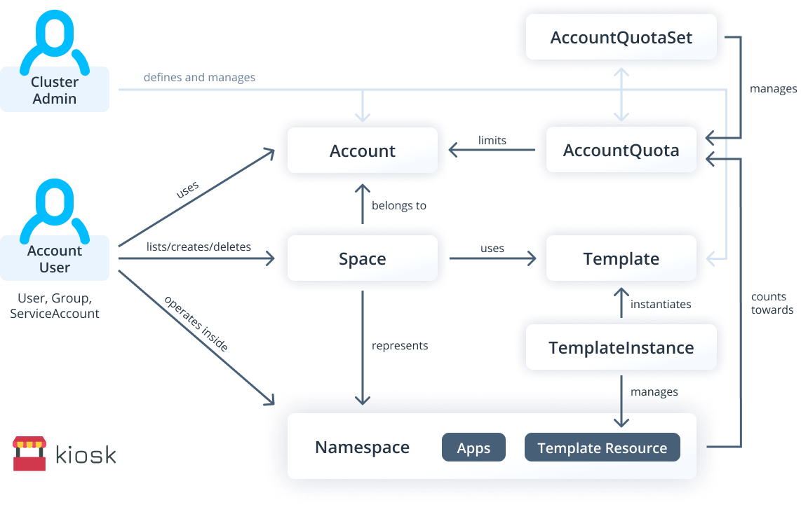
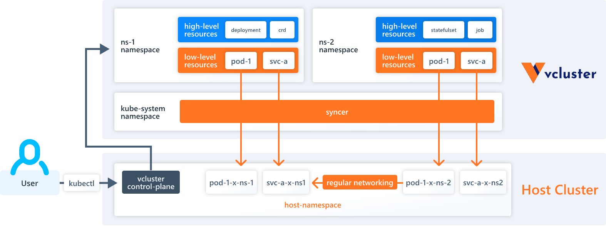

# 8.2 多租户与资源隔离

企业组织在使用 Kubernetes 时，为简化运维以及降低资源成本，通常组织内各个部门、团队需要共享使用 Kubernetes 集群（多租户）。Kubernetes 集群并非天然地支持多租户，但它提供了一些列可被用于实现多租户的基础功能，基于这些功能，Kubernetes 社区也出现了一批较为成熟的多租户实现方案。

## 多租户的隔离性

Kubernetes 中多租户的隔离性集中在两个方面：
- 控制面的隔离性，主要是隔离不同租户间能够访问哪些 API。
- 数据面的隔离性，比如说业务在实际运行起来之后，不能去占用别人的计算资源、存储资源等。

### 控制面的隔离

Kubernetes 提供了三个机制来实现控制平面的隔离：namespace、RBAC 和 quota。

- Namespace 来做资源组织和划分，使用多 Namespace 可以将包含很多组件的系统分成不同的组。此外，namespace 也限定 RBAC 以及 quota 的作用范围。
- RBAC 被用来限定用户或者负载对 API 的访问权限。通过设定合适的 RBAC 规则，可以实现对 API 资源的隔离访问。
- ResourceQuota 可以被用来限制 namespace 下各类资源的使用上限，以防止某个 namespace 占据过多的集群资源而影响其他 namespace 下的应用。不过使用 ResourceQuota 有一个限制条件，即要求 namespace 下的每个容器都指定 resource request 和 limit。

### 数据平面隔离

数据平面的隔离主要分为三个方面：容器运行时、存储和网络。

- 由于容器和宿主机共享内核，应用程序或者主机系统上的漏洞可能被攻击者所利用，从而突破容器边界而攻击到主机或者其他容器。解决方法通常是将容器放到一个隔离的环境中运行，例如虚拟机或者是用户态 kernel。前者以 Kata Containers 为代表，后者的代表则是 gVisor。
- 存储的隔离应保证 volume 不会跨租户访问。由于 StorageClass 是集群范围的资源，为防止 PV 被跨租户访问，应指定其 reclaimPolicy 为 Delete。此外，也应禁止使用例如 hostPath 这样的 volume，以避免节点的本地存储被滥用。

- 网络隔离：Namespace 的组织上划分对运行的对象来说，它不能做到真正的隔离。举例来说，如果两个 Namespace 下的 Pod 知道对方的 IP，而 Kubernetes 依赖的底层网络没有提供 Namespace 之间的网络隔离的话，那这两个 Pod 就可以互相访问。Kubernetes 提供了 NetworkPolicy，支持按 Namespace 级别的网络隔离，需要注意的是，使用 NetworkPolicy 需要特定的网络解决方案，如果不启用，即使配置了 NetworkPolicy 也无济于事，生产环境中可以 Calico 配合 NetworkPolicy 实现业务需要的安全组策略。

## 多租户解决方案

Kubernetes 社区有许多开源项目专门解决多租户问题。从大方向上，它们分为两类。一类是以 namespace 为边界划分租户，另一类则为租户提供虚拟控制平面

### 按 namespace 划分租户

Kubernetes 的控制平面隔离中的 RBAC 和 ResourceQuota 均以 namespace 为边界，因此以 namespace 来划分租户是比较自然的想法。不过，在现实中，限定一个租户只能使用一个命名空间存在较大局限性。例如无法进一步以团队，或者以应用为粒度进行细分，造成一定的管理难度。因此 Kubernetes 官方提供了支持层级化 namespace 的 controller。此外，第三方开源项目例如 Capsule 和 kiosk 提供了更为丰富的多租户支持。

	

### 虚拟控制平面

另一种多租户的实现方案是为每个租户提供一个独立的虚拟控制平面，以彻底隔离租户的资源。

虚拟控制平面的实现方式通常是为每个租户运行一套独立的 apiserver，同时利用 controller 将租户 apiserver 中的资源同步到原 Kubernetes 集群中。每个租户只能访问自己对应的 apiserver，而原 Kubernetes 集群的 apiserver 则通常不对外访问。

这类方案的代价是额外的 apiserver 的开销，但能够获得更为彻底的控制平面隔离。结合数据平面的隔离技术，虚拟控制平面可以实现更为彻底和安全的多租户方案。此类方案以 vcluster 项目为代表。

	

## 小结

通常来说，按 namespace 划分租户的隔离性和自由度会略有欠缺，但优势在于轻量。对于多团队共享使用的场景，按 namespace 划分租户较为合适。而对于商业用户共享使用的场景，选择虚拟控制平面通常能够提供更好的隔离保障。