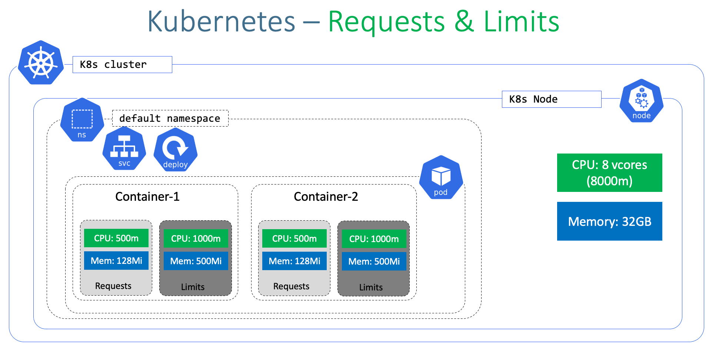

# 8.5.2 容器资源限制：requests 与 limits 

Kubernetes 通过配置 Pod 内容器的 requests (资源需求） 和 limits (资源限制) 属性分配内存和 CPU 资源，以防止资源匮乏并调整云成本。

- requests 容器需要的最小资源量。举例来讲，对于一个 Spring Boot 业务容器，这里的 requests 必须是容器镜像中 JVM 虚拟机需要占用的最少资源。
- limits 容器最大可以消耗的资源上限，防止过量消耗资源导致资源短缺甚至宕机。

<div  align="center">
	
</div>


每一个容器都可以独立地设定相应的 requests 和 limits 。这 2 个参数通过每个容器 resources 字段进行设置。
，当设置 limits 而没有设置 requests 时，Kubernetes 默认令 requests 等于 limits 。

```plain
container:
	resources:  
	    requests:    
	        cpu: 50m
	        memory: 50Mi
	   limits:    
	        cpu: 100m
	        memory: 100Mi
```

该资源对象指定容器进程需要 50/1000 核（5%）才能被调度，并且允许最多使用 100/1000 核（10%）。


## 集群稳定性建议

集群的稳定性直接决定了其上运行的业务应用的稳定性。而临时性的资源短缺往往是导致集群不稳定的主要因素。

那么如何提高集群的稳定性呢？一方面，可以通过编辑 Kubelet 配置文件来预留一部分系统资源，从而保证当可用计算资源较少时 kubelet 所在节点的稳定性。 这在处理如内存和硬盘之类的不可压缩资源时尤为重要。另一方面，通过合理地设置 pod 的 QoS 可以进一步提高集群稳定性：不同 QoS 的 Pod 具有不同的 OOM 分数，当出现资源不足时，集群会优先 Kill 掉 Best-Effort 类型的 Pod ，其次是 Burstable 类型的 Pod ，最后是 Guaranteed 类型的 Pod 。因此，如果资源充足，可将 QoS pods 类型均设置为 Guaranteed 。用计算资源换业务性能和稳定性，减少排查问题时间和成本。同时如果想更好的提高资源利用率，业务服务也可以设置为 Guaranteed ，而其他服务根据重要程度可分别设置为 Burstable 或 Best-Effort 。