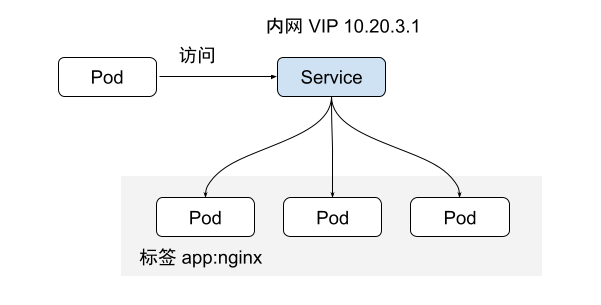
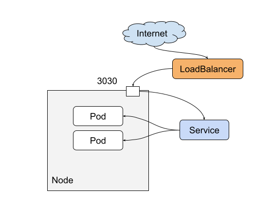

# 8.4.3 Service

## Pod 访问问题

Pod 被创建之后，该如何访问呢？直接访问 Pod 会有以下几个问题：

- Pod 的 IP 地址是在 Pod 启动后才被分配，在启动前并不知道 Pod 的 IP 地址。
- Pod 的 IP 存在变化的可能性，被 Deployment 重建 IP 就会发生变化。
- 应用服务往往是一组 Pod 组成，逐个访问 Pod 也不现实。

为了以一种固定的方式访问 Pod，Kubernetes 提供了一种负载均衡和服务发现的机制： Service。Service 创建后会提供一个固定的虚拟 IP(以 ClusterIP 类型的 Service 为例), 这样，用户无需关心 Pod 在哪个节点，通过固定 Service IP 即可实现对 Pod 地访问，并且 Service 可以对访问进行负载均衡。


示例：创建一个 Service

```plain
apiVersion: v1
kind: Service
metadata:
  name: nginx        # Service的名称
spec:
  selector:          # Label Selector，选择包含app=nginx标签的Pod
    app: nginx
  ports:
  - name: service0
    targetPort: 80   # Pod的端口
    port: 8080       # Service对外暴露的端口
    protocol: TCP    # 转发协议类型，支持TCP和UDP
  type: ClusterIP    # Service的类型
```

<div  align="center">
	
</div>

### 使用 ServiceName 访问 Service

使用 IP 直连有一个问题，如果 Service 被删除，相应的 Cluster IP 也会被回收。域名发现

为此 Kubernetes 结合 DNS 的。CoreDNS 安装成功后会成为 DNS 服务器，当创建 Service 后，CoreDNS 会将 Service 的名称与 IP 记录起来，这样 Pod 就可以通过向 CoreDNS 查询 Service 的名称获得 Service 的 IP 地址。


coreDNS 提供格式如 `<service-name>.<namespace-name>.svs.cluster.local` 的服务，访问该地址，集群内的域名解析解析服务器会返回该服务所对应的 A 记录。实际使用中，同一个命名空间下可以省略`<namespace>.svc.cluster.local`，直接使用 ServiceName 即可。

例如上面创建的名为 nginx 的 Service，直接通过 `nginx:8080` 就可以访问到 Service，进而访问 Pod， 这样无需感知具体 Service 的 IP 地址。

## Service 类型

Service 的类型除了 ClusterIP 还有 NodePort、LoadBalancer 和 Headless Service，这几种类型的 Service 有着不同的用途。

- ClusterIP：用于在集群内部互相访问的场景，通过 ClusterIP 访问 Service。
- NodePort：用于从集群外部访问的场景，通过节点上的端口访问 Service，详细介绍请参见 NodePort 类型的 Service。
- LoadBalancer：用于从集群外部访问的场景，其实是 NodePort 的扩展，通过一个特定的 LoadBalancer 访问 Service，这个 LoadBalancer 将请求转发到节点的 NodePort，而外部只需要访问 LoadBalancer。
- Headless Service：用于 Pod 间互相发现，该类型的 Service 并不会分配单独的 ClusterIP， 而且集群也不会为它们进行负载均衡和路由。您可通过指定 spec.clusterIP 字段的值为 “None” 来创建 Headless Service。

### NodePort 类型的 Service

NodePort 类型的 Service 可以让 Kubernetes 集群每个节点上保留一个相同的端口， 外部访问连接首先访问节点 IP:Port，然后将这些连接转发给服务对应的 Pod。如下图所示。

下面是一个创建 NodePort 类型的 Service。创建完成后，可以通过节点的 IP:Port访问到后台 Pod

```plain
apiVersion: v1
kind: Service
metadata:
  name: nodeport-service
spec:
  type: NodePort
  ports:
  - port: 8080
    targetPort: 80
    nodePort: 3030
  selector:
    app: nginx
```

### LoadBalancer 类型的 Service

LoadBalancer 类型的 Service 其实是 NodePort 类型 Service 的扩展，通过一个特定的 LoadBalancer 访问 Service，这个 LoadBalancer 将请求转发到节点的 NodePort。

LoadBalancer 本身不是属于 Kubernetes 的组件，这部分通常是由具体厂商（云服务提供商）提供，不同厂商的 Kubernetes 集群与 LoadBalancer 的 对接实现各不相同，例如 CCE 对接了 ELB。这就导致了创建 LoadBalancer 类型的 Service 有不同的实现。

<div  align="center">
	
</div>


下面是一个创建 LoadBalancer 类型的 Service。创建完成后，可以通过 ELB 的 IP:Port访问到后台 Pod

```plain
apiVersion: v1 
kind: Service 
metadata: 
  annotations:   
    kubernetes.io/elb.id: 3c7caa5a-a641-4bff-801a-feace27424b6
  labels: 
    app: nginx 
  name: nginx 
spec: 
  loadBalancerIP: 10.28.12.100     # ELB实例的IP地址
  ports: 
  - name: service0 
    port: 80
    protocol: TCP 
    targetPort: 80
    nodePort: 3030
  selector: 
    app: nginx 
  type: LoadBalancer    # 类型为LoadBalancer 
```

### Headless Service

前面讲的 Service 解决了 Pod 的内外部访问问题，允许客户端连接到 Service 关联的某个 Pod。但还有下面这些问题没解决。

- 同时访问所有 Pod
- 一个 Service 内部的 Pod 互相访问

为了解决以上问题，Kubernetes 提供了另一种较为特殊的 Service 类型，称为 Headless Service。

对于其他 Service 来说，客户端在访问服务时，DNS 查询时只会返回 Service 的 ClusterIP 地址，具体访问到哪个 Pod 是由集群转发规则（IPVS 或 iptables）决定的。而 Headless Service 并不会分配单独的 ClusterIP，在进行 DNS 查询时会返回所有 Pod 的 DNS 记录，这样就可查询到每个 Pod 的 IP 地址。StatefulSet 中 StatefulSet 正是使用 Headless Service 解决 Pod 间互相访问的问题

```plain
apiVersion: v1
kind: Service       # 对象类型为Service
metadata:
  name: nginx-headless
  labels:
    app: nginx
spec:
  ports:
    - name: nginx     # Pod间通信的端口名称
      port: 80        # Pod间通信的端口号
  selector:
    app: nginx        # 选择标签为app:nginx的Pod
  clusterIP: None     # 必须设置为None，表示Headless Service
```
创建完成后可以查询 Service。

```plain
# kubectl get svc
NAME             TYPE        CLUSTER-IP   EXTERNAL-IP   PORT(S)   AGE
nginx-headless   ClusterIP   None         <none>        80/TCP    5s
```

创建一个 Pod 来查询 DNS，可以看到能返回所有 Pod 的记录，这就解决了访问所有 Pod 的问题了。

```plain
$ kubectl run -i --tty --image tutum/dnsutils dnsutils --restart=Never --rm /bin/sh
If you don't see a command prompt, try pressing enter.
/ # nslookup nginx-headless
Server:         10.247.3.10
Address:        10.247.3.10#53

Name:   nginx-headless.default.svc.cluster.local
Address: 172.16.0.31
Name:   nginx-headless.default.svc.cluster.local
Address: 172.16.0.18
Name:   nginx-headless.default.svc.cluster.local
Address: 172.16.0.19
```
