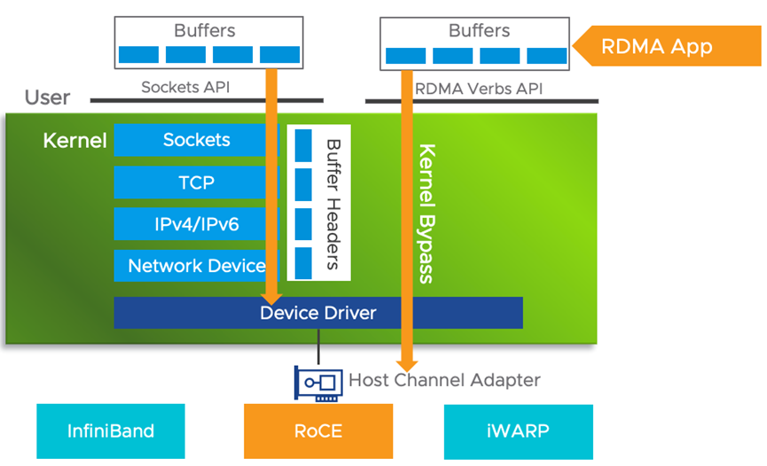
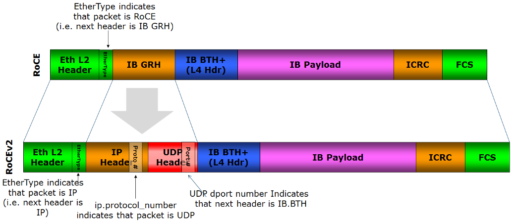

# 3.4.3 远程直接内存访问 RDMA

尽管现在数据中心内部已经提供了足够高的带宽，但传统的 TCP/IP 协议栈仍然面临着高延迟、单核吞吐量低以及 CPU 开销大的问题。近年来，随着人工智能、分布式训练和分布式数据存储对低延迟和高吞吐量数据传输需求的迅速增长，原本主要应用于高性能计算领域的 RDMA 技术，逐渐成为满足这些需求的首选解决方案。

RDMA（Remote Direct Memeory Access，远程直接内存访问）是一种绕过远程主机操作系统访问其内存中数据的技术，概念源自于 DMA 技术。在 DMA 技术中，外部设备（PCIe 设备）能够绕过 CPU 直接访问主机内存；而 RDMA 则是指外部设备绕过 TCP/IP 网络协议栈，一次跨主机的网络请求就像读取本地内存一样。

RDMA 的工作原理如下图所示，RDMA 绕过了传统以太网复杂的 TCP/IP 协议栈，直接从网卡硬件上开始网络数据传递。由于不经过操作系统，不仅节省了大量 CPU 资源，同样也提高了系统吞吐量、降低了系统的网络通信延迟。

:::center
   
  图  RDMA 技术栈
:::

RDMA 网络主要由三种协议实现：Infiniband、RoCE 和 iWARP，它们的含义与区别如下：

- Infiniband（无限带宽）是一种专门为 RDMA 设计的网络协议，由 IBTA（InfiniBand Trade Association，
InfiniBand 贸易协会）在 2000 年提出。构建 Infiniband 网络需要配备全套专用设备，包括专用网卡、交换机和线缆，从硬件层面确保网络的无损传输，能够实现小于 3 微秒的时延和 400Gb/s 以上的网络吞吐量。值得一提的是，风靡全球的人工智能应用 ChatGPT 背后的分布式机器学习系统就是基于 Infiniband 网络构建的。但极致性能的背后是 Infiniband 网络需要特定厂商提供的专用产品，采用的是私有协议，不兼容现有的 IP 以太网。同时，封闭的架构也带来设备昂贵，技术方案被锁定的一系列缺陷。
- iWRAP（互联网广域 RDMA 协议）是一种封装在 TCP 协议内的 RDMA 网络协议，需要支持 IWARP 的特殊网卡。RDMA 技术为了高性能而生，而 TCP 为了可靠性而生，TCP 协议三次握手、确认应答、拥塞控制等机制让 IWARP 失去了绝大部分 RDMA 协议的优势。所以，iWRAP 已经逐渐被业界抛弃。
- 为了降低 RDMA 使用成本，以及使 RDMA 技术走向通用数据中心领域，2010 年，IBTA 发布了 RoCE（RDMA over Converged Ethernet，融合以太网的远程直接内存访问）技术，将 Infiniband 的四层传输协议 RDMA“移植”到以太网。这样，只要有支持 RoCE 的特殊网卡 + 普通的以太网交换机就能享受 RDMA 高性能。RoCE 的发展过程中出现了两个协议版本 RoCEv1 和 RoCEv2：RoCEv1 是一种链路层协议，仅支持在二层在一个广播域内实现互通；而 RoCEv2 是一种网络层协议，允许不同广播域下的主机通过三层 IP 网络互通。可以看出，RoCEv2 解除了 RoCEv2 无法跨子网的限制，同时结合本身固有的低成本以及兼容性优势，开始被广泛应用于分布式存储、并行计算等通用数据中心场景。根据云计算平台 Azure 公开的信息，2023 年 Azure 整个数据中心 70% 的流量已经是 RDMA 流量了。
:::center
   
  图 RoCE v1 只能在广播域内通信，RoCE v2 支持 L3 路由
:::

值得注意的是，RDMA 技术对网络丢包极为敏感，任何一个报文的丢失都可能引发大量的重传，严重影响 RDMA 的传输性能。Infiniband 网络从专用设备层面确保网络的高性能与低延迟。而 RoCE 网络是在标准以太网基础设施上实现 RDMA 技术，这要求基础设施层面必须支持无损以太网络，以避免数据丢包对性能的影响。

