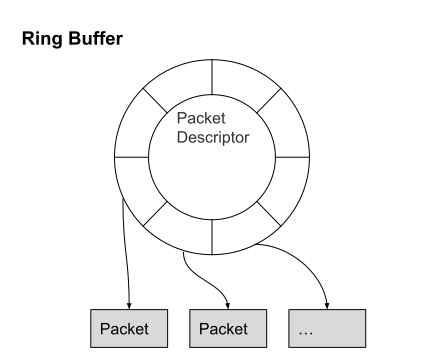

# 2.3.1 多 CPU 下的 Ring Buffer 处理

NIC 收到数据的时候产生的 IRQ 只可能被一个 CPU 处理，从而只有一个 CPU 会执行 softirq 和 softirq 的 handler，所以同一个时刻只有一个 CPU 在拉取 Ring Buffer。因为分配给 Ring Buffer 的空间是有限的，当收到的数据包速率大于单个 CPU 处理速度的时候 Ring Buffer 可能被占满，占满之后再来的新数据包会被自动丢弃。

<div  align="center">
	
</div>


一个 CPU 去处理 Ring Buffer 数据会很低效，这个时候就产生了叫做 Receive Side Scaling(RSS) 或者叫做 multiqueue 的机制来处理这个问题。

简单说就是现在支持 RSS 的网卡内部会有多个 Ring Buffer，NIC 收到数据包的时候分配给不同的 Ring Buffer ，触发的 IRQ 也可以通过操作系统或者手动配置 IRQ affinity 将 IRQ 分配到多个 CPU 上。这样 IRQ 能被不同的 CPU 处理，从而做到 Ring Buffer 上的数据也能被不同的 CPU 处理，从而提高数据的并行处理能力。


## 1. RSS 配置

如果支持 RSS 的话，NIC 会为每个队列分配一个 IRQ，你可以通过配置 IRQ affinity 指定 IRQ 由哪个 CPU 来处理中断。先通过 /proc/interrupts 找到 IRQ 号之后，将希望绑定的 CPU 号写入 /proc/irq/IRQ_NUMBER/smp_affinity，写入的是 16 进制的 bit mask。

比如看到队列 rx_0 对应的中断号是 41 那就执行：

```
echo 6 > /proc/irq/41/smp_affinity  // 6 表示的是 CPU2 和 CPU1
```

0 号 CPU 的掩码是 0x1 (0001)，1 号 CPU 掩码是 0x2 (0010)，2 号 CPU 掩码是 0x4 (0100)，3 号 CPU 掩码是 0x8 (1000) 依此类推。

## 2. RPS 配置

如果 NIC 不支持 RSS，这时候可以尝试使用 RPS（Receive Packet Steering）。RPS 是 NIC 在不支持 RSS的情况下使用软件实现 RSS 类似功能的机制。其好处就是对 NIC 没有要求，任何 NIC 都能支持 RPS。

RPS 相对于 RSS 的缺点是 NIC 收到数据后 DMA 将数据存入的还是一个 Ring Buffer，NIC 触发 IRQ 还是发到一个 CPU，RPS 是在单个 CPU 将数据从 Ring Buffer 取出来之后才开始起作用，它会为每个数据包计算 Hash 之后发到对应 CPU 的 backlog 中，并通过 Inter-processor Interrupt(IPI) 告知目标 CPU 来处理 backlog。后续 Packet 的处理流程就由这个目标 CPU 来完成。从而实现将负载分到多个 CPU 的目的。

RPS 默认是关闭的，当机器有多个 CPU 并且通过 softirqs 的统计 /proc/softirqs 发现 NET_RX 在 CPU 上分布不均匀或者发现网卡不支持 mutiqueue 时，就可以考虑开启 RPS。

开启 RPS 需要调整 /sys/class/net/DEVICE_NAME/queues/QUEUE/rps_cpus 的值。比如执行:

```
echo f > /sys/class/net/eth0/queues/rx-0/rps_cpus
```

表示的含义是处理网卡 eth0 的 rx-0 队列的 CPU 数设置为 f 。即设置有 15 个 CPU 来处理 rx-0 这个队列的数据，如果你的 CPU 数没有这么多就会默认使用所有 CPU 。甚至有人为了方便都是直接将 echo fff > /sys/class/net/eth0/queues/rx-0/rps_cpus 写到脚本里，这样基本能覆盖所有类型的机器，不管机器 CPU 数有多少，都能覆盖到。

RPS 将收到的数据包发配到不同的 CPU 以实现负载均衡，但是可能同一个 Flow 的数据包正在被 CPU1 处理，但下一个数据包被发到 CPU2，会降低 CPU cache hit 比率，这时候可以开启 Receive Flow Steering(RFS) 机制。RFS 一般和 RPS 配合使用，保证同一个 flow 的数据包都会被路由到正在处理当前 Flow 数据的 CPU，从而提高 CPU cache hit 比率。

RFS 默认是关闭的，必须主动配置才能生效。正常来说开启了 RPS 都要再开启 RFS，以获取更好的性能。

配置 rps_sock_flow_entries

```
sysctl -w net.core.rps_sock_flow_entries=32768
```

配置 rps_flow_cnt

```
echo 2048 > /sys/class/net/eth0/queues/rx-0/rps_flow_cnt
```