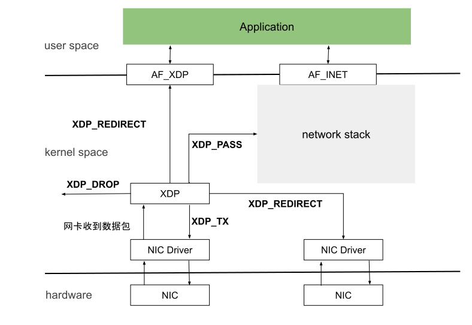
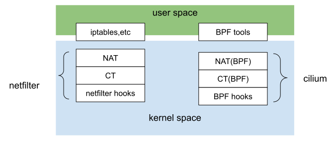

# 3.2.3 快速数据路径 XDP

由于 Linux 内核协议栈更加注重通用性，所以在网络性能需求场景中存在一定的瓶颈，随着 100G、200/400G 高速率网卡的出现，这种性能瓶颈就变得无法接受了。2010 年，由 Intel 领导的 DPDK 实现了一个内核旁路（Bypass Kernel）思想的高性能网络应用开发解决方案，并逐渐成为了独树一帜的成熟技术体系。但是 DPDK 也由于内核旁路这一前提，天然就无法与内核技术生态很好的结合。

2016 年，在 Linux Netdev 会议上，David S. Miller 喊出了 “DPDK is not Linux” 的口号。同年，伴随着 eBPF 技术的成熟，Linux 内核终于迎来了属于自己的高速公路 —— XDP（AF_XDP），其具有足以媲美 DPDK 的性能以及背靠内核的多种独特优势。

以上，就是 XDP 出现的背景。

## 1. XDP 概述

XDP (eXpress Data Path，快速数据路径) 本质上是 Linux 内核网络模块中的一个 BPF Hook，能够动态挂载 eBPF 程序逻辑，使得 Linux 内核能够在数据报文到达 L2（网卡驱动层）时就对其进行针对性高速处理，无需再`循规蹈矩`地进入到内核网络协议栈。用虚拟化领域的完全虚拟化和半虚拟化概念类比，如果 DPDK 是”完全 Kernel bypass”，那么 AF_XDP 就是 “半 Kernel bypass”。

更详细地说，AF_XDP 和 AF_INET 一样，也是 address family 的一种，AF_XDP 就相当于 socket 底层通讯方式的不同实现，AF_INET 可以用于 IPv4 类型地址的通讯，AF_XDP 则是一套基于 XDP 的通讯的实现。

XDP 程序在内核提供的网卡驱动中直接取得网卡收到的数据帧，然后直接送到用户态应用程序。应用程序利用 AF_XDP 类型的 socket 接收数据。

<div  align="center">
	
	<p>图 3-14 XDP 流程概念</p>
</div>

## 2. XDP 应用示例

前面讲过的连接跟踪实际上独立于 Netfilter，Netfilter 只是 Linux 内核中的一种连接跟踪实现。换句话说，只要具备了 hook 能力，能拦截到进出主机的每个数据包，就完全可以在此基础上实现另外一套连接跟踪。


云原生网络方案 Cilium 在 1.7.4+ 版本就实现了这样一套独立的连接跟踪和 NAT 机制，其基本原理是：

- 基于 BPF hook 实现数据包的拦截功能（等价于 netfilter 的 hook 机制）
- 在 BPF hook 的基础上，实现一套全新的 conntrack 和 NAT

因此使用 Cilium 方案的 Kubernetes 网络模型，即便在 Node 节点卸载 Netfilter，也不会影响 Cilium 对 Kubernetes ClusterIP、NodePort、ExternalIPs 和 LoadBalancer 等功能的支持。

<div  align="center">
	
	<p>图 3-15 conntrack Cilium 方案</p>
</div>

由于 Cilium 方案的连接跟踪机制独立于 Netfilter，因此它的 conntrack 和 NAT 信息也没有存储在内核中的 conntrack table 和 NAT table 中，常规的 conntrack/netstats/ss/lsof 等工具看不到 nat、conntrack 数据，所以需要另外使用 Cilium 的命令查询，例如：

```
$ cilium bpf nat list
$ cilium bpf ct list global
```
