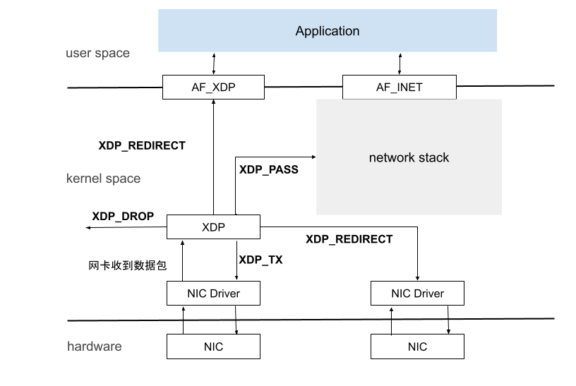
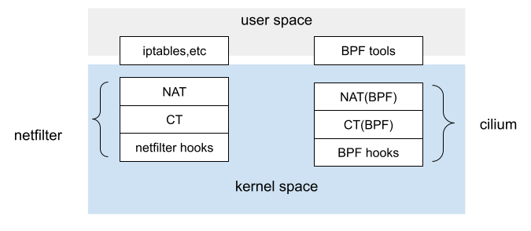

# 2.1.3 快速数据路径 XDP

XDP（eXpress Data Path，快速数据路径）是 Linux 内核中提供高性能、可编程的网络数据包处理框架，本质上是 Linux 内核网络模块中的一个 BPF Hook，能够动态挂载 eBPF 程序逻辑，使得 Linux 内核能够在数据报文到达 L2（网卡驱动层）时就对其进行针对性 kernel bypass（内核旁路）处理，而无需再`循规蹈矩`地进入到内核网络协议栈。

## 1. XDP 数据处理
下面展示了 XDP 程序执行的流程，网卡驱动调用内核 XDP 模块提供的 API ，然后间接调用用户提供的XDP程序，也就是说 XDP 是在设备驱动程序的上下文中执行。

在网卡接收到数据包之后，内核协议栈处理数据包之前，设备驱动程序会先调用 XDP 模块中的 BPF 程序，这段程序进行以下几种工作

- XDP_DROP 丢弃数据包 
- XDP_REDIRECT 将数据包重定向其他网络接口（包括虚拟网卡），或者结合 AF_XDP 套接字重定向用户态程序。
- XDP_PASS 放行数据包，数据包进入常规的内核网络协议栈
- XDP_TX XDP 程序的一个高效选型，能够在收到数据包的网络接口上直接将数据包再发送出去。适合防火墙或负载均衡程序。

<div  align="center">
	
</div>

## 2. XDP 应用示例

我们 2.1.2 小节讲过连接跟踪机制，连接跟踪独立于 netfilter，netfilter 只是 Linux 内核中的一种连接跟踪实现。换句话说，只要具备了 hook 能力，能拦截到进出主机的每个数据包，就完全可以在此基础上实现另外一套连接跟踪。

<div  align="center">
	
</div>

云原生网络方案 Cilium 在 1.7.4+ 版本就实现了这样一套独立的连接跟踪和 NAT 机制。其基本原理是：

- 基于 BPF hook 实现数据包的拦截功能（等价于 netfilter 的 hook 机制）
- 在 BPF hook 的基础上，实现一套全新的 conntrack 和 NAT

因此使用 Cilium 方案的 Kubernetes 网络模型，即便在 Node 节点卸载 netfilter ，也不会影响 Cilium 对 Kubernetes ClusterIP、NodePort、ExternalIPs 和 LoadBalancer 等功能的支持。

由于 Cilium 方案的连接跟踪机制独立于 netfilter ，因此它的 conntrack 和 NAT 信息也没有存储在内核中的 conntrack table 和 NAT table 中，常规的 conntrack/netstats/ss/lsof 等工具看不到 nat、conntrack 数据，所以需要另外使用 Cilium 的命令查询，例如：

```
$ cilium bpf nat list
$ cilium bpf ct list global
```
