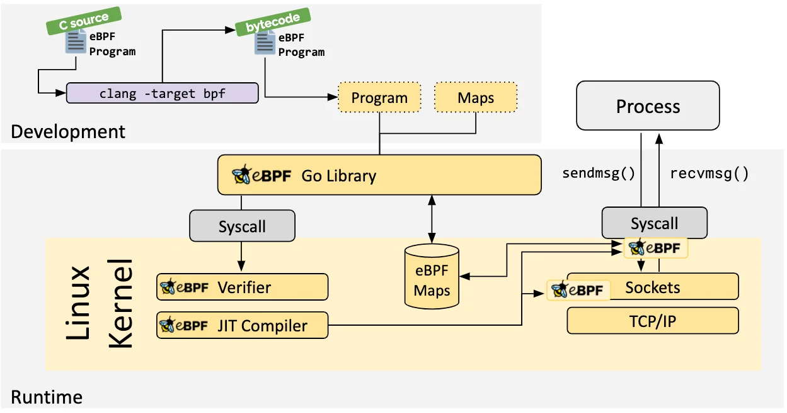

# 3.4.2 eBPF 和 快速数据路径 XDP 

由于 DPDK 完全基于“内核旁路”的思想，它天然无法与 Linux 内核生态很好地结合。

2016 年，Linux Netdev 会议，Linux 内核开发者 David S. Miller[^1] 喊出了“DPDK is not Linux”的口号。同年，随着 eBPF 技术成熟，Linux 内核终于迎来了属于自己的“高速公路” —— XDP（eXpress Data Path，快速数据路径）。XDP 因其媲美 DPDK 的性能、背靠 Linux 内核，无需第三方代码库和许可、无需专用 CPU 等多种优势，一经推出便备受关注。

DPDK 技术完全绕过内核，直接将数据包透传至用户空间处理。XDP 正好相反，它在内核空间根据用户的逻辑处理数据包。

在内核执行用户逻辑的关键在于 BPF（Berkeley Packet Filter，伯克利包过滤器）技术 —— 一种允许在内核空间运行经过安全验证的代码的机制。Linux 内核 2.5 版本起，Linux 系统就开始支持 BPF 技术了，但早期的 BPF 主要用于网络数据包的捕获和过滤。到了 Linux 内核 3.18 版本，开发者推出了一套全新的 BPF 架构，也就是我们今天所说的 eBPF（Extended Berkeley Packet Filter）。与早期的 BPF 相比，eBPF 的功能不再局限于网络分析，它几乎能访问所有 Linux 内核关联的资源，逐渐发展成一个多功能的通用执行引擎。

行文至此，相信读者不难发现 eBPF 访问 Linux 内核关联资源的手段，其实和 Netfilter 开放钩子的方式如出一辙。两者区别在于，Netfilter 的钩子数量有限，面向的是 Linux 其他内核模块；而 eBPF 程序面向普通开发者，Linux 系统中开放了“数不清”的钩子挂载 eBPF 程序。

笔者列举部分钩子的名称及含义供读者参考：

- TC（Traffic Control）钩子：位于内核的网络流量控制层，用于处理流经 Linux 内核的网络数据包。它可以在数据包进入或离开网络栈的各个阶段触发。
- XDP 钩子：位于网络栈最底层的钩子，直接在网卡驱动程序中触发，用于处理收到的网络数据包，主要用于实现超高速的数据包处理操作，例如 DDoS 防护、负载均衡、数据包过滤等。
- Tracepoints 钩子：Tracepoints 是内核代码中的静态探测钩子，分布在内核的各个子系统中。主要用于内核的性能分析、故障排查、监控等。例如，可以在调度器、文件系统操作、内存管理等处进行监控。
- LSM（Linux Security Modules）钩子：位于 Linux 安全模块框架中，允许在内核执行某些安全相关操作（如文件访问、网络访问等）时触发 eBPF 程序。主要用于实现安全策略和访问控制。例如，可以编写 eBPF 程序来强制执行自定义的安全规则或监控系统的安全事件。

从上述钩子可知，XDP 本质是 Linux 内核在网络路径上埋下的钩子，该钩子位于网卡驱动层内，数据包进入网络协议栈之前。如果 XDP 钩子挂载了 eBPF 程序，就能在 Linux 系统收包早期阶段介入处理，避免数据包“循规蹈矩”的进入内核，带来的额外开销。

XDP 执行完 eBPF 逻辑之后，用“返回码”作为输出，它代表对数据包应该做什么样的最终裁决。XDP 支持的 5 种返回码名称及含义如下：

- XDP_ABORTED：表示 XDP 程序处理数据包时遇到错误或异常。
- XDP_DROP：在网卡驱动层直接将该数据包丢掉，通常用于过滤无效或不需要的数据包，如实现 DDoS 防护时，丢弃恶意数据包。
- XDP_PASS：数据包继续送往内核的网络协议栈，和传统的处理方式一致。这使得 XDP 可以在有需要的时候，继续使用传统的内核协议栈进行处理。
- XDP_TX：数据包会被重新发送到入站的网络接口（通常是修改后的数据包）。这种操作可以用于实现数据包的快速转发、修改和回环测试（如用于负载均衡场景）。
- XDP_REDIRECT：数据包重定向到其他的网卡或 CPU，结合 AF_XDP[^2]可以将数据包直接送往用户空间。

:::center
  <br/>
 图 3-8 XDP 钩子在 Linux 系统的位置与 5 个动作
:::

假设我们已经清楚如何编写 eBPF 代码，通过下面的步骤，进一步了解 eBPF 程序是如何被 Linux 内核加载、验证并执行：

- 第一步：编写的 c eBPF 程序，经过编译器，编译为 eBPF 字节码。
- 第二步：编译好的代码，会被 eBPF 所对应的高级编程语言库程序加载，并由高级语言进行系统调用处理。目前 eBPF 支持 Golang、Python、C/C++、Rust 等。
- 第三步：通过系统调用陷入内核后，首先由内核 eBPF 程序进行验证（verify），这一步确保程序本身无误：不会崩溃，不会出现死循环，没有权限异常；然后编译为 eBPF 伪代码的程序再转换为具体的机器指令集，最终挂载到对应的钩子处（或称追踪点）。
- 第四步：内核在处理某个追踪点时，刚好有 eBPF 程序，则触发事件，并由加载的 eBPF 程序处理

:::center
  <br/>
 图 3-9 eBPF 的技术架构
:::

eBPF 能够在不修改内核源码的情况下，动态加载和执行用户定义的代码，在 Linux 内核的多个子系统，如网络、跟踪和 Linux 安全模块（LSM）中广泛应用。基于 eBPF 技术的开源项目也层出不穷，如 Facebook 的高性能网络负载均衡器 Katran、内核跟踪调试工具 BCC 和 bpftrace，以及 Isovalent 的容器网络方案 Cilium 等。

以 Cilium 为例，它在 eBPF 和 XDP 钩子（也有其他的钩子）基础上，实现了一套全新的 conntrack 和 NAT 机制。并以此为基础，构建出如 L3/L4 负载均衡、网络策略、观测和安全认证等各类高级功能。

由于 Cilium 实现的底层网络功能现独立于 Netfilter，因此它的连接追踪数据和 NAT 规则数据不会存储在 Linux 内核默认的 conntrack 表和 NAT 表中。常规的 Linux 命令 conntrack、netstat、ss 和 lsof 等，无法查看 NAT 规则和连接追踪数据。得使用 Cilium 提供的查询命令才行，例如：

```bash
$ cilium bpf nat list  // 列出 Cilium 中配置的 NAT 规则。
$ cilium bpf ct list global // 列出 Cilium 中的连接追踪条目
```

[^1]: Linux Netdev，专注于 Linux 网络栈和网络技术的会议。David S. Miller 是 Linux 内核网络子系统的主要维护者之一，也是 Linux 内核开发领域的知名人物。
[^2]: 相较 AF_INET 是基于传统网络的 Linux socket，AF_XDP 则是一套基于 XDP 的高性能 Linux socket。
