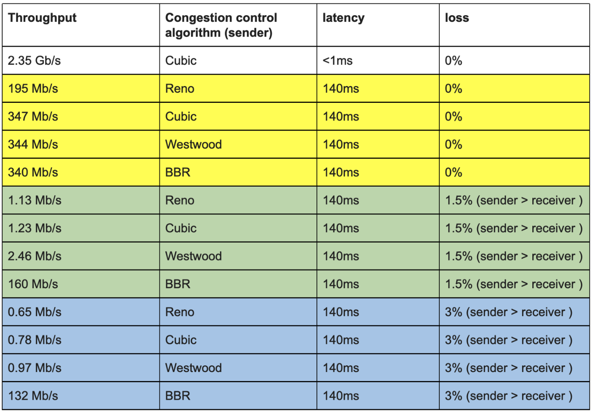

# 2.3.3 使用 BBR 改善长链路下的网络吞吐率率

笔者曾做过在高 BDP 网络环境中提升 CDN 吞吐量的工作，提升效果较为明显，主要的改善调整是尝试使用了 BBR 算法。在本节，笔者对拥塞控进行简单地讲解，以供读者在后续实践中参考。

BBR (Bottleneck Bandwidth and Round-trip propagation time)是 Google 在 2016 年发布的一套拥塞控制算法。它尤其适合在存在一定丢包率的弱网环境下使用，在这类环境下，BBR 的性能远超 cubic 等传统的拥塞控制算法。

查询系统所支持的拥塞控制算法。
```
$ sysctl net.ipv4.tcp_available_congestion_control
net.ipv4.tcp_congestion_control = bbr cubic reno
```
查询正在使用中的拥塞控制算法。
```
$ sysctl net.ipv4.tcp_congestion_control
net.ipv4.tcp_congestion_control = cubic
```

指定拥塞控制算法为 bbr。

```
$ echo net.ipv4.tcp_congestion_control=bbr >> /etc/sysctl.conf && sysctl -p
```

## 1. 理解拥塞控制

TCP 中对拥塞控制算法分类有基于延迟改变 (Reno)、丢包反馈(Cubic)、主动探测(BBR) 这几类实现代表。现在大部分 Linux 系统默认的拥塞控制算法是 Cubic，内核 4.9+ 增加了 BBR 算法支持，而 Reno 网上文章介绍得比较多，但实际多年前就已不再使用。

正常情况下，程序员完全不需关注拥塞控制，拥塞控制是一个很复杂的过程，两端网络链路其一是动态变化的，其二中间网络设备 buffer 影响、ISP 中的 QoS 策略 等等都影响传输效率，整个过程非常难以理解，笔者在配置 BBR，参阅文章时，注意到 Google BBR 论文中一张设计图，该设计图中对拥塞控制各个因素有一个完整的概括。

<div  align="center">
	
	<p>图 2-8 BBR 论文中拥塞控制概览</p>
</div>

我们根据这张图梳理传输链路，有几个物理属性需要关注。

- **RTprop** (round-trip propagation time)，两端之间最小时延，取决于物理距离。
- **BtlBw**（bottleneck bandwidth）瓶颈带宽，把链路想象成物理管道，RTprop 就是管道的长度，BtlBw 则是管道最窄处的直径。
- **BtlBufSize**  链路之间各个路由节点的缓存。
- **BDP 带宽时延积** 整条物理链路（不含路由器缓存）所能储藏的比特数据之和 BDP = BtlBw * RTprop。

除了上面的物理属性，传输效率还依赖以下几个属性。

- **round-trip time** 数据从发送端到接收端实际时延，也就是RTT。
- **delivery rate** 数据的实际传输带宽。
- **inflight data** 已发送但还未被确认的数据量。

## 2. 拥塞控制的分区

BBR 对拥塞控制在逻辑上通过横轴对 bufferbloat 划分三个分区。

- **(0, BDP)** 该区间客户端发送的数据并未占满瓶颈带宽，称为：应用受限（app limited）区。
- **(BDP, BtlneckBuffSize)** 该区间已经达到链路瓶颈容量，但还未超过瓶颈容量+缓冲区容量，此时应用能发送的数据量受带宽限制，称为带宽受限（bandwidth limited）区。
- **(BDP + BtlneckBuffSize, infinity)** 该区间实际发送速率已经超过瓶颈容量+缓冲区容量 ，多出来的数据会被丢弃，缓冲区大小决定了丢包多少，称为缓冲区受限（buffer limited）区。

通过分析图片的关系：**拥塞就是 inflight 数据量持续向右侧偏离 BDP 线的行为（在接近第三区间时，传输效率最高），而拥塞控制就是各种在平均程度上控制这种偏离程度解决 Bufferbloat 方案或算法**，如果是基于丢包反馈的拥塞控制算法，就会在无法及时第三区间偏离而形成锯齿形波动。

BBR 在控制时机提前，不再等到丢包时再进行暴力限制，而是控制稳定的发包速度，尽量榨干带宽，却又不让报文在中间设备的缓存队列上累积。
为了得到稳定的发包速度，BBR 使用 TCP Pacing 进行发包控制，因此 BBR 的实现也需要底层支持 TCP Pacing。为了榨干带宽，BBR 会周期性地去探测是否链路条件变好了，如果是，则加大发送速率。为了不让报文在中间设备的缓存队列上累积，BBR 会周期性地探测链路的最小 RTT，并使用该最小 RTT 计算发包速率。

## 3. BBR 实践结论

BBR 算法对于大带宽长链路也就是高 BDP 网络环境中，例如跨海网络、尤其是在有轻微丢包的网络条件下，较传统的 cubic 算法，有一定的提升。

在笔者实践结论中，通过对 cubic 和 BBR 进行吞吐量测试，使用 BBR 提升了 30% ~ 45% 的吞吐率。表 2-2 综合使用不同拥塞控制算法、延迟和丢包参数所做的各种 TCP 吞吐量测试的全套测试，证明了在一定的丢包率（1.5%、3%）的情况下 BBR 的出色表现。

表 2-2 拥塞控制算法效果对比实践。
<div  align="center">
	
</div>

在书写本节内容时，BBR 迭代到了 v3 版本，相信再经过一段时间，BBRv3 也会被提交到上游 Linux 内核主线。

