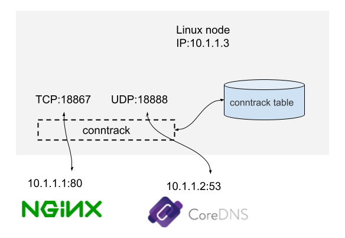
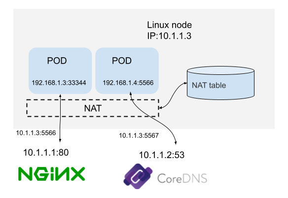
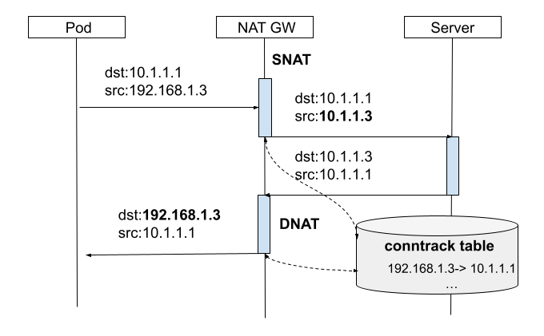

# 3.2.3 连接跟踪 conntrack

连接跟踪（connection tracking，conntrack，CT）对连接状态进行跟踪并记录。

<div  align="center">
	
	<p>图 2-16 conntrack 示例</p>
</div>

例如，图 2-16 是一台 IP 地址为 10.1.1.3 的 Linux 机器，我们能看到这台机器上有两条连接：

- 机器访问外部 HTTP 服务的连接（目的端口 80）
- 机器访问外部 DNS 服务的连接（目的端口 53）

连接跟踪所做的事情就是发现并跟踪这些连接的状态，具体包括：

- 从数据包中提取元组信息，辨别数据流和对应的连接。
- 为所有连接维护一个状态数据库（conntrack table），例如连接的创建时间、发送 包数、发送字节数等。
- 回收过期的连接（GC）。
- 为更上层的功能（例如 NAT）提供服务。

## 1. conntrack 原理

当加载内核模块nf_conntrack后，conntrack机制就开始工作，如图，椭圆形方框 conntrack 在内核中有两处位置(PREROUTING和OUTPUT之前)能够跟踪数据包。

对于每个通过conntrack的数据包，内核都为其生成一个conntrack条目用以跟踪此连接，对于后续通过的数据包，内核会判断若此数据包属于一个已有的连接，则更新所对应的conntrack条目的状态(比如更新为ESTABLISHED状态)，否则内核会为它新建一个conntrack条目。所有的conntrack条目都存放在一张表里，称为连接跟踪表

连接跟踪表存放于系统内存中，可以用 cat /proc/net/nf_conntrack 查看当前跟踪的所有 conntrack 条目。conntrack 维护的所有信息都包含在这个条目中，通过它就可以知道某个连接处于什么状态。

如下示例 表示一条状态为 ESTABLISHED 的 TCP 连接。
```
ipv4     2 tcp      6 88 ESTABLISHED src=10.0.12.12 dst=10.0.12.14 sport=48318 dport=27017 src=10.0.12.14 dst=10.0.12.12 sport=27017 dport=48318 [ASSURED] mark=0 zone=0 use=2
```

## 2. conntrack 应用示例 

连接跟踪是许多网络应用的基础，常用的使用场景如 NAT、iptables 的状态匹配等。

### 2.1 NAT

NAT（Network Address Translation，网络地址转换）, 即对（数据包的）网络地址（IP + Port）进行转换。

<div  align="center">
	
	<p>图 2-17</p>
</div>

例如上图中，机器自己的 IP 10.1.1.3 可以与外部正常通信，但 192.168 网段是私有 IP 段，外界无法访问，源 IP 地址是 192.168 的包，其应答包也无 法回来。因此，

- 当源地址为 192.168 网段的包要出去时，机器会先将源 IP 换成机器自己的 10.1.1.3 再发送出去，SNAT（对源地址（source）进行转换）。
- 收到应答包时，再进行相反的转换，DNAT （对目的地址（destination）进行转换）。

除 SNAT 和 DNAT 外，还有 Full NAT （同时对源地址和目的地址进行转换）。这就是 NAT 的基本过程。

当 NAT 网关收到内部网络的请求包之后，会做 SNAT，同时将本次连接记录保存到连接跟踪表，当收到响应包之后，就可以根据连接跟踪表确定目的主机，然后做 DNAT。

<div  align="center">
	
	<p>图 2-18</p>
</div>

### 2.2 conntrack 与 LVS DR 模式

在 LVS 机器上应用 iptables 时需要注意一个问题就是，LVS-DR(或LVS-Tun)模式下，不能在 director 上使用 iptables 状态匹配(NEW，ESTABLISHED，INVALID...)，LVS-DR模式下，client访问director，director转发流量到realserver，realserver直接回复client，不经过director，这种情况下，client与direcotr处于tcp半连接状态

因此如果在director机器上启用conntrack，此时conntrack只能看到client–>director的数据包，因为响应包不经过direcotr，conntrack无法看到反方向上的数据包，就表示iptables中的ESTABLISHED状态永远无法匹配，从而可能发生DROP

<div  align="center">
	
	<p>图 2-19 conntrack 示例</p>
</div>
