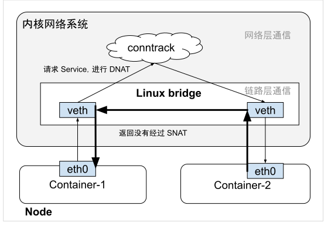

# 3.3.3 连接跟踪模块 conntrack

conntrack 是 connection track（连接跟踪）的缩写。顾名思义，这个模块是用来跟踪连接的。需要注意的是，conntrack 中的“连接”指的是通信双方之间的数据传输连接，不仅可以跟踪 TCP 连接，还可以跟踪 UDP、ICMP 这样的“连接”。

Linux 内核中的 conntrack 模块为每一个经过网络协议栈的数据包，生成一个新的连接记录（又称连接条目）。此后，所有属于此连接数据包都被分配给这个连接，并标识连接的状态（如 NEW、ESTABLISHED 等）。当连接状态变化时，conntrack 会更新连接记录反映这些变化。

笔者用 TCP 的三次握手例子帮助你理解。首先客户端向服务器发送一个 TCP SYN 包，请求建立连接。当 Linux 系统收到这个 SYN 包时，内核中的 conntrack 模块会创建一个新的连接跟踪条目，标记为 NEW。之后，服务器回复 SYN-ACK，并等待客户端的 ACK 报文，一旦握手完成，状态将转为 ESTABLISHED。

通过命令 cat /proc/net/nf_conntrack 命令查看连接记录项，如下所示的是一条状态为 ESTABLISHED 的 TCP 连接。

```bash
$ cat /proc/net/nf_conntrack
ipv4     2 tcp      6 88 ESTABLISHED src=10.0.12.12 dst=10.0.12.14 sport=48318 dport=27017 src=10.0.12.14 dst=10.0.12.12 sport=27017 dport=48318 [ASSURED] mark=0 zone=0 use=2
```

conntrack 连接记录是 iptables 连接状态匹配的基础，也是网络地址转换中实现 SNAT 和 DNAT 的前提。Linux 内核进行 NAT 时，conntrack 会跟踪每个连接的源地址和目标地址的映射关系，以确保返回流量能够正确地被重定向到原始发起请求的主机。

我们知道 Kubernetes 的核心组件 kube-proxy，作用是负责处理集群中的服务（Service）网络流量。它实现的实现本质是个反向代理（也就是 NAT）。当外部的请求访问 Service 时，请求被 DNAT 成 PodIP:Port，响应时再经过 SNAT。

例如：客户端向 my-service 的 IP 10.0.0.10 发送 HTTP 请求，端口 80。

- kube-proxy 在节点上接收到这个请求后，执行 DNAT 操作，将目标地址 10.0.0.10:80 转换为某个 Pod 的 IP 和端口，例如 192.168.1.2:8080。
- 在 Pod 生成响应并发送回客户端时，kube-proxy 执行 SNAT 操作，将响应的源地址 192.168.1.2:8080 转换为 Service IP 10.0.0.10:80。

conntrack 维护的连接记录包含了从客户端到服务的 DNAT 映射（10.0.0.10:80 到 192.168.1.2:8080）以及从服务到客户端的 SNAT 映射（192.168.1.2:8080 到 10.0.0.10:80）。这样有来有回，对于 conntrack 而言，有一条完整的 NAT 映射关系。

但如果发起请求的 Pod 和处理请求的 Pod 在同一个主机内，问题就来了：
- 发起请求时，数据包经过网络层时，内核中的 conntrack 模块根据 iptables 规则，判断是否需要进行 DNAT；
- 返回响应时，如果 Linux 网桥检测到目的 IP 位于同一网桥上，则直接通过二层转发（即链路层通信），并没有触发网络层的 conntrack 模块，也就是不进行 SNAT。

因此，通信双方不在同一“频道”上，与 NAT 相关的连接记录不完整，进而影响容器间通信，产生各类异常。

:::center
  <br/>
  图 3-13 请求和响应不在一个“频道”上，双方通信失败
:::

针对上述问题，Linux 内核提供了 bridge-nf-call-iptables 配置，决定内核是否将通过网桥的流量交由 iptables 规则匹配处理，也就是处理 NAT 保证 conntrack 连接记录的完整性。这也是为什么部署 Kubernetes 集群时，务必开启 Linux 系统配置 bridge-nf-call-iptables（设置为 1）的原因。

