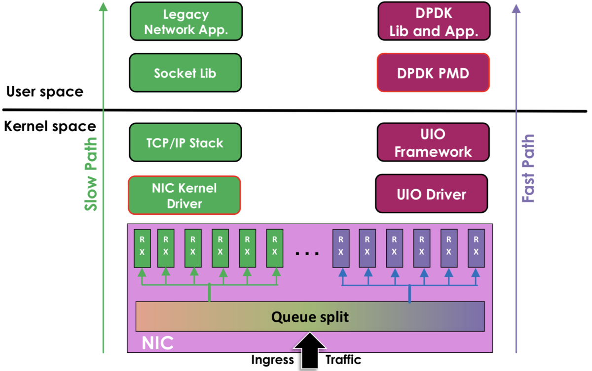

# 3.3.3 内核旁路技术

笔者 3.2.2 节介绍了半 kernel bypass 的 XDP 技术，这一节，我们再介绍完全 kernel bypass 的技术。

高并发下网络协议栈的冗长流程是最主要的性能负担，也就是说内核才是高并发的瓶颈所在。既然内核是瓶颈所在，那很明显解决方案就是想办法绕过内核。经很多前辈先驱的研究，目前业内已经出现了很多优秀内核旁路（kernel bypass）思想的高性能网络数据处理框架，如 6WIND、Wind River、Netmap、DPDK 等。其中，Intel 的 DPDK 在众多方案脱颖而出，一骑绝尘。

DPDK（Data Plane Development Kit，数据平面开发套件） 为 Intel 处理器架构下用户空间高效的数据包处理提供了库函数和驱动的支持，它不同于 Linux 系统以通用性设计为目的，而是专注于网络应用中数据包的高性能处理。也就是 DPDK 绕过了 Linux 内核协议栈对数据包的处理过程，在用户空间实现了一套数据平面来进行数据包的收发与处理。

在内核看来，DPDK 就是一个普通的用户态进程，它的编译、连接和加载方式和普通程序没有什么两样，如图 3-18 所示，DPDK 与 传统内核网络的对比。

- 左边是原来的方式：数据从网卡 -> 驱动 -> 协议栈 -> Socket 接口 -> 业务。
- 右边是 DPDK 方式：基于 UIO（Userspace I/O）旁路数据。数据从网卡 -> DPDK 轮询模式-> DPDK 基础库 -> 业务。

	
	
图 3-18 DPDK 与传统内核网络对比

很多企业如 Facebook 的 Katran、美团的 MGW、爱奇艺的 dpvs 等使用 DPDK、eBPF 技术进行 kernel bypass，直接全部在用户态进行数据包的处理，正是基于此，才得以实现单机千万并发的性能指标。

如图 3-19 所示，dpvs 与 lvs 在 PPS 转发上的指标对比，dvps 性能提升约 300%。

	
	
图 3-19 dpvs 性能指标对比

对于海量用户规模的互联网应用来说，动辄需要部署数千、甚至数万台服务器，如果能将单机性能提升 10 倍甚至百倍，无论是从硬件投入还是运营成本上来看都能带来非常可观的成本削减，这样的技术变革带来的潜在效益非常诱人。

