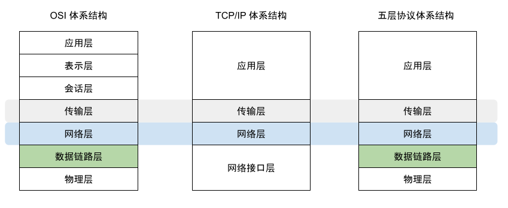
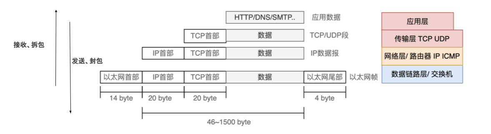

# 2.2 网络分层模型及基础概念

在计算机网络的所有基本概念里面，分层次的体系结构是最基本的，被广泛所知的分层模型有三类，其一是 OSI 网络七层模型，不过该模型并未被实际应用。其二是基于 TCP/IP 互联网的四层模型，由于 TCP/IP 最下面的网络接口层并没有实质内容，所以在学习网络原理时，通常综合 OSI 和 TCP/IP 的优点，采用另外一种五层协议的体系结构。

	
	
图 计算机网络体系结构

下面按照从上到下的顺序，简单介绍 OSI 模型中各个分层的作用。

- 应用层（L7）：该层的协议包括 HTTP、HTTPS、SSH 等。
- 表示层 (L6)：把数据转换为能与接收者的系统格式兼容并适合传输的格式。
- 会话层（L5）：负责在数据传输中设置和维护节点的通信连接。
- 传输层（L4）：对会话层及以上层提供端到端的传输服务，该层的代表协议为 TCP，如果为 TCP/IP 模型，该层还包括 UDP 协议。
- 网络层（L3）：通过路由算法，为数据选择合适的路径，以实现网络中的互联功能，该层代表协议 IP。
- 数据链路层（L2）：将数据组装成帧，然后按顺序传输，每一帧包括数据和必要的控制信息，该层代表协议包括 SDLC、HDLC、PPP 等。
- 物理层 （L1）：利用传输介质为通信的两端物理连接，实现比特流的传输。

一般来说，数据链路层的数据单元被称为帧（frame），网络层的数据单元为称为数据包（data packet），而一个应用层一个完整的数据单元被称为报文（message）。本书中并不区分这些严格的定义，只要是网络中的数据，统称为数据包。

## 2.2.3 分层下的数据封装和拆封

在网络分层的体系下，数据发送是一个数据封装的过程，每一层协议在进行数据封装时，都会在上层传来的数据的基础上添加本层的元数据，而数据接收则是封装的逆过程。

	
	
图 数据的封装和拆封示例

