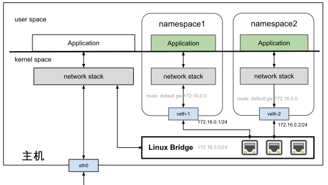

# 3.5.4 虚拟交换机 Linux bridge

物理网络中，我们如果要将多台主机连接起来，会使用以太网交换机设备将它们组成一个小型局域网。Linux 网络虚拟化系统中，也提供了交换机的虚拟实现 —— Linux bridge（Linux 网桥）。

Linux bridge 作为一个虚拟的交换机，和物理交换机有相似的功能。在 Linux 系统中，将一个或多个网络接口（如物理网卡 eth0、虚拟接口 veth、tap 等）添加到 Linux bridge 之后，它们的通信与物理交换机的转发行为是完全一致的。当一个数据帧进入 Linux bridge 时，它就会根据数据包的类型和目标 MAC 地址，按照如下规则理：

- 如果是广播帧，转发给所有桥接到该 Linux bridge 的设备。
- 如果是单播帧，查看 FDB（地址转发表）中 MAC 地址与网络设备接口的映射：
	- 如找不到记录，则洪泛（Flooding）给所有接入网桥的设备，并把响应设备的网络接口与 MAC 地址记录到 FDB 表中；
	- 如找到记录，则将数据帧转发到对应的接口。


笔者举一个具体的例子帮你加深理解，使用 Linux bridge 将两个命名空间接入到同一个二层网络。该例子的网络拓扑结构如图 3-15 所示。

:::center
  <br/>
 图 3-15 veth 网卡与 Linux Bridge
:::

创建 Linux bridge 与创建其他虚拟网络设备类似，只需要指定 type 参数为 bridge。

```bash
$ ip link add name br0 type bridge
$ ip link set br0 up
```

这样创建出来的 Linux bridge 一端连接着主机协议栈，其他端口没有连接。我们需要将其他设备连接到该 bridge 才能有实际的功能。下面，创建网络命名空间以及 veth 设备。然后将 veth 设备的一端加入到网络命名空间内，另一端桥接到刚创建的 br0。

```bash
# 创建网络命名空间
$ ip netns add ns1
$ ip netns add ns2

# 创建 veth 网线
$ ip link add veth0 type veth peer name veth1
$ ip link add veth2 type veth peer name veth3

# 将 veth 网线的一端连接到网络命名空间内
$ ip link set veth0 netns ns1
$ ip link set veth2 netns ns2

# 将 veth 另一端连接到 br0
$ ip link set dev veth1 master br0
$ ip link set dev veth3 master br0
```

激活命名空间内的虚拟网卡，为它们设置 IP 地址，这些 IP 地址位于同一个子网 172.16.0.0/24 中。

```bash
# 配置命名空间1
$ ip netns exec ns1 ip link set veth1 up
$ ip netns exec ns1 ip addr add 172.16.0.1/24 dev veth1
# 配置命名空间2
$ ip netns exec ns2 ip link set veth2 up
$ ip netns exec ns2 ip addr add 172.16.0.2/24 dev veth2
```

接下来，我们检查几个命名空间之间是否可达。

```bash
ip netns exec ns1 ping 172.16.0.2
PING 172.16.0.2 (172.16.0.2) 56(84) bytes of data.
64 bytes from 172.16.0.1: icmp_seq=1 ttl=64 time=0.153 ms
64 bytes from 172.16.0.1: icmp_seq=2 ttl=64 time=0.148 ms
64 bytes from 172.16.0.1: icmp_seq=3 ttl=64 time=0.116 ms
```
通过上面的实验，我们验证了可以使用 Linux bridge 来将多个命名空间连接到同一个二层网络中。你可能注意到，在分配 IP 地址的时候，我们只为 veth 在命名空间中那一端的虚拟网卡分配了地址，而没有为加入 bridge 那一端分配地址。这是因为 bridge 是工作在二层（数据链路层）上的，只会处理以太包，包括 ARP 解析、以太数据包的转发和泛洪。

值得注意的是，区别于物理二层交换机，Linux bridge 的本质是 Linux 系统中的虚拟网络设备，因此也具备网卡的特征，即可配置 MAC/IP 地址。从主机角度来看，配置了 IP 的 Linux bridge 设备就是主机上的一张网卡，自然可以参与主机的路由转发。也就是说，将命名空间的缺省网关设置为该 IP 后，便可以让原本隔离的命名空间和主机进行网络通信。

打通容器与主机之间的互通是实现容器跨主机通信最关键的一环，笔者将在后续（第七章 7.6 节）详细介绍容器跨主机通信原理。


