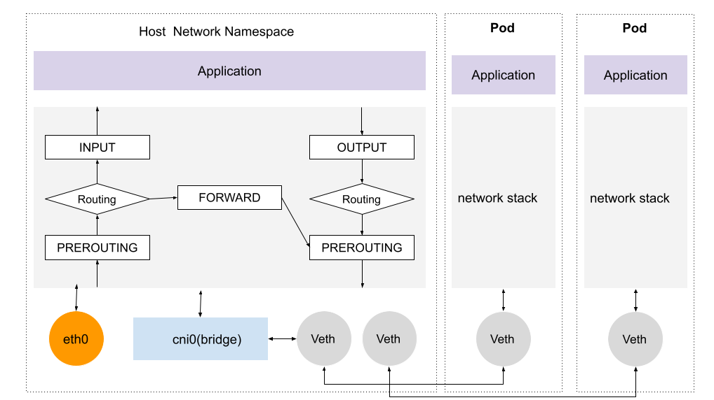

# 3.2 Linux 内核网络框架分析

本章节从理论学习、技术铺垫的角度介绍 Linux 内核数据包处理流程，熟悉 Linux 内核网络有助于我们理解上层各类的网络应用。

	
	
图 2-9 网络数据包流程和 Netfilter 框架

从图 2-9 我们可以看到，Netfilter 框架采用模块化设计理念，并且贯穿了 Linux 系统的内核态和用户态。在用户态层面，根据不同的协议类型，为上层用户提供了不同的系统调用工具，比如我们常用的针对 IPv4 协议 iptables，IPv6 协议的 ip6tables，针对 ARP 协议的 arptables，针对网桥控制的 ebtables，针对网络连接追踪的 conntrack 等等。不同的用户态工具在内核中有对应的模块进行实现，而底层都需要调用 Netfilter hook API 接口进行实现。

我们以 Kubernetes 网络模型说明 netfilter 的作用，如图 2-10 示例，当一个 Pod 跨 Node 进行通信时，数据包从 Pod 网络 Veth 接口发送到 cni0 虚拟网桥，进入主机协议栈之后，首先会经过 PREROUTING hook，调用相关的链做 DNAT，经过 DNAT 处理后，数据包目的地址变成另外一个 Pod 地址，再继续转发至 eth0，发给正确的集群节点。

	
	
图 2-10 kubernetes 网络模型

对Linux内核网络有了基本的了解之后，我们先看数据经过的第一个模块，XDP。