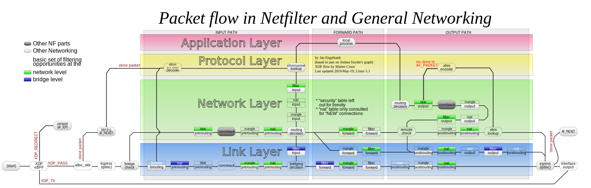
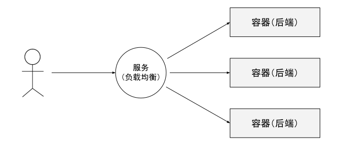
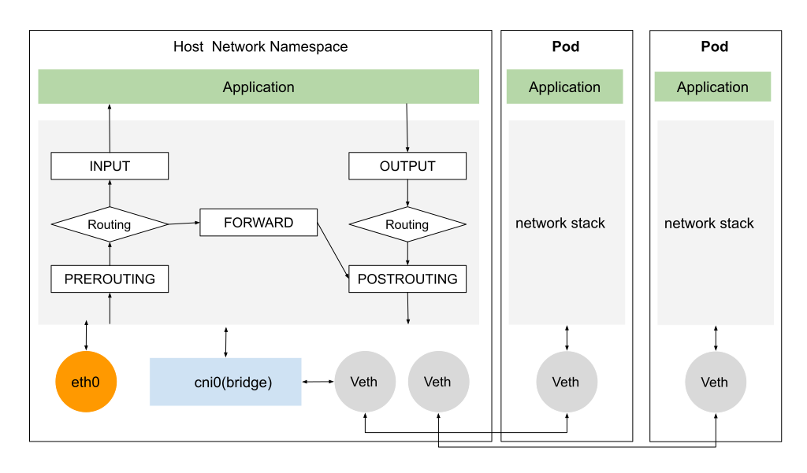

# 3.2 Linux 内核网络框架

网络协议栈的处理是一套相对固定和封闭的流程，整套处理过程中，除了网络设备层能看到一点点程序以设备的形式介入处理的空间外，其他过程似乎就没有什么可提供程序插手的空间了。然而事实并非如此，从 Linux Kernel 2.4 版本起，内核就开放了一套通用的，可提供代码干预数据在协议栈流转的过滤框架 -- Netfilter。

如图 3-3 所示，该架构图来自 Netfilter 项目[^1]，图片名称为 《Packet flow in Netfilter and General Networking》，该设计图较全面介绍了内核网络设计原理，包含了 XDP、Netfilter 和 traffic control 部分。带颜色的部分为 Netfilter 模块，有着更细节的内核协议栈各 hook 点位置和 iptables 规则优先级的经典配图。

	
	
图 3-3 网络数据包流程和 Netfilter 框架

Netfilter 实际上就是一个过滤器框架，Netfilter 在网络包收发以及路由的“管道”中，一共切了 5 个口（hook），分别是 PREROUTING、FORWARD、POSTROUTING、INPUT 以及 OUTPUT，其它内核模块(例如 iptables、IPVS 等)可以向这些 hook 点注册处理函数。每当有数据包留到网络层，就会自动触发内核模块注册在这里的回调函数，这样程序代码就能够通过回调函数来干预 Linux 的网络通信，进而实现对数据包过滤、修改、SNAT/DNAT 等各类功能。

如图 3-4 所示，Kubernetes 集群服务的本质其实就是负载均衡或反向代理，而实现反向代理，归根结底就是做 DNAT，即把发送给集群服务的 IP 地址和端口的数据包，修改成具体容器组的 IP 地址和端口。

	
	
图 3-4 Kubernetes 服务的本质

如图 3-5 Kubernetes 网络模型说明示例，当一个 Pod 跨 Node 进行通信时，数据包从 Pod 网络 Veth 接口发送到 cni0 虚拟网桥，进入主机协议栈之后，首先会经过 PREROUTING hook，调用相关的链做 DNAT，经过 DNAT 处理后，数据包目的地址变成另外一个 Pod 地址，再继续转发至 eth0，发给正确的集群节点。

	
	
图 3-5 kubernetes 网络模型

对 Linux 内核网络基本了解之后，我们再来看看 Netfilter 和它的上层应用 iptables。

[^1]: 参见 https://en.wikipedia.org/wiki/Netfilter
