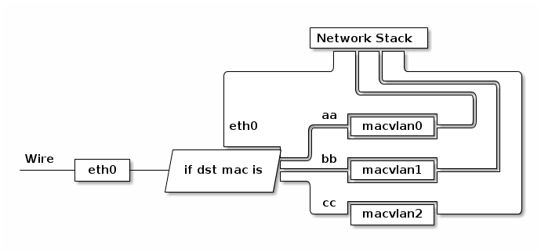

# 3.5.5 MACVLAN

前面介绍的 VLAN 属于二层虚拟技术，不同的 VLAN 之间的节点通信需要三层设备来进行路由。

以往，我们可以在一块以太网卡中添加多个 IP 地址，却不能添加多个 MAC 地址。

而有了 macvlan 技术，
macvlan 允许你在主机的一个网络接口上配置多个虚拟的网络接口，这些网络 interface 有自己独立的 mac 地址，也可以配置上 ip 地址进行通信。macvlan 下的虚拟机或者容器网络和主机在同一个网段中，共享同一个广播域。

macvlan 的最大优点是性能极好，相比其他方式，macvlan 不需要创建 Linux bridge，而是直接通过interface 连接到物理网络。

  
  
macvlan 工作原理

开启一种叫 “混杂模式”，这种模式允许即使目标 MAC 不是本机也可以接受它。因为我们这的 MACVlan 设备的父设备，可能会需要将数据包转发给它的子 MACVlan 设备，但是他们的 MAC 地址是不一样的，所以这里就需要父网卡开启这种 “混杂模式” 以便接收目标 MAC 非本网卡的数据包。

MACVLAN 本身跟 VLAN 没啥关系，如果不考虑虚拟化的概念，甚至可以理解为一个物理机插了多个网卡，但在容器里面通常跟 VLAN 结合使用（因为一个宿主机的上百个容器可能属于不同的 VLAN ）

Macvlan 是将 VM 或容器通过二层连接到物理网络的近乎理想的方案。