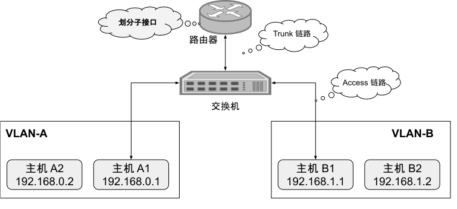
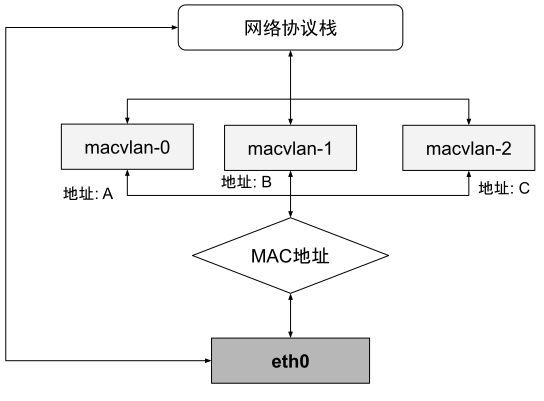
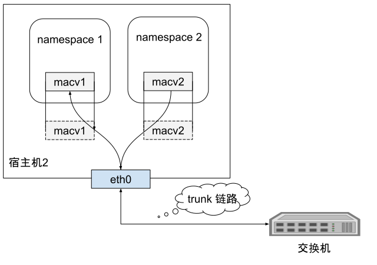

# 3.5.5 MACVLAN

通过前面讲述的 VLAN以及 VxLAN，我们已经有足够的前置知识来了解最后一种虚拟设备 MACVLAN。

两个 VLAN 之间位于独立的广播域，是完全二层隔离的，要通信就只能通过三层设备。假设位于 VLAN-A 中的主机 A1，希望把数据包发送给 VLAN-B 中的主机 B2，由于 A、B 两个 VLAN 之间二层链路不通，因此引入了单臂路由。

  
  
两个 VLAN 之间使用单臂路由模式通信

单臂路由不属于任何 VLAN，它与交换机之间的链路允许任何 VLAN ID 的数据包通过，这种接口被称为 Trunk。这样，A1 要和 B2 通信，A1 就把数据包先发送给路由（只需把路由设置为网关即可做到），然后路由根据数据包上的 IP 地址得知 B2 的位置，去掉 VLAN-A 的 VLAN Tag，改用 VLAN-B 的 VLAN Tag 重新封装数据包后，发回给交换机，交换机收到后就可以顺利转发给 B2 了。由于 A1、B2 各自处于独立的网段上，它们又各自要把同一个路由作为网关使用，这就要求路由器必须同时具备 192.168.0.0/24 和 192.168.1.0/24 的 IP 地址。

当然，如果真的就只有 VLAN-A、VLAN-B 两个 VLAN，那把路由器上的两个接口分别设置不同的 IP 地址，然后用两条网线分别连接到交换机上，也勉强算是一个解决办法。但要知道，VLAN 最多可以支持 4096 个 VLAN，那如果要接四千多条网线就太离谱了。因此为了解决这个问题，802.1Q 规范中专门定义了子接口（Sub-Interface）的概念，它的作用是允许在同一张物理网卡上，针对不同的 VLAN 绑定不同的 IP 地址。

MACVLAN 借用了 VLAN 子接口的思路，并且在这个基础上更进一步，不仅允许对同一个网卡设置多个 IP 地址，还允许对同一张网卡上设置多个 MAC 地址，这也是 MACVLAN 名字的由来。

原本 MAC 地址是网卡接口的“身份证”，应该是严格的一对一关系，而 MACVLAN 打破了这层关系。方法就是在物理设备之上、网络栈之下生成多个虚拟的 Device，每个 Device 都有一个 MAC 地址，新增 Device 的操作本质上相当于在系统内核中，注册了一个收发特定数据包的回调函数，每个回调函数都能对一个 MAC 地址的数据包进行响应，当物理设备收到数据包时，会先根据 MAC 地址进行一次判断，确定交给哪个 Device 来处理。

  
  
macvlan 工作原理

用 MACVLAN 技术虚拟出来的副本网卡，在功能上和真实的网卡是完全对等的，此时真正的物理网卡实际上也确实承担着类似交换机的职责。在收到数据包后，物理网卡会根据目标 MAC 地址，判断这个包应该转发给哪块副本网卡处理，由同一块物理网卡虚拟出来的副本网卡，天然处于同一个 VLAN 之中，因此可以直接二层通信，不需要将流量转发到外部网络。而除了模拟交换机的 Bridge 模式外，MACVLAN 还支持虚拟以太网端口聚合模式（Virtual Ethernet Port Aggregator，VEPA）、Private 模式、Passthru 模式、Source 模式等另外几种工作模式。

  
  
macvlan 工作原理

MACVLAN 本身跟 VLAN 没什么关系，如果不考虑虚拟化的概念，甚至可以理解为一个物理机插了多个网卡。但在容器里面通常跟 VLAN 结合使用（因为一个宿主机的上百个容器可能属于不同的 VLAN）。如下图所示，一台宿主机上面可以虚拟出多块 VLAN 网卡，宿主机和交换机的链路在 trunk 模式下，同一链路根据不同报文内的 vlanID 如（10、20、30）组成逻辑信道，互不干扰。

  
  
macvlan 工作原理

不需要创建 Linux bridge，而是直接通过 interface 连接到物理网络，Macvlan 是将 VM 或容器通过二层连接到物理网络的近乎理想的方案。
