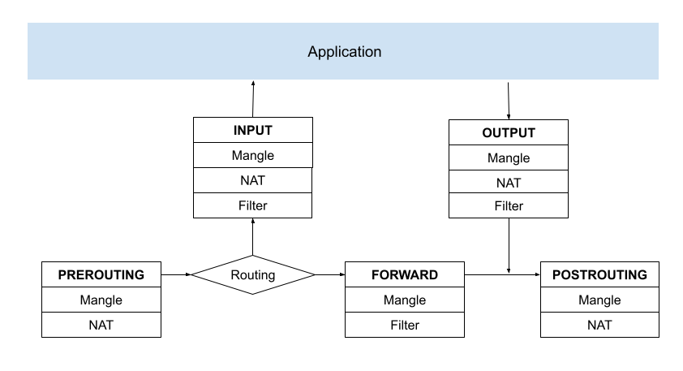
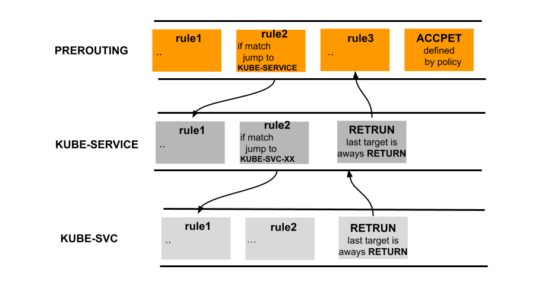
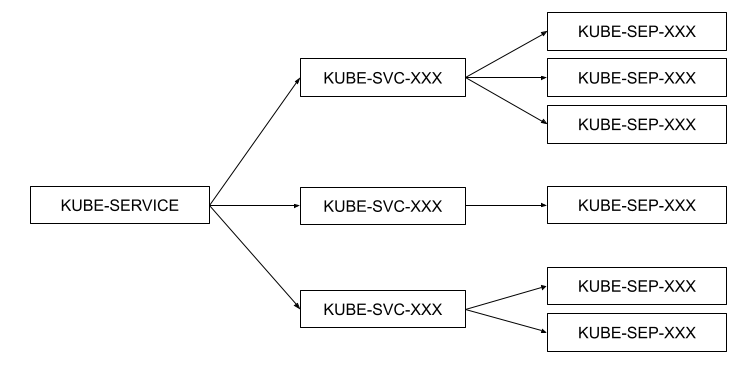
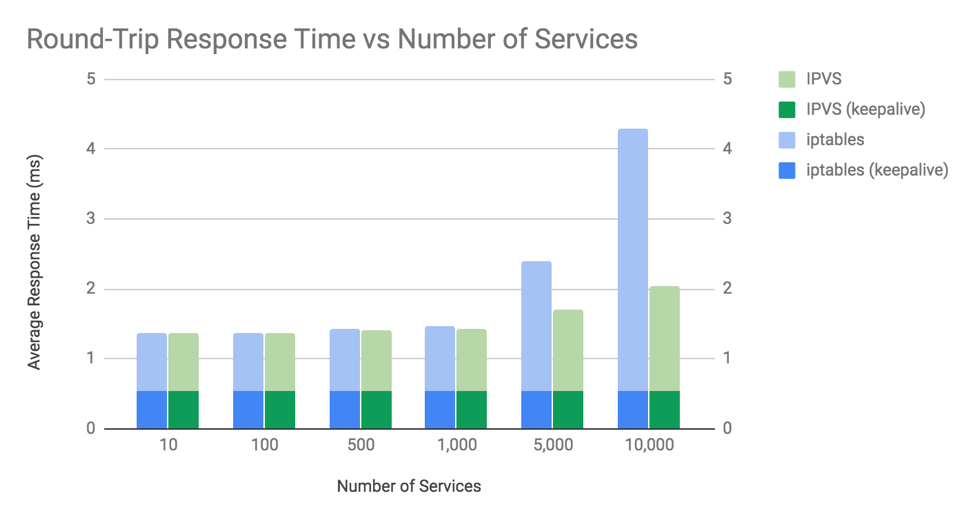

# 3.2.1 iptables 与 Netfilter

以 Netfilter 为基础的应用很多，其中使用最广泛的无疑要数 Xtables 系列工具，譬如iptables、ebtables、arptables 等。 用过 Linux 系统的开发人员或多或少都使用过 iptables，它常被称为 Linux 系统”自带的防火墙“，然而 iptables 能做的事情已经远超防火墙的范畴，严谨地讲，iptables 的定位应是能够代替 netfilter 多数常规功能的 IP 包过滤工具。

Netfilter 的钩子回调固然强大，但仍要通过程序编码才能使用，并不适合系统管理员日常运维，而设计 iptables 的目的便是以配置的方式实现原本用 Netfilter 编码才能做到的事情。iptables 在用户空间管理数据包处理规则，内核中 Netfilter 根据 iptables 的配置对数据包进行处理，它们的关系如图 3-6 所示。

<div  align="center">
	
	<p>图3-6 iptables 与 Netfilter 的关系</p>
</div>

## 1. iptables 表和链

iptables 包括了“tables（表）”、“chain（链）”和“rules（规则）”三个层面。iptables 使用表来组织规则，如果规则是处理网络地址转换的，那会放到 nat 表，如果是判断是否允许包继续向前，那可能会放到 filter 表。每个表内部规则被进一步组织成链，链由内置的 hook 触发后数据包依次匹配里面的规则。

这几个内置链的功能如下：

- **PREROUTING:** 接收到的包进入协议栈后立即触发此链，在进行任何路由判断（将包发往哪里）之前。
- **INPUT:** 接收到的包经过路由判断，如果目的是本机，将触发此链。
- **FORWARD** 接收到的包经过路由判断，如果目的是其他机器，将触发此链。
- **OUTPUT:** 本机产生的准备发送的包，在进入协议栈后立即触发此链。
- **POSTROUTING:** 本机产生的准备发送的包或者转发的包，在经过路由判断之后，将触发此链。

如图3-7所示，一个目的是本机的数据包依次经过 PREROUTING 链上面的 mangle、nat 表，然后再依次经过 INPUT 链的 mangle、filter、nat表，最后到达本机某个具体应用。

<div  align="center">
	
	<p>图3-7 iptables 中 chain 和 table 关系</p>
</div>

## 2. iptables 自定义链

iptables 规则允许数据包跳转到其他链继续处理，同时 iptables 也支持创建自定义链，不过自定义链没有注册到 Netfilter hook，所以自定义链只能通过从另一个规则跳转到它。

<div  align="center">
	
	<p>图3-8 iptables 自定义链</p>
</div>

自定义链可以看作是对调用它的链的扩展，自定义链结束的时候，可以返回 netfilter hook，也可以再继续跳转到其他自定义链，这种设计使 iptables 具有强大的分支功能，管理员可以组织更大更复杂的网络规则。

kubernetes 中 kube-proxy 组件的 iptables 模式就是利用自定义链模块化地实现了 Service 机制，其架构如图3-9 所示。KUBE-SERVICE 作为整个反向代理的入口链，KUBE-SVC-XXX 为具体某一服务的入口链，KUBE-SEP-XXX 链代表某一个具体的 Pod 地址和端口，即 Endpoint。KUBE-SERVICE 链会根据具体的服务 IP 跳转至具体的 KUBE-SVC-XXX 链，然后 KUBE-SVC-XXX 链再根据一定的负载均衡算法跳转至 Endpoint 链。

<div  align="center">
	
	<p>图3-9 kube-porxy 自定义链</p>
</div>

如下命令，查看 kube-proxy 创建的规则。
```
$ iptables -S -t nat
-A PREROUTING -m -comment --comment "kubernetes service portals" -j KUBE-SERVICES
-A OUTPUT -m -comment --comment "kubernetes service portals" -j KUBE-SERVICES
-A POSTROUTING -m -comment --comment "kubernetes postrouting rules " -j KUBE-POSTROUTING
```

## 3. iptables 性能问题

Kubernetes 中 Kube-Proxy 组件有两种模式：iptables 和 IPVS。不过 iptables 的规则匹配是线性的，匹配的时间复杂度是 O(N)。规则更新是非增量式的，哪怕增加/删除一条规则，也是整体修改 iptables 规则表，当集群内 Service 数量较多，则会有较大的性能问题。而 IPVS 则专门用于高性能负载均衡，实现上使用了更高效的哈希表，时间复杂度为 O(1)，性能与规模无关。

如图3-10所示，当 1000 个服务（10000 个 Pod）以上时，会开始观察到差异。

<div  align="center">
	
	<p>图3-10 iptables 与 IPVS 的性能差异</p>
</div>

所以，当 Kubernetes 规模较大时，应避免使用 iptables 模式。
