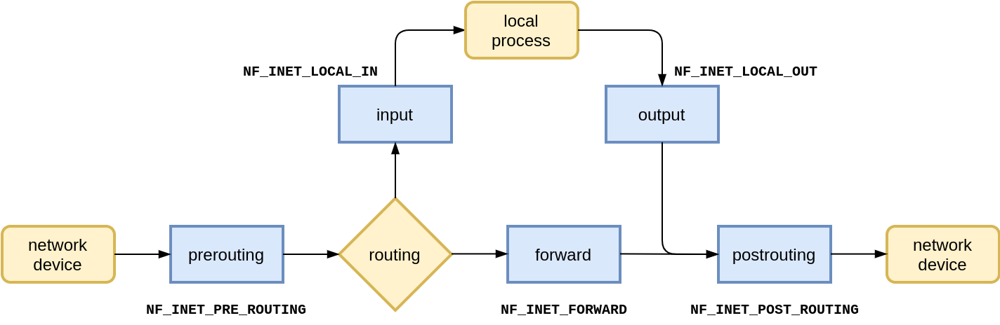

# 3.2.2 数据包处理框架 netfilter

netfilter 是 Linux 内核 2.4 版本中引入的数据包处理框架。netfilter 在内核协议栈的不同位置实现了 5 个 hook 点，其它内核模块(例如 iptables、IPVS 等)可以向这些 hook 点注册处理函数，当数据包经过这些 hook 点时，注册处理函数被依次调用，进而实现对数据包过滤、修改、SNAT/DNAT 等各类功能。

图 2-3 中，可以看到 netfilter 框架是如何处理通过不同协议栈路径上的数据包，netfilter 既可以处理网络层（network Layer）IP 数据包，也可以在链路层（Link Layer）处理以太网帧。

我们看到在链路层（Link Layer）也有一些 iptables 的表和链标识，这意味着 iptables 配置的规则也可以对链路层数据生效，这种机制是保证同数据包不会因网桥和IP层差异导致通信失败。例如，搭建 kubernetes 环境要求设置 net.bridge.bridge-nf-call-iptables = 1，就是以上原因。

## 1. netfilter 与 iptables 

Linux 上最常用的防火墙工具是 iptables，可用于检测、修改转发、重定向以及丢弃 IPv4 数据包。同时，iptables 也是众多上层应用，例如 SLB（Server Load Balancer，负载均衡）、容器网络、kube-proxy iptables模式等实现基础，所以在本节我们介绍 netfilter 与 iptables 的关系。

iptables 的底层实现是 netfilter，iptables 在用户空间管理数据包处理规则，内核中 netfilter 根据 iptables 的配置对数据包进行处理。iptables 与 netFilter 的关系如图 2-5 所示。

<div  align="center">
	
	<p>图 2-11 iptables 与 netfilter 的关系</p>
</div>

## 2. netfilter hooks

netfilter 框架在内核协议栈的不同位置实现了 5 个 hook 点，每个进入网络系统的数据包经过协议栈时会触发注册在这里的 hook 处理函数 。数据包触发哪个 hook 取决于数据包的方向（ingress/egress）、目的地址、上一个 hook 点是被丢弃还是拒绝等等。

下面几个 hook 是内核协议栈中已经定义好的：

- **NF_IP_PRE_ROUTING:** 接收到的包进入协议栈后立即触发此 hook，在进行任何路由判断 （将包发往哪里）之前。
- **NF_IP_LOCAL_IN:** 接收到的包经过路由判断，如果目的是本机，将触发此 hook。
- **NF_IP_FORWARD:** 接收到的包经过路由判断，如果目的是其他机器，将触发此 hook。
- **NF_IP_LOCAL_OUT:** 本机产生的准备发送的包，在进入协议栈后立即触发此 hook。
- **NF_IP_POST_ROUTING:** 本机产生的准备发送的包或者转发的包，在经过路由判断之后，将触发此 hook。

<div  align="center">
	
	<p>图 2-12 数据包经过内核 hook </p>
</div>

## 3. iptables 表和链

iptables 使用 table（表）来组织规则，并将不同功能的规则分为不同 table，例如，如果规则是处理网络地址转换的，那会放到 nat table，如果是判断是否允许包继续向前，那可能会放到 filter table。

在每个 table 内部，规则被进一步组织成 chain（链），内置的 chain 由内置的 hook 触发。内核中有 5 个 hook，也内置了 5 个 chain，并和 hook 一一对应。内置的 5个 chain 为 PREROUTING、INPUT、FORWARD、OUTPUT、POSTROUTING。

## 4. iptables 规则

iptables 规则放置在特定 table 的特定 chain 中。当 chain 被调用的时候，数据包依次匹配 chain 里面的规则。每条规则都有一个匹配部分和一个动作部分。规则的匹配部分指定了一些条件，数据包必须满足这些条件才会和相应的将要执行的动作 `target`进行关联。target 分为两种类型：

- 终止目标（terminating targets）：这种 target 会终止 chain 的匹配，将控制权转移回 netfilter hook。根据返回值的不同，hook 或者将包丢弃，或者允许包进行下一阶段的处理。
- 非终止目标（non-terminating targets）：非终止目标执行动作，然后继续 chain 的执行。虽然每个 chain 最终都会回到一个终止目标，但是在这之前，可以执行任意多个非终止目标。


根据上面对 iptables 表、链以及 hook 的解释，我们看一下数据包的转发流程。假设服务器知道如何路由数据包，而且防火墙允许数据包传输，下面是不同场景下数据包转发流程：

- 收到的、目的是本机的包：PRETOUTING -> INPUT
- 收到的、目的是其他主机的包：PRETOUTING -> FORWARD -> POSTROUTING
- 本地产生的包：OUTPUT -> POSTROUTING

<div  align="center">
	
	<p>图 2-13 netfilter hook 和 iptables 表 </p>
</div>

通过上图，对于一个目的是本机的数据包：首先依次经过 PRETOUTING chain 上面的 mangle、nat table，然后再依次经过 INPUT chain 的 mangle、filter、nat table，最后到达本机某个具体应用。

我们看一条 iptbales 的规则示例。

```
iptables -A INPUT -i eth0 -p tcp --dport 80 -m state --state NEW,ESTABLISHED -j ACCEPT
```

在 INPUT chain 增加一条规则，对来自 eth0 接口，协议为 TCP，目标端口 80，连接状态(conntrack) 为 NEW,ESTABLISHED 的数据包执行 ACCEPT 动作。

## 5. 用户自定义 chain

iptables 规则允许数据包 jump 跳转到其他 chain 继续处理的动作， 同时 iptables 也支持管理员创建自定义的 chain，不过自定义 chain 没有注册到 netfilter hook，所以用户定义 chain 只能通过从另一个规则跳转（jump）到它。

<div  align="center">
	
	<p>图 2-14 iptables 自定义链</p>
</div>

用户定义 chain 可以看作是对调用它的 chain 的扩展，用户定义 chain 在结束的时候，可以返回 netfilter hook，也可以再继续跳转到其他自定义 chain，这种设计使框架具有强大的分支功能，使得管理员可以组织更大更复杂的网络规则。

kubernetes 中 kube-proxy 组件 iptbales 模式就是利用自定义 chain 模块化地实现了 Service 机制。KUBE-SERVICE 作为整个反向代理的入口链，KUBE-SVC-XXX 链为具体某一服务的入口链，KUBE-SEP-XXX 链代表某一个具体的 Pod 地址和端口，即 Endpoint。KUBE-SERVICE 链会根据具体的服务 IP 跳转至具体的 KUBE-SVC-XXX 链，然后 KUBE-SVC-XXX 链再根据一定的负载均衡算法跳转至 Endpoint 链。其结构如图 2-9 所示。

<div  align="center">
	
	<p>图 2-15 kubernetes 中 kube-porxy组件 iptables 模式自定义链</p>
</div>

## 6. iptables 应用问题

在 Kubernetes 中 Kube-Proxy 组件有两种模式：iptables 和 IPVS。这两者都基于 netfilter，不过 iptables 定位是为防火墙而设计，而 IPVS 则专门用于高性能负载均衡。iptables 的规则链是一种线性表，时间复杂度为 O(n) ，规则的遍历和更新成线性延时，当集群内 Service 数量较多，则会有较大的性能问题，而 IPVS 的实现为更高效的哈希表，时间复杂度为 O(1)，性能与规模无关，如表 2-1 所示。

表 2-3 不同模式、规模下增加规则的延迟

|  |  | ||
|:--|:--|:--|:--|
| of Services | 1 | 5,000 | 20,000 |
| of Rules | 8 |  40,000|  160,000|
| iptables| 2 ms| 11 min | 5 hours |
| ipvs  |  2 ms | 2ms | 2 ms |

所以，当 Kubernetes 规模较大时，应避免使用 iptables 模式。
