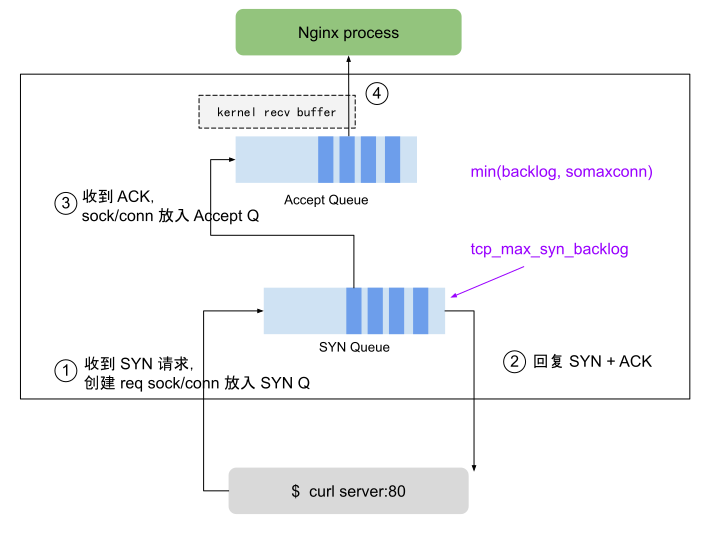
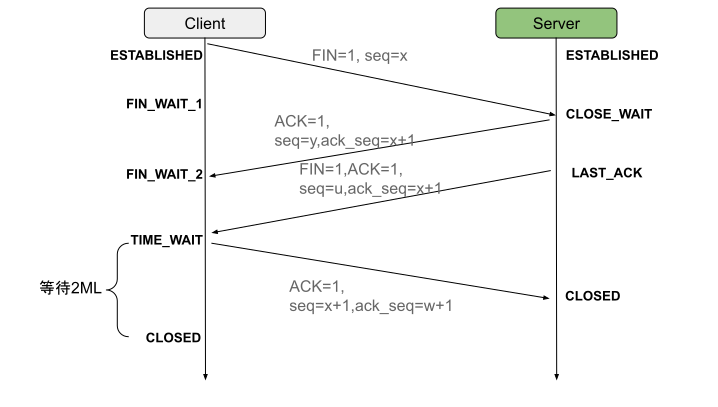

# 3.3.2 内核协议栈优化

一个传输少量数据的 TCP 连接生命周期中，握手、挥手阶段会占用了 70% 的资源消耗。高并发环境中，针对性地优化较为保守内核参数是提升服务处理能力的必要手段。

在本文，将介绍内核协议栈中 TCP 握手流程中队列、挥手 TIME_WAITE、Keepalive 保活原理及参数设置。

## 1. TCP 握手流程

如图 3-16 所示，握手流程中有两个队列比较关键，当队列满时多余的连接将会被丢弃。

<div  align="center">
	
	<p>图 3-16 TCP 握手概览</p>
</div>

- SYN Queue（半连接队列）是内核保持未被 ACK 的 SYN 包最大队列长度，通过内核参数 net.ipv4.tcp_max_syn_backlog 设置。
- Accept Queue（全连接队列） 是 socket 上等待应用程序 accept 的最大队列长度，取值为 min(backlog，net.core.somaxconn)。

backlog 创建 TCP 连接时设置，用法如下。
```plain
int listen(int sockfd, int backlog)
```

## 2. TCP 连接保活

TCP 建立连接后有个发送一个空 ACK 的探测行为来保持连接（keepalive），保活机制受以下参数影响：

- net.ipv4.tcp_keepalive_time 最大闲置时间
- net.ipv4.tcp_keepalive_intvl 发送探测包的时间间隔
- net.ipv4.tcp_keepalive_probes 最大失败次数，超过此值后将通知应用层连接失效

大规模的集群内部，如果 keepalive_time 设置较短且发送较为频繁，会产生大量的空 ACK 报文，存在塞满 RingBuffer 造成 TCP 丢包甚至连接断开风险，可以适当调整 keepalive 范围减小空报文 burst 风险。

## 3. TCP 连接断开

由于 TCP 双全工的特性，安全关闭一个连接需要四次挥手，如图 3-17 所示。但复杂的网络环境中存在很多异常情况，异常断开连接会导致产生“孤儿连”，这种连接既不能发送数据，也无法接收数据，累计过多，会消耗大量系统资源，资源不足时产生 Address already in use: connect 类似的错误。

<div  align="center">
	
	<p>图 3-17 TCP 挥手概览</p>
</div>

“孤儿连”的问题和 TIME_WAIT 紧密相关。TIME_WAIT 是 TCP 挥手的最后一个状态，当收到被动方发来的 FIN 报文后，主动方回复 ACK，表示确认对方的发送通道已经关闭，继而进入 TIME_WAIT 状态，等待 2MSL 时间后关闭连接。如果发起连接一方的 TIME_WAIT 状态过多，会占满了所有端口资源，则会导致无法创建新连接。

可以尝试调整以下参数减小 TIME_WAIT 影响：

- net.ipv4.tcp_max_tw_buckets，此数值定义系统在同一时间最多能有多少 TIME_WAIT 状态，当超过这个值时，系统会直接删掉这个 socket 而不会留下 TIME_WAIT 的状态
- net.ipv4.ip_local_port_range，TCP 建立连接时 client 会随机从该参数中定义的端口范围中选择一个作为源端口。可以调整该参数增大可选择的端口范围。

TIME_WAIT 问题在反向代理节点中出现概率较高，例如 client 传来的每一个 request，Nginx 都会向 upstream server 创建一个新连接，如果请求过多， Nginx 节点会快速积累大量 TIME_WAIT 状态的 socket，直到没有可用的本地端口，Nginx 服务就会出现不可用。

## 4. 相关配置参考

笔者整理了部分内核参数配置，以供读者参考。但注意使用场景不同和机器配置不同，相关的配置起到的作用也不尽相同，生产环境中的参数配置，得在知晓原理基础上，根据实际情况进行调整。

```plain
net.ipv4.tcp_tw_recycle = 0
net.ipv4.tcp_tw_reuse = 1
net.ipv4.ip_local_port_range = 1024 65535
net.ipv4.tcp_rmem = 16384 262144 8388608
net.ipv4.tcp_wmem = 32768 524288 16777216
net.core.somaxconn = 8192
net.core.rmem_max = 16777216
net.core.wmem_max = 16777216
net.core.wmem_default = 2097152
net.ipv4.tcp_max_tw_buckets = 5000
net.ipv4.tcp_max_syn_backlog = 10240
net.core.netdev_max_backlog = 10240
net.netfilter.nf_conntrack_max = 1000000
net.ipv4.netfilter.ip_conntrack_tcp_timeout_established = 7200
net.core.default_qdisc = fq_codel
net.ipv4.tcp_congestion_control = bbr
net.ipv4.tcp_slow_start_after_idle = 0
```