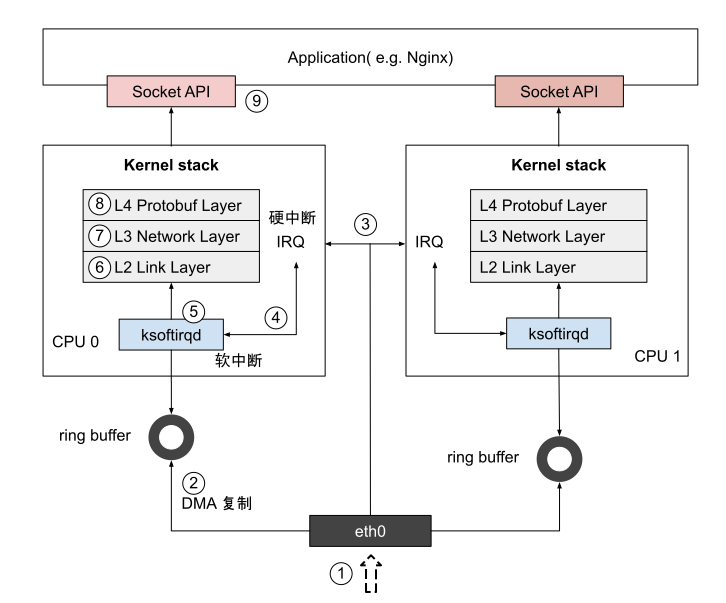

# 3.1 Linux 系统收包流程

笔者先问读者们两个问题：如何将一个 100G 的高速网卡流量打满? 一个大规模集群内，面对东西向的 Gbp/s 规模级数据流量，关键节点的挑战是什么？带着这两个问题，我们来了解 Linux 系统接收数据包的过程。

	
	
图3-2 Linux ingress 架构概览 

如图 3-2 所示，Linux 系统收包流程如下：

1. 网卡 eth0 收到数据包。
2. 网卡通过 DMA 将数据包拷贝到内存的环形缓冲区(Ring Buffer，在网卡中有 RX Ring 和 TX Ring 两种缓冲)。
3. 数据从网卡拷贝到内存后, 网卡产生 IRQ（Interupt ReQuest，硬件中断）告知内核有新的数据包达到。
4. 内核收到中断后, 调用相应中断处理函数，开始唤醒 ksoftirqd 内核线程处理软中断。
5. 内核进行软中断处理，调用 NAPI poll 接口来获取内存环形缓冲区(ring buffer)的数据包，送至更上层处理。
6. 内核中网络协议栈：L2 处理。
7. 内核中网络协议栈：L3 处理。
8. 内核中网络协议栈：L4 处理。
9. 网络协议栈处理数据后，并将其发送到对应应用的 socket 接收缓冲区。

如果设计一个 C10K（单机 1 万并发） 指标的系统，无需在乎内核的细节，但如果要设计一个 C10M（单机 1000 万并发） 的系统，那就不能忽略 Linux 内核带来的各种影响，这些影响包括用户进程调用系统进入内核态的开销，响应数据包时产生的硬中断开销，以及 ksoftirqd 处理软中断而产生的上下文开销等等。

现在可以回答上面的问题了：关键节点的挑战**是用户态内核态的频繁转换、网络协议栈的冗长流程，也就是说内核才是高并发下导致瓶颈的原因所在**。

Linux ingress 架构介绍已经结束，Netfilter 框架以及内核旁路技术还在继续等待我们探索，下一节，我们进入内核网络细节。