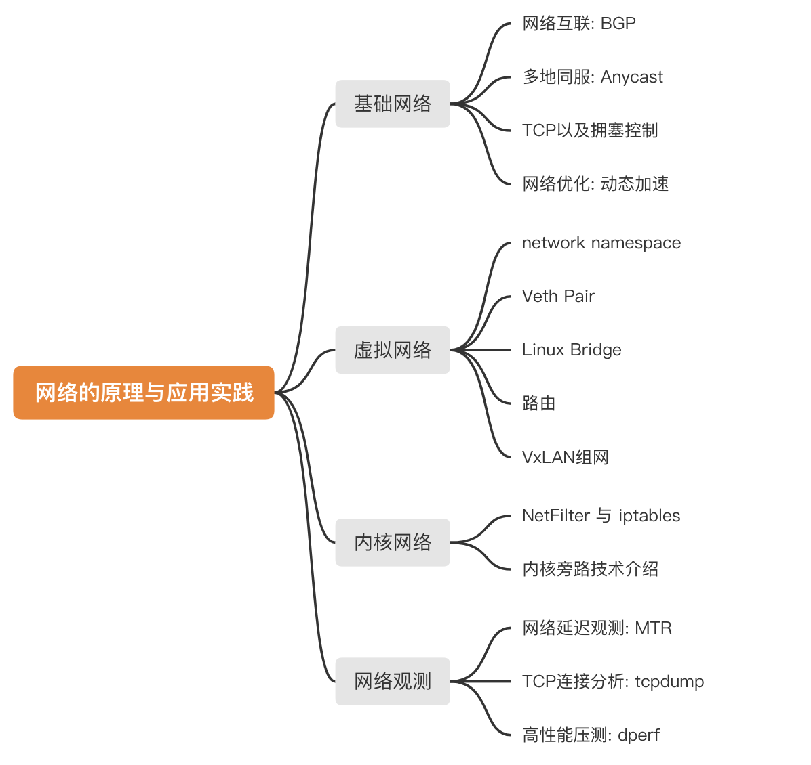

# 第二章：理解网络与应用实践

在互联网系统架构中，毫无疑问网络是其中最基础也是最复杂的部分。最近几年像容器网络、云原生网络、SDN，再具体到 Flannel、Calico 等各类技术层出不穷，

作为架构原理相关的书籍，笔者将网络篇内容作为第一章, 内容从传统网络、网络虚拟化、内核旁路再到网络观测等技术。相信读者在夯实这些基础，面对各类场景错综复杂的问题，如用户端弱网、延迟、高BDP（大带宽长链路）、数据中心组网等问题时，能做到得其理知其法。

	
图1：本章内容导图 

	

