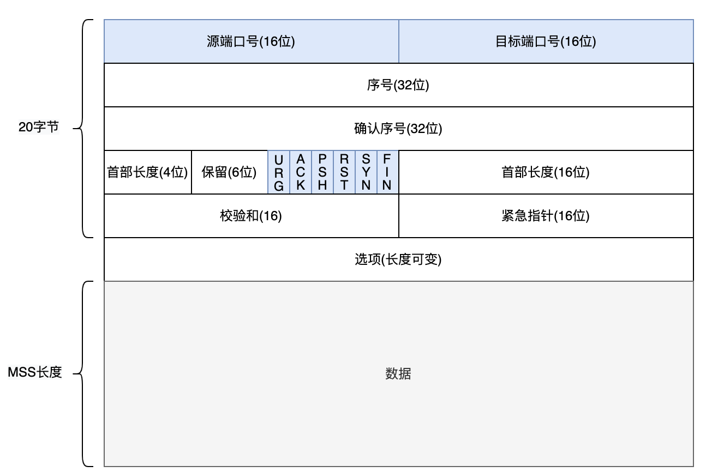
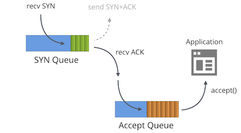

# 2.2.1 TCP 协议理解与应用

TCP 是整个 TCP/IP 协议族中最重要的传输层协议，它定义了面向连接的、可靠的、基于流的传输方式。
在工程师排查请求错误时，一般都先进行TCP连接排查，另外HTTP也是基于TCP协议传输的，所以也可以说TCP是互联网中最重要、最基础的协议。

## 1. TCP 报文结构

 TCP 传输数据的单元是报文段，一个 TCP 报文段可分为两部分：报头和数据部分，报头含有各类控制信息。

	

- 序列号：在建立连接时由计算机生成的随机数作为其初始值，通过 SYN 包传给接收端主机，每发送一次数据，就「累加」一次该「数据字节数」的大小。
- 确认序号：指下一次「期望」收到的数据的序列号，发送端收到这个确认应答以后可以认为在这个序号以前的数据都已经被正常接收。
- 控制位信息：
	- ACK：该位为 1 时，「确认应答」的字段变为有效，TCP 规定除了最初建立连接时的 SYN 包之外该位必须设置为 1。
	- RST：该位为 1 时，表示 TCP 连接中出现异常必须强制断开连接。
	- SYN：该位为 1 时，表示希望建立连接，并在其「序列号」的字段进行序列号初始值的设定。
	- FIN：该位为 1 时，表示今后不会再有数据发送，希望断开连接。当通信结束希望断开连接时，通信双方的主机之间就可以相互交换 FIN 位为 1 的 TCP 段。

## 2. TCP 握手以及连接队列

TCP 连接管理包括连接建立和连接拆除，连接建立过程称`三次握手`，连接拆除过程为`四次挥手`。TCP 通过三次握手确保双方彼此清楚初始序列号、接收窗口大小，从而为双方应用进程提供了端到端的全双工可靠字节流逻辑通信信道。

正常 TCP 三次握手过程，分为如下三个步骤：

- Client 发送 SYN 到 Server 发起握手
- Server 收到 SYN 后回复 SYN + ACK 给 Client
- Client 收到 SYN + ACK后，回复 Server 一个 ACK 表示收到了 Server 的 SYN + ACK（此时 Client连接已经是 Established）

	

### 2.1 连接队列

Linux 内核使用两个队列管理 TCP 连接，当队列溢出时，TCP 将导致无法预知的意外。

	

- SYN Queue （半连接队列，连接处于 SYN RECEIVED 状态），当该队列满时：
	- 若设置 net.ipv4.tcp_syncookies = 0，则直接丢弃当前 SYN 包。
	- 若设置 net.ipv4.tcp_syncookies = 1，表明开启 syncookie，继续后面的处理。
- Accept Queue （全连接队列，连接处于 ESTABLISHED 状态），当该队列满了时
	- 若设置 tcp_abort_on_overflow = 1，则 TCP 协议栈回复 RST 包，废弃这个握手过程和这个连接。
	- 若设置 tcp_abort_on_overflow = 0，该连接标记为 acked，并启动 timer 以便重发 SYN，ACK 包。

## 2.3 TCP 挥手以及 TIME_WAIT

	
图1:TCP挥手流程

	

