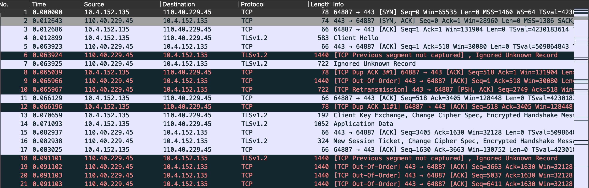
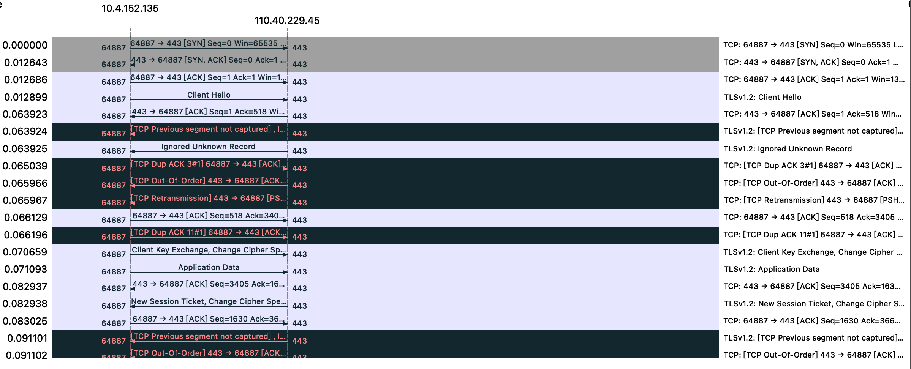

# 2.5.2 使用 tcpdump 排查网络问题 

如果服务端出现 Connection refused ，这大概率是 TCP 层面的连接错误。对于此类的错误，我们可以使用 tcpdump 进行分析 TCP 报文排查问题。

tcpdump 是一款强大的网络分析工具，不受 netfilter 影响，它可以抓取网络接口中传输的网络包，并提供了强大的过滤规则，帮我们从大量的网络包中，挑出最想关注的信息。

不过 tcpdump 输出并不直观，我们可以通过 tcpdump 和 wireshark 组合的方式来排查问题。首先在出问题的节点中 通过 tcpdump 抓包，并保存至 .pcap 格式文件中，将文件拷贝至本地后再使用 wireshark 进行可视化排查分析。tcpdump 和 wireshark 结合使用，可以排查出绝大部分的网络故障。


## 1. 使用 tcpdump 进行抓包

使用 tcpdump 命令进行抓包， -i 参数为指定 `en0` 网卡，host 参数指定 thebyte.com.cn 的包，-w 参数将抓到的包写到文件。

```
$ tcpdump -i en0 host thebyte.com.cn -w thebyte.com.cn.pcap

tcpdump: listening on en0, link-type EN10MB (Ethernet), snapshot length 524288 bytes
^C42 packets captured
135 packets received by filter
0 packets dropped by kernel
```

## 2. 使用 wireshark 分析

将 thebyte.com.cn.pcap 文件拖入 wireshark 中进行分析。

<div  align="center">
	
	<p>图 TCP 报文信息</p>
</div>

Wireshark 可以用时序图的方式显示数据包交互的过程，从菜单栏中，点击 统计 (Statistics) -> 流量图 (Flow Graph)，然后，在弹出的界面中的「流量类型」选择 「TCP Flows」，可以更清晰的看到，整个过程中 TCP 流的执行过程。

<div  align="center">
	
	<p>图: TCP 执行过程</p>
</div>