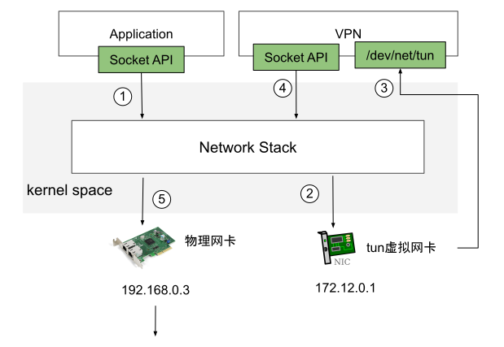

# 2.5.4 虚拟网络设备 tun/tap

tun 和 tap 是 Linux 提供的两个相对独立的虚拟网络设备，其中 tap 模拟了网络层设备，工作在 L3，操作 IP 报文，tun 则模拟了以太网设备，工作在 L2，操作的是数据帧。

使用 tun/tap 设备的目的是实现把来自于协议栈的数据包先交由某个打开 /dev/net/tun 字符设备的用户进程处理后，再把数据包重新发回到链路中。
我们可以把 tun/tap 理解为一端连着网络协议栈，另一端连着用户态程序。tun/tap 设备可以将 TCP/IP 协议栈处理好的网络包发送给任何一个使用 tun/tap 驱动的进程，只要协议栈中的数据包能被用户态程序截获并加工处理，就能实现例如数据压缩、流量加密、透明代理等功能。

	
	
图 2-25 VPN 中数据流动示意图

tun/tap 设备通常用作 overlay 网络传输，如图示例，应用程序通过 tun 发送数据包，tun 设备如果发现另一读被 VPN 程序打开，便会通过字符设备发送给 VPN，VPN 收到数据包，重新修改成新报文，然后作为报文体，再封装到另一个发送给 B 地址的新报文中，这种将一个数据包封装到另一个数据包的处理方式被称为 “隧道”，隧道技术是构建虚拟逻辑网络的经典做法。

OpenVPN、Vtun、Flannel 等都是基于 tun/tap 实现隧道封装的，在 2.7.1 的 VXLAN 网卡也是一种 tun 设备。但使用 tun/tap 设备传输数据需要经过两次协议栈，会有多次的封包解包，一定的性能损耗，这也是大家所说 Flannel UDP 模式性能较低的原因。