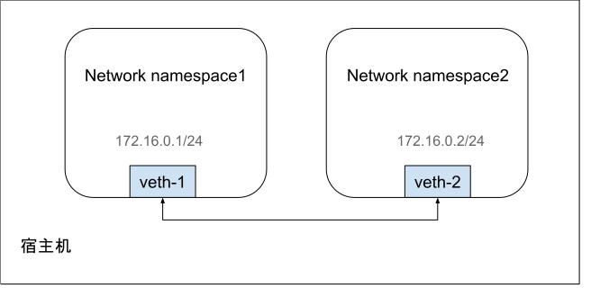
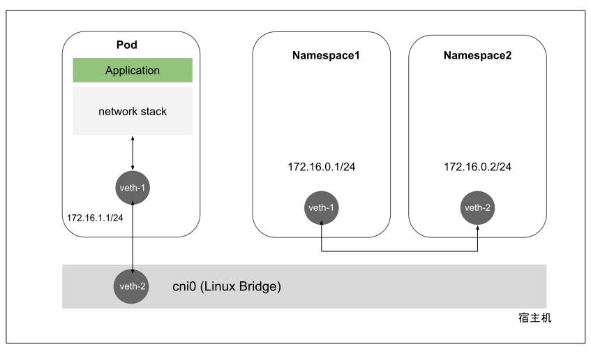

# 2.5.2 虚拟以太网设备 Veth 

Linux 内核支持网络命名空间的同时，也提供了专门的虚拟以太网 Veth（Virtual Ethernet），用来让两个隔离的 Network Namespace 可以互相通信。veth 总是成对出现，因此也常被称作 veth pair（虚拟网卡对）。简单理解 Veth 就是一根带两个 Ethernet 网卡的`网线`，从一头发数据，另一头收数据，如果 veth-1 和 veth-2 是一对 veth 设备，veth-1 发送的数据会由 veth-2 收到，反之亦然。

<div  align="center">
	
	<p>图 2-22</p>
</div>

因为 veth 这个特性，它常常充当着一个桥梁，连接着宿主机内的虚拟网络，典型的例子像两个 Network namespace 之间的连接、Bridge 和 OVS （Open vSwitch）之间的连接等，通过这种方式，从而构建出复杂的虚拟网络拓扑架构。我们在 Kubernetes 集群中的宿主机总能看到一堆 veth 开头的网卡设备信息，这些就是为不同 Pod 之间通信而创建的虚拟网卡。

<div  align="center">
	
	<p>图 2-23</p>
</div>

在 Kubernetes 宿主机中查看网卡设备。
```plain
$ ip addr
7: veth9c0be5b3@if2: <BROADCAST,MULTICAST,UP,LOWER_UP> mtu 1450 qdisc noqueue master cni0 state UP group default 
    link/ether e2:7c:c8:36:d7:14 brd ff:ff:ff:ff:ff:ff link-netnsid 2
    inet6 fe80::e07c:c8ff:fe36:d714/64 scope link 
       valid_lft forever preferred_lft forever
```

## 1. veth 操作实践

笔者根据 图 ，基于 veth 实现两个 Network namespace 之间点对点通信。

首先创建两个 Network namespace。

```plain
$ ip netns add ns1
$ ip netns add ns2
```

创建一对虚拟以太网卡，名为 veth1 和 veth1-peer。
```plain
$ ip link add veth1 type veth peer name veth1-peer
```
把 veth 分别放入 ns1 和 ns2 中。
```plain
$ ip link set veth1 netns ns1
$ ip link set veth1-peer netns ns2
```

设置 veth 设备为 UP 状态，并分配 IP 地址。

```plain
$ ip netns exec ns1 ip addr add 172.16.0.1/24 dev veth1
$ ip netns exec ns1 ip link set dev veth1 up

$ ip netns exec ns2 ip addr add 172.16.0.2/24 dev veth1-peer
$ ip netns exec ns2 ip link set dev veth1-peer up
```

配置完基本信息之后，我们查看 veth 设备是否正常，如下所示 veth MAC 地址、IP 地址 以及设备状态均处于正常状态。

```plain
$ ip netns exec ns1 ip addr
13: veth1@if12: <BROADCAST,MULTICAST,UP,LOWER_UP> mtu 1500 qdisc noqueue state UP group default qlen 1000
    link/ether 92:02:64:b0:9f:0e brd ff:ff:ff:ff:ff:ff link-netnsid 1
    inet 172.16.0.1/24 scope global veth1
    ...
```

现在我们测试这两个 namespace 是否可以相互通信：

```plain
$ ip netns exec ns1 ping 172.16.0.2
PING 172.16.0.2 (172.16.0.2) 56(84) bytes of data.
64 bytes from 172.16.0.2: icmp_seq=1 ttl=64 time=0.309 ms
64 bytes from 172.16.0.2: icmp_seq=2 ttl=64 time=0.079 ms
...
```

对上面的流程进行分析总结，由于 veth 的特性，当向另一方通信时，不论是 ARP、还是或者 ICMP 等，当从 172.16.0.1（veth1）出口发出时，都将转发给 veth1 的另一端 veth1-peer，然后再交由上层协议栈完成点对点通信。