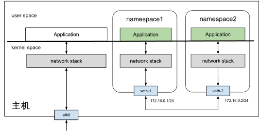

# 3.5.3 虚拟网卡 veth

Linux 内核 2.6 版本支持网络命名空间的同时，也提供了专门的虚拟网卡 veth（Virtual Ethernet，虚拟以太网网卡）。

veth 实现原理的本质是一种“反转数据传输方向”的实现，即：在内核中将需要被发送的数据包“反转"为新接收到的数据包，重新进入内核网络协议栈中处理。通俗一点的解释：veth 就是带着两个“水晶头”的一根“网线”，从网线的一头发送数据，另一头就会收到数据。因此，Veth 也被说成是一对设备（称作 veth-pair）。

veth 的典型应用是连接各类虚拟设备，让原本隔离的网络名称空间可以互相通信。当我们创建一个 veth 设备时，会自动创建另一个关联的 veth 设备（网线的另一头）。将关联的 veth 设备其移动到其他网络命名空间后，两个 veth 设备之间的数据包传输被视为在一个以太网连接上传输。

假设我们已经有两个相互隔离的网络命名空间 ns1 和 ns2，它们的网络拓扑结构如图 3-14。下面笔者进行操作演示，帮助你理解 veth 设备如何实现网络命名空间的互通。

:::center
  <br/>
 图 3-14 Veth 设备对
:::

首先，创建一对 Veth 设备，它们的名称分别为 veth1 和 veth2。命令如下所示：

```bash
$ ip link add veth1 type veth peer name veth2
```

接下来，要做的是把这对设备分别放到 ns1 和 ns2 中。命令如下所示：

```bash
$ ip link set veth1 netns ns1
$ ip link set veth2 netns ns2
```

veth 是虚拟的网络设备，因此具备虚拟网卡的特征。即可配置 IP/MAC 地址。接下来，给 veth 设备配置上 ip 地址，它们的 IP 地址处于同一个子网 172.16.0.1/24 中，同时激活 veth 设备。

```bash
# 配置命名空间1
$ ip netns exec ns1 ip link set veth1 up
$ ip netns exec ns1 ip addr add 172.16.0.1/24 dev veth1
# 配置命名空间2
$ ip netns exec ns2 ip link set veth2 up
$ ip netns exec ns2 ip addr add 172.16.0.2/24 dev veth2
```
Veth 设备配置完 ip 之后，每个网络命名空间中会自动生成对应的路由信息。

```bash
$ ip netns exec ns1 ip route
172.16.0.0/24 dev veth1  proto kernel  scope link  src 172.16.0.1
```
上面的路由配置表明，凡是属于 172.16.0.0/24 网段的数据包都会通过 veth1 发送。自然地，通过 veth1 接口发送的数据包会被 veth2 接收到。在 ns1 中进行 ping 测试，可以看到两个命名空间已经连通了。

```bash
$ ip netns exec ns1 ping -c10 172.16.0.2
PING 172.16.0.2 (172.16.0.2) 56(84) bytes of data.
64 bytes from 172.16.0.2: icmp_seq=1 ttl=64 time=0.121 ms
64 bytes from 172.16.0.2: icmp_seq=2 ttl=64 time=0.063 ms
```

虽然 veth 设备模拟网卡直连的方式解决了两个容器之间的通信问题，但面对多个容器间通信需求，如果只用 Veth 设备的话，事情就会变得非常麻烦。让每个容器都为与它通信的其他容器建立一对专用的 Veth 设备，根本不切实际。

此刻，就迫切需要有一台虚拟化的交换机，来解决多容器之间的通信问题，这就是我们前面多次提到的 Linux Bridge。

