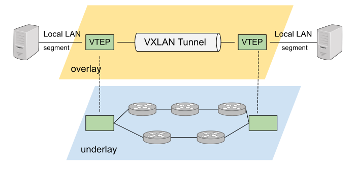
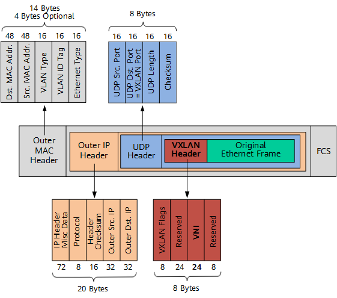
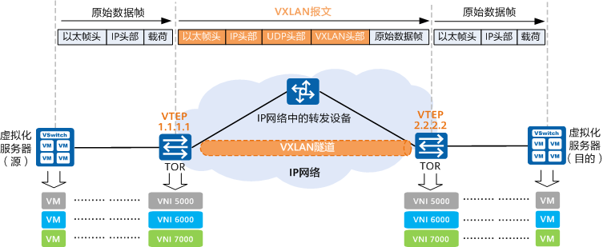

# 2.5.5 Overlay 网络互通：VXLAN

有了各类虚拟设备之后，下一步就是要使用这些设备组成网络。传统的物理拓扑结构相对固定，这很难支持云原生时代下逻辑拓扑结构频繁变动的要求，例如灾难恢复、业务迁移等敏捷需求，跨集群甚至跨多个计算中心的可迁移性。

SDN（Software Definded Network，软件定义网络）在云计算和分布式时代下应运而生。SDN 的核心思想是在物理网络之上，再构建一层虚拟化的网络，通过上层控制平面参与对网络的控制管理，以满足业务网络运维的需求。SDN 位于下层的物理网络被称为 Underlay，它着重解决网络的连通性，位于上层的逻辑网络被称为 overlay，它着重为应用提供与软件需求相符的传输服务和拓扑结构。

	
	
图 2-26 SDN 网络模型

VXLAN（Virtual eXtensible Local Area Network ，虚拟可扩展的局域网）就是一种基于虚拟交换机实现的 overlay 网络。

VLAN（Virtual Local Area Network，虚拟局域网）是一种传统的网络隔离技术。由于二层网络本身特性决定它非常依赖广播，但当设备非常多、广播又非常频繁的时候，很容易形成广播风暴，因为 VLAN 的首要职责是划分广播域，将同一个物理网络的设备区分出来。具体的做法是在以太网的报头增加 VLAN tag，让所有广播只针对相同的 VLAN tag 的设备生效，这样就缩小了广播域，也提高了安全性和可管理性。

不过 VXLAN 有一个非常明显的缺陷，就是 VLAN tag 的设计，只有 12 位来存储 VLAN ID，标准定义中 VLAN 的数量只有 4000 个左右，这显然无法支持大型数据中心数以万记的设备数，另外，VLAN 的二层范围一般较小且固定，也无法支持虚拟机大范围的动态迁移。

VXLAN 完美地弥补了 VLAN 的上述不足，一方面通过 VXLAN 中的 24 比特 VNI 字段（如图 1-5 所示），提供多达 16M 租户的标识能力，远大于 VLAN 的 4000；另一方面，VXLAN 本质上在两台交换机之间构建了一条穿越数据中心基础 IP 网络的虚拟隧道，将数据中心网络虚拟成一个巨型“二层交换机”，满足虚拟机大范围动态迁移的需求。

虽然从名字上看，VXLAN 是 VLAN 的一种扩展协议，但 VXLAN 构建虚拟隧道的本领已经与 VLAN 迥然不同了。

	
	
图 2-27 VXLAN 报文结构

从上图中可以发现，VXLAN 本质上是一种隧道封装技术，它使用 TCP/IP 协议栈的惯用手法“封装/解封装技术”，将 L2 的以太网帧（Ethernet frames）封装成 L4 的 UDP 数据报，然后在 L3 的网络中传输，效果就像 L2 的以太网帧在一个广播域中传输一样，不再受数据中心传输的限制。

	
	
图 2-28 VXLAN 通信概览

VXLAN 对网络基础设施的要求很低，不需要专门的硬件提供特别支持，只要三层可达的网络就可以部署 VXLAN。VXLAN 每个边缘入口都部署了一个 VTEP（VXLAN Tunnel Endpoints，VXLAN 隧道端点），VTEP 是 VXLAN 隧道的起点和终点，VXLAN 对用户原始数据帧的封装和解封装均在 VTEP 上进行，VTEP 既可以是一台独立的网络设备，也可以是在服务器中的虚拟交换机。源服务器发出的原始数据帧，在 VTEP 上被封装成 VXLAN 格式的报文，并在 IP 网络中传递到另外一个 VTEP 上，并经过解封转还原出原始的数据帧，最后转发给目的服务器。

目前 Linux 对 VXLAN 有较完善的支持，一台 Linux 主机经过简单配置之后，就可以把 Linux bridge 作为 VETP 设备使用。VXLAN 带来了很高的灵活性、扩展性和可管理性，不过 VXLAN 也带来了额外的复杂度和性能开销，每个 VXLAN 报文的解封和封包都属于额外操作，尤其是使用软件实现 VETP，额外的性能消耗不可忽视。

