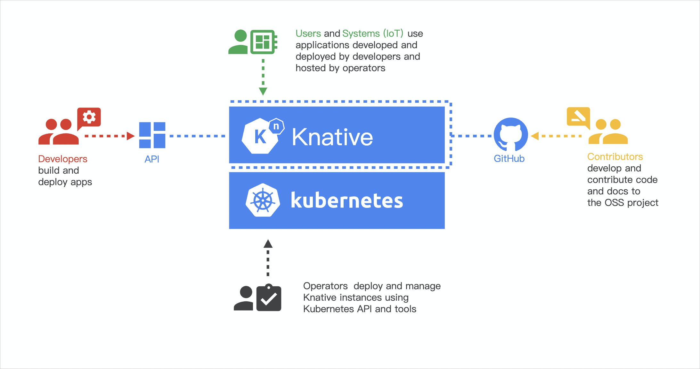

# Knative 

Knative 是一款基于 Kubernetes 的云函数框架，其目标是制定云原生、跨平台的 Serverless 编排标准。

Knative 整合容器构建（或者函数）、工作负载管理（动态扩缩）以及事件模型特性，可将云原生应用开发在 Serverless 领域的最佳实践结合起来——服务构建部署的自动化、服务编排的弹性化以及事件驱动基础设施的标准化。

	

- Developers Serverless服务的开发人员可以直接使用原生的Kubernetes API基于Knative部署Serverless服务。

- Contributors 主要是指社区的贡献者。

- Operators Knative可以被集成到支持的环境中，例如，云厂商，或者企业内部。目前Knative是基于Kubernetes来实现的，有Kubernetes的地方就可以部署Knative。

- Users 终端用户通过Istio网关访问服务，或者通过事件系统触发Knative中的Serverless服务。

## Knative核心组件

作为一个通用的Serverless框架，Knative由两个核心组件组成：
- Eventing：提供了事件的接入、触发等一整套事件管理的能力。
Eventing组件针对Serverless事件驱动模式做了一套完整的设计。包括外部事件源的接入、事件注册和订阅、以及对事件的过滤等功能。事件模型可以有效的解耦生产者和消费者的依赖关系。生产者可以在消费者启动之前产生事件，消费者也可以在生产者启动之前监听事件。

- Serving：管理Serverless工作负载，提供了应用部署、多版本管理、基于请求的自动弹性、灰度发布等能力，而且在没有服务需要处理的时候可以缩容到零个实例。